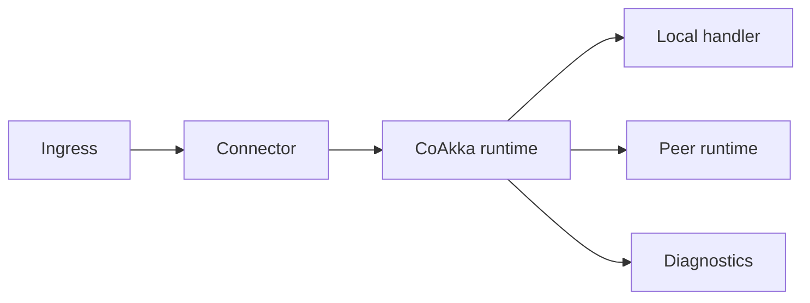
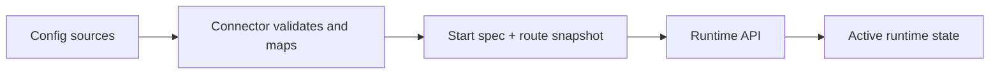

# coakka-samples

[](https://github.com/phuong-tran/coakka-samples/actions/workflows/sample-smoke.yml)

Public samples for the CoAkka runtime v2 and logger integration shape.

These samples consume artifacts from the public CoAkka publish surface. The
current public artifact surface exposes logger packages, the public native
runtime C ABI package, runtime JVM/language connector packages, and the Spring
Boot and Quarkus adapters.

## Table of Contents

- [Try Containers First](#try-containers-first)
- [Start Here](#start-here)
- [Why CoAkka Exists](#why-coakka-exists)
- [Runtime First](#runtime-first)
- [Architectural Value](#architectural-value)
- [Questions And Answers](#questions-and-answers)
- [How It Works](#how-it-works)
- [Sample Integration Checklist](#sample-integration-checklist)
- [Runtime Scenarios](#runtime-scenarios)
- [Framework Local Adapters](#framework-local-adapters)
- [Logger](#logger)
- [Runtime And Logger Together](#runtime-and-logger-together)
- [Quick Start](#quick-start)
- [Requirements](#requirements)
- [Runtime Configuration Notes](#runtime-configuration-notes)
- [Integration Guide](#integration-guide)
- [Future Connector Scope](#future-connector-scope)
- [Samples](#samples)
- [Runtime Capability Samples](#runtime-capability-samples)
- [Container Sample Direction](#container-sample-direction)
- [Benchmark And Load Status](#benchmark-and-load-status)
- [Artifact Source](#artifact-source)
- [Public Status](#public-status)
- [Direct Runs](#direct-runs)
- [CI](#ci)
- [Diagnostics](#diagnostics)
- [License And Trademark](#license-and-trademark)

## Try Containers First

The fastest visible runtime proof is the container path. It uses pinned Docker
Hub images, so you can test a cross-process runtime delivery path without
installing Node.js, Python, Go, Java, protobuf tooling, or native build tools.

Public Docker Hub images:

```text
docker.io/gabrielgun1983/sample-node-web:0.1.0-fbab60154993-remote
docker.io/gabrielgun1983/sample-python-store:0.1.0-fbab60154993-remote
docker.io/gabrielgun1983/sample-spring-web:0.1.0-fbab60154993-remote
docker.io/gabrielgun1983/sample-go-store:0.1.0-fbab60154993-remote
```

Run either sample:

```sh
bash run.sh containers node-python
bash run.sh containers spring-go
```

Then open the browser UIs:

```text
Node.js web -> Python store:
  http://localhost:8080
  http://localhost:8081

Spring Boot JVM web -> Go store:
  http://localhost:8090
  http://localhost:8091
```

Stop every container sample:

```sh
bash run.sh containers down
```

These samples prove two real processes, two language hosts, browser-visible
state changes, and runtime delivery with no REST fallback between the sample
services.

## Start Here

Run the shortest local non-container paths:

```sh
bash run.sh quickstart
bash run.sh runtime jvm basic
bash run.sh runtime native basic
bash run.sh runtime native pressure
```

Check your local toolchain without launching a sample:

```sh
bash run.sh doctor
```

List every sample:

```sh
bash run.sh list
```

## Why CoAkka Exists

CoAkka is aimed at systems where process, language, and deployment boundaries
are part of the design problem.

Modern systems are rarely rewritten in one clean step. A JVM service may be
stable, a Python worker may own a data path, a Node.js service may sit at the
edge, a Go utility may handle operational work, and a desktop application may
still be part of the real workflow.

CoAkka exists to give those pieces a shared runtime contract that can be adopted
gradually. The goal is not to replace a working legacy system before value can
be measured. The goal is to put a typed, inspectable boundary around one
workflow, one process, or one integration point at a time.

The intended adoption path is incremental:

- keep the existing service or desktop application
- add a small host-language connector at the boundary
- route typed requests, replies, events, and diagnostics through the shared
  native runtime contract
- migrate one process, one integration point, or one workflow at a time

That boundary can be embedded inside an application, placed beside a service as
a sidecar, or used as the point where adapters talk to existing integration
systems. Camel, MQTT, message brokers, files, serial devices, HTTP services, and
other legacy entrypoints are natural places to attach adapters. The samples in
this repository do not claim every adapter is already shipped; they show the
runtime contract those adapters can share.

The samples are meant to be easy to run on a local development machine, but
Linux validation is part of the runtime story. Native loading, service
supervision, memory pressure, and deployment packaging are part of the system,
not an afterthought.

## Runtime First

Runtime v2 is the main CoAkka surface in this repository.

It is not presented here as a generic framework. These samples focus on a
smaller boundary problem: once services cross process and language
boundaries, each connector can end up reinventing framing, routing,
request/reply, one-way event delivery, lifecycle, deadletter behavior, and
diagnostics.

Runtime v2 provides one native runtime contract for those concerns. Host
languages keep local ergonomics, while the native runtime owns the shared
routing table, request correlation, deadletter accounting, lifecycle snapshots,
and version diagnostics.

Messages are typed. A runtime payload declares:

- message type
- payload schema version
- payload format

The samples use JSON where readability matters. The runtime contract also has
payload format space for Protobuf, Thrift, MessagePack, plain text, and binary
payloads when a workflow needs a different wire shape.

When run with a matching public artifact set, local primitive samples and
cross-process customer scenarios keep business traffic on the runtime path; if
runtime delivery fails, the UI/API returns an explicit runtime error instead of
hiding the failure behind a REST fallback.

## Architectural Value

The primary value is not adding one more transport option. The value is
standardizing the boundary between an application host and the runtime:

That can sound abstract until a system has been lived in for a while:

- one small service change requires edits in five other services
- ten or more services are coupled through informal message conventions
- a message disappears between two processes and nobody can tell where it was
  dropped
- each team implements routing, retry, correlation, and error handling in a
  slightly different way
- migrating one service to another language becomes painful because the real
  contract was scattered across code, config, logs, and tribal knowledge

CoAkka treats those problems as boundary problems first. The runtime does not
try to own every framework decision; it gives each host a common contract for
the parts that must behave consistently across services and languages:

- one runtime contract for JVM, Python, Node.js, Go, C#, Rust, and native C/C++
- one vocabulary for target names, route snapshots, generations, and handler
  ownership
- one diagnostic model for request/reply, deadletters, queue pressure, and
  lifecycle
- application hosts keep feeding config from their own environment
- the C/C++ runtime core keeps behavior consistent instead of each framework
  inventing a different routing, correlation, or failure model

That boundary matters during a wider rollout:

- integration drift is reduced because teams do not reinvent routing,
  correlation, and deadletter behavior service by service
- legacy migration can start by wrapping one boundary instead of rewriting a
  whole service
- polyglot systems stay disciplined because a store can move from Spring to Go
  or Node.js while the target and payload contract remain stable
- operational debugging has shared terms: target, route generation, deadletter
  reason, pending counters, matched responses, and queue pressure
- config and route hot reload stay flexible because the runtime does not care
  where config came from, only that a route snapshot is applied with clear
  semantics
- delivery failures become deadletters and diagnostics instead of vague
  timeouts or silent drops

For that value to hold in production, the project still has to prove three
things:

1. the remote transporter runs reliably under load, reconnect, process restart,
   and route reload
2. connector ergonomics stay simple when an application feeds config, registers
   handlers, and sends asks/events
3. diagnostics are sharp enough for operators to identify the route,
   generation, target, pending work, and deadletter reason quickly

The intended shape is a small runtime core, host-language connectors that feed
config and business handlers, route snapshots that can be re-applied with
defined semantics, and infrastructure that still owns ingress, TLS, discovery,
and deployment policy. That gives an organization a shared integration
substrate without forcing every service into the same application framework.

## Questions And Answers

Common positioning questions are collected in [docs/qna.md](docs/qna.md).
Start there for comparisons with gRPC, CQRS, Event Sourcing, and business
versus runtime boundaries.

## How It Works

CoAkka keeps a hard boundary between the application host and the native runtime
core.



The connector layer adapts the host language and framework. It reads host
config, builds route snapshots, registers local handlers, encodes payloads, and
maps framework lifecycle into runtime start and shutdown calls.

The native runtime core owns the shared behavior: active route generation,
target-to-endpoint resolution, bounded queues, request/reply correlation,
deadletters, health, stats, and the local or remote transporter boundary.

### Configuration Injection

CoAkka runtime does not fetch platform configuration by itself. The connector
or framework adapter owns that work: it reads the host environment, validates
the shape, builds a start spec and route snapshot, then injects those values
through the runtime API.



Configuration sources can be files, process environment, framework config,
Kubernetes ConfigMaps or Secrets, Consul, another config service, or an
operator/control plane. Those sources stay outside the runtime contract.

The runtime is deliberately platform-agnostic:

- it does not read config files, environment variables, Spring Config, Consul,
  Kubernetes objects, or service mesh state
- it does not discover services by itself
- it does not decide business retry policy
- it does not know Spring, Kubernetes, Node.js, Go, or Python framework
  semantics
- it only receives explicit API calls from the host connector

That keeps responsibilities testable. Runtime tests can focus on route
application, target resolution, correlation, queue pressure, deadletters, and
lifecycle. Connector tests can focus on config mapping, payload encoding,
handler registration, and framework shutdown behavior.

Route reload is the critical API shape. Conceptually, a connector applies a
complete snapshot:

```text
applyRoutes(generation, routes) -> applied | stale_generation | invalid_snapshot
```

The semantics need to stay strict:

- `generation` must increase for a new snapshot
- apply is atomic; a failed apply leaves the active route table untouched
- diagnostics always report the active generation
- route misses produce deadletters with target, reason, and generation context
- in-flight requests continue to be matched by correlation; new sends observe
  the active route snapshot at send time
- rollback is another explicit snapshot with a newer generation, not a partial
  mutation of runtime state

## Sample Integration Checklist

The samples are written as an integration path, not only as API snippets. A
useful runtime sample should make these boundaries visible:

1. Start the runtime participant.
2. Feed route config from the app host into the runtime.
3. Register the local handler for the target this process owns.
4. Send a typed ask or event to a peer target.
5. Handle route miss and delivery deadletters explicitly.
6. Observe active generation, pending requests, matched responses, and
   deadletter counters.
7. Shut the runtime down through the host framework lifecycle.

The customer scenarios expose the important config knobs in application config:

- `local-target`
- `local-host`
- `local-port`
- `peer-target`
- `peer-host`
- `peer-port`
- `generation`

The shared `customer-contract` module holds the cross-service contract:

- message type constants
- payload schema version and format
- request and response DTOs
- delivery mode values used by API/UI diagnostics

`/api/customers/runtime` shows the route config that the connector fed into
the runtime, including `configuredGeneration`, `localEndpoint`, and
`peerEndpoint`.

The API responses distinguish how a request was handled:

- `runtime` for runtime delivery

There is no store REST fallback on the customer web path. If cross-process
runtime delivery fails, the web API returns `RUNTIME_DELIVERY_FAILED` so the
runtime failure is visible instead of hidden by a second transport.
Store and audit services run headless; even the Spring Boot store is configured
as a non-web application, so `8081` is the only browser/API HTTP surface.

The route hot reload capability is covered by `runtime/python/hot-reload` and
by the Spring Boot single-process customer scenario. The scenario includes a
`routes.yml` example, a `reload-routes` command, and diagnostics that show the
active generation changing after an atomic route snapshot apply.

## Runtime Scenarios

The customer CRUD scenarios make the runtime boundary visible through an
ordinary workflow: add, edit, delete, and list customer data.

The workflow is web-based because a browser is easy to inspect, but the runtime
is not web-specific. The same request/reply, one-way event, deadletter, and
diagnostic contract can be used by services, workers, CLI tools, desktop
applications, and sidecar-style adapters.

Current customer topologies:

| Scenario | Purpose |
| --- | --- |
| `runtime/scenarios/customer-crud/spring-boot-single-process` | Spring Boot web service plus local runtime store target |
| `runtime/scenarios/customer-crud/spring-boot-starter-local` | Spring Boot starter with local `@CoAkkaHandler` targets |
| `runtime/scenarios/customer-crud/quarkus-local` | Quarkus Kotlin web service plus local runtime store target |
| `runtime/scenarios/customer-crud/kotlin-desktop-local` | Kotlin desktop app with two local runtime handles |
| `runtime/scenarios/customer-crud/python-desktop-local` | Python desktop app with one local `RuntimeHost` |
| `runtime/scenarios/customer-crud/spring-boot-spring-boot` | Spring Boot web service to Spring Boot store |
| `runtime/scenarios/customer-crud/spring-boot-node` | Spring Boot web service to Node.js store |
| `runtime/scenarios/customer-crud/spring-boot-go` | Spring Boot web service to Go store |
| `runtime/scenarios/customer-crud/spring-boot-csharp` | Spring Boot web service to C# store |
| `runtime/scenarios/customer-crud/spring-boot-nodes` | Spring Boot web service to Node.js store plus Node.js audit service |

## Framework Local Adapters

Spring Boot and Quarkus CRUD code often starts cleanly: the browser/API
controller calls a local store service directly. When teams try to create a
stronger boundary, that call often becomes an internal REST service even though
the browser/API edge is the only real HTTP boundary.

### Before: Internal REST

The traditional split adds an internal endpoint just so the public controller
has something HTTP-shaped to call:

```kotlin
@RestController
@RequestMapping("/internal/customers")
class CustomerStoreInternalController(private val store: InMemoryCustomerStore) {
    @PostMapping
    fun create(@RequestBody request: CustomerDraft): MutationResponse {
        return store.create(request)
    }
}
```

The browser-facing controller then forwards business work through an internal
HTTP client:

```kotlin
@RestController
@RequestMapping("/api/customers")
class CustomerController(private val storeClient: CustomerStoreRestClient) {
    @PostMapping
    @ResponseStatus(HttpStatus.CREATED)
    fun createCustomer(@RequestBody request: CustomerDraft): MutationResponse {
        return storeClient.create(request)
    }
}
```

That works, but the store call now carries URL config, HTTP serialization,
timeout/error mapping, and test setup before there is a real network boundary.
The CoAkka local adapter samples keep HTTP at `/api/...` and move internal work
onto typed runtime capabilities instead.

This is not a claim that every CoAkka call beats every tuned HTTP call in a
synthetic contest. The point is simpler: if the call is not a real product/API
boundary, forcing it through an internal HTTP stack adds parser, header,
middleware, status-code, timeout, retry, and test-policy work that belongs to a
web boundary. CoAkka keeps the internal path as a runtime envelope with routing,
request/reply, and deadletter semantics, then leaves REST for the edge where it
is actually useful.

### After: Local Runtime Capability

Spring Boot uses the public starter artifact:

```kotlin
implementation("coakka.spring:coakka-spring-boot-starter:0.1.0-ga671b3a")
```

```kotlin
@Component
class CustomerCapabilityHandlers(private val store: InMemoryCustomerStore) {
    @CoAkkaHandler("samples.customer.create")
    fun create(command: CustomerDraft): MutationResponse {
        return store.create(command)
    }
}
```

The controller still owns real HTTP ingress, but it asks a runtime capability
rather than an internal REST endpoint:

```kotlin
@PostMapping("/api/customers")
@ResponseStatus(HttpStatus.CREATED)
fun create(@RequestBody request: CustomerDraft): MutationResponse {
    return coakka.askBlocking(
        "samples.customer.create",
        request,
        MutationResponse::class.java,
        "create_customer",
        5_000,
    )
}
```

Quarkus follows the same shape through the public extension artifact:

```kotlin
implementation("coakka.quarkus:coakka-quarkus-extension:0.1.0-ga671b3a")
```

```kotlin
@ApplicationScoped
@CoAkkaHandler("samples.customer.store")
class CustomerCapabilityHandler(...) : CoAkkaLocalHandler
```

Read the concrete walkthroughs here:

- `runtime/scenarios/customer-crud/spring-boot-starter-local`
- `runtime/scenarios/customer-crud/quarkus-local`

For teams that want to see the runtime connector surface without framework
adapter help, `runtime/scenarios/customer-crud/spring-boot-single-process` keeps
route declaration and handler registration explicit.

## Logger

The logger is the second CoAkka surface in this repository.

It is not positioned as a full replacement for SLF4J, Log4J, Logback, or each
language's standard logging ecosystem. It is a bounded native logging core with
small host-language connectors.

The logger samples demonstrate:

- bounded queue capacity
- pressure rejection and dropped counters
- manual drain behavior
- native ABI/version/git diagnostics
- the same logging behavior from JVM, Python, Node.js, Go, and native C/C++

Use it when the useful property is predictable logging behavior across language
ports, especially under constrained machines, queue pressure, or incident
debugging.

## Runtime And Logger Together

Runtime and logger can be used independently. They are also meant to fit
together in a system.

Runtime owns message routing, request/reply, one-way events, deadletters,
lifecycle, and runtime diagnostics. Logger owns bounded log emission, pressure
behavior, sink lifecycle, and logger diagnostics.

Together they give a service boundary both a communication contract and an
observability contract. A legacy service can first adopt runtime at one
integration point, then add the logger where bounded logging behavior matters,
without requiring the whole application to be rewritten.

## Quick Start

Run the default quickstart from the repository root. It checks the local
toolchain and runs the smallest public-ready JVM logger sample:

```sh
bash run.sh quickstart
```

The repository root command is the same quickstart:

```sh
bash run.sh
```

Check what your machine can run without launching a sample:

```sh
bash run.sh doctor
```

List the available samples:

```sh
bash run.sh list
```

Run one artifact-backed sample from the repository root:

```sh
bash run.sh logger basic
bash run.sh logger node basic
bash run.sh logger native basic
```

Run public runtime native samples:

```sh
bash run.sh runtime native basic
bash run.sh runtime native pressure
```

Run public JVM/language connector samples:

```sh
bash run.sh runtime jvm basic
bash run.sh runtime python basic
bash run.sh runtime node basic
bash run.sh runtime go basic
bash run.sh runtime csharp basic
bash run.sh runtime rust basic
```

Run from inside a sample directory:

```sh
cd logger/jvm/basic
bash run.sh
```

Run every sample in one lane:

```sh
bash run.sh logger
```

List the larger scenario tracks:

```sh
bash run.sh scenarios
```

Check that every scenario can build or prepare its services:

```sh
bash run.sh scenarios check
```

Run a scenario command from the repository root:

```sh
bash run.sh scenario customer-crud spring-boot-nodes check
bash run.sh runtime/scenarios/customer-crud/spring-boot-node smoke
```

The scripts create temporary install/build directories for Python, Node.js, Go,
C#, Rust, and native C/C++ package examples. JVM samples resolve artifacts
through a Maven repository; package lanes use their ecosystem or native package
archives.

If a command is missing, run `bash run.sh doctor`. It reports which language
lane is affected. Use `COAKKA_PUBLISH_ROOT` to point samples at a local public
publish checkout.

## Requirements

Install only the toolchain for the language you want to try:

| Language | Required locally |
| --- | --- |
| JVM | JDK 17 or newer |
| Python | Python 3.11 or newer with `pip` |
| Node.js | Node.js 20 or newer with `npm` |
| Go logger | Go 1.22 or newer |
| Go runtime v2 | Go 1.23 or newer |
| C# samples | .NET SDK 10 or newer |
| Rust samples | Rust/Cargo 1.74 or newer |
| Native C/C++ samples | CMake plus C and C++ compilers |

The scripts check these commands before running and print a direct error when a
tool is missing.

## Runtime Configuration Notes

Runtime samples use the same small start-spec shape across JVM, Python,
Node.js, Go, and C#. The native C/C++ runtime sample uses the lower C ABI
directly and makes the same route snapshot and generation concepts visible:

Read the sample config as one startup declaration for one runtime process:

```text
RuntimeStartSpec
  this process identity
  runtime queue and delivery policy
  initial route table
```

The route table is nested:

```text
RuntimeRouteSpec      = one target/capability route
RuntimeEndpointSpec   = one place that can handle that target
RuntimeEndpointFlags  = endpoint state, such as LOCAL or UNAVAILABLE
```

| Item | Question it answers | Plain meaning |
| --- | --- | --- |
| `RuntimeStartSpec` | What does this process declare when joining runtime? | Startup declaration for one runtime participant/process. |
| `RuntimeRouteSpec` | Which target/capability is routed where? | One route-table row: target/capability to endpoint list. |
| `RuntimeEndpointSpec` | Where can that target be handled? | One concrete endpoint with `host`, `port`, and flags. |
| `systemName` | Which logical service do I belong to? | Logical runtime participant name used in diagnostics, such as `customer-store`. |
| `nodeId` | Which concrete instance/process am I? | Concrete process identity used in logs and runtime snapshots; samples may hard-code it, but production should inject a unique value per process/pod. |
| `queueCapacity = 128` | How much work can runtime buffer before applying pressure? | Bounded queue that is large enough for a demo but still prevents unbounded memory growth. |
| `strictNoDrop = true` | Should overload be visible instead of silently dropping work? | Overload becomes visible as an error/deadletter instead of silently dropping work. |
| `separateDeliveredRequestLane = true` | Should inbound work be separated from replies/deadletters? | Keeps inbound delivered requests separate from response/deadletter matching for outgoing asks. |
| `generation = 1` | Which version of the route table is this? | First route-table snapshot applied at startup. Real services should increment this when applying a new route snapshot. |
| `routes` | What targets does this runtime know how to route? | Maps a target name such as `samples.customer.store` to one or more endpoints. |
| `target` | What capability is the caller asking for? | Stable capability address, not a class name, function name, or URL. |
| `source` | Who is sending this request or reply? | Caller or responder identity used for diagnostics, correlation, and reply naming. |
| `strategy` | If a target has multiple eligible endpoints, how should runtime choose one? | Route selection policy such as single owner, weighted round robin, or rendezvous hash. |
| `host` / `port` | What endpoint identity should runtime use? | Endpoint address for local listener or remote runtime handoff. |
| `RuntimeEndpointFlags.LOCAL` | Is the handler in this process? | This process owns the target and should register the handler. |
| `RuntimeEndpointFlags.UNAVAILABLE` | Should this endpoint stay visible but receive no new work? | Endpoint remains in the snapshot but is excluded from new route selection. |
| no `LOCAL` flag | Is this a peer endpoint instead of my handler? | The endpoint is a peer/remote endpoint, not a handler owned by this process. |

For example, a route with `target = "samples.runtime.jvm.echo"` and one
endpoint marked `LOCAL` means:

```text
When a request targets samples.runtime.jvm.echo, deliver it to the handler
registered in this process. The 127.0.0.1:19301 address is the endpoint
identity for this runtime participant.
```

If the same target points to an endpoint without `LOCAL`, the current process
does not own the handler. Runtime treats that endpoint as a peer destination.

When sending a request, `source` names the caller and `target` names the
capability being called:

```text
source = samples.customer.frontend
target = samples.customer.store
```

The runtime routes by `target`. `source` stays with the envelope so logs,
deadletters, and replies can explain who sent the work.

Customer scenarios intentionally do not include a store REST fallback. The
single-process scenario can complete CRUD through a local runtime store target.
Cross-process scenarios use the same runtime-only customer traffic across
processes and languages. Only the browser-facing web surface exposes HTTP;
store and audit processes are runtime handlers without a REST API.

That shape is deliberate for polyglot work. Once a store is a runtime target,
changing the owner from Spring Boot to Node.js, Go, C#, Python, or another
connector does not require inventing a new internal REST mini-service for each
language.

## Integration Guide

After running the demos, use
[Runtime Integration Guide](docs/runtime-integration-guide.md) for the
production-facing shape: dependencies, start spec, route targets, endpoint
flags, payload identities, handler ownership, caller timeouts, deadletter
handling, queue policy, and shutdown.

Language-specific entry points:

- [JVM runtime samples](runtime/jvm/README.md)
- [Python runtime samples](runtime/python/README.md)
- [Node.js runtime samples](runtime/node/README.md)
- [Go runtime samples](runtime/go/README.md)
- [C# runtime samples](runtime/csharp/README.md)
- [Rust runtime samples](runtime/rust/README.md)
- [Logger samples](logger/README.md)
- [Native C/C++ runtime samples](runtime/native/README.md)

## Future Connector Scope

Android and PHP are intentionally not in the current sample matrix yet.

Android is a likely future connector target, but it is a different kind of
runtime host. The useful Android shape is not "Spring Boot on a phone"; it is a
long-lived app, dashboard, field tablet, sensor surface, or edge operator UI
that can own a local runtime target or connect to one. That points toward an
AAR packaging lane, Android lifecycle handling, foreground/background policy,
ABI splits, and device smoke coverage. The Android path should start as an
experiment in the connector workspace before it is presented here as a sample.

PHP is deliberately lower priority. Traditional PHP-FPM request lifecycle does
not match CoAkka's long-lived `RuntimeHost` model: each request is too short to
own a clean runtime lifecycle, and production FFI/native-extension policy is
often constrained by hosting and framework setup. A PHP connector, if it ever
exists, should target long-running worker hosts such as RoadRunner, Swoole, or
Laravel Octane. Generic request-per-process PHP is out of scope until there is
a clear worker-host story.

## Samples

### Runtime Capability Samples

Runtime features are listed separately from language coverage so a capability
does not look missing just because it is demonstrated through one host
connector first.

| Capability | Public sample | What it proves |
| --- | --- | --- |
| Request/reply | JVM, Python, Node.js, Go, C#, Rust, native C/C++ basic samples | Typed local request/reply and runtime counters |
| Deadletter | JVM, Java, Python, Node.js, Go deadletter samples; native basic route miss | Missing-route accounting and matched pending requests |
| Route hot reload | `runtime/python/hot-reload`; `runtime/scenarios/customer-crud/spring-boot-single-process/routes.yml` and `runtime/scenarios/customer-crud/spring-boot-spring-boot/routes.yml` with `bash run.sh reload-routes` | Apply a newer route snapshot, reject stale/invalid snapshots, and observe generation changes |
| Queue pressure | `runtime/native/pressure`; status notes in [`runtime/README.md`](runtime/README.md) | Bounded runtime queue rejection and deadletter counters at the public C ABI intake boundary |
| Logger pressure | JVM, Java, Python, Node.js, Go, C#, Rust, native logger pressure samples | Bounded logger queue rejection and dropped counters |
| Customer CRUD scenarios | Spring Boot, Quarkus, desktop, Node.js, Go, and C# scenario tracks | Real workflow shape across local and cross-process runtime boundaries |

Current gaps:

| Gap | Status |
| --- | --- |
| Cross-process route hot reload scenario | Route apply covered by `runtime/scenarios/customer-crud/spring-boot-spring-boot/routes.yml`; live cross-host delivery capture pending |
| Language connector runtime pressure samples | Tracked separately from native intake pressure; current public connector samples cover request/reply, deadletter, and hot reload |
| Two-machine Linux walkthrough | Manual setup documented in [`docs/two-machine-linux.md`](docs/two-machine-linux.md); live two-host capture pending |
| Repeatable benchmark harness | Manual smoke-load harness present; Linux CI workflow is manual; Linux hardware benchmark remains pending |

### Container Sample Direction

Containerized samples are the low-friction public path. The first target is a
lightweight Node.js web UI calling a Python customer store through the CoAkka
runtime. The second target adds a Spring Boot JVM web edge talking to a Go
store, with both sides exposing browser-visible state.

Run the wave 1 sample:

```sh
bash run.sh containers node-python
bash run.sh containers spring-go
```

Then open:

```text
http://localhost:8080
http://localhost:8081
http://localhost:8090
http://localhost:8091
```

Stop all container samples:

```sh
bash run.sh containers down
```

Or run Compose directly:

```sh
docker compose -f containers/node-python/compose.yaml up
podman compose -f containers/node-python/compose.yaml up
podman-compose -f containers/node-python/compose.yaml up
docker compose -f containers/spring-go/compose.yaml up
podman compose -f containers/spring-go/compose.yaml up
podman-compose -f containers/spring-go/compose.yaml up
```

The intent is to prove two real processes, two language hosts, and one runtime
delivery path with browser-visible state changes. The Spring Boot JVM to Go
sample keeps the framework lane practical for this wave.

Framework native-image builds are deliberately not the primary public sample
path. For Java and Kotlin framework applications, the JVM remains the expected
runtime: it keeps the normal dependency model, diagnostics, profiling, and
steady-state behavior. For native deployment, the sample matrix uses native
language hosts such as Go, Rust, C, and C++ instead of treating native-image as
the default way to run Spring Boot or Quarkus.

Spring Boot native-image and Quarkus native-image may be explored later as
optional advanced lanes if they become useful for a concrete deployment case,
but they are not a promise or a requirement for the container story.

The default container path uses pinned Docker Hub images so users can try a
runtime generation without building protobuf, connector packages, transport
dependencies, or native runtime artifacts locally.

Planning note: [Container Samples Plan](docs/container-samples-plan.md).

### Samples By Language

| Lane | JVM | Python | Node.js | Go | C# | Rust | Native C/C++ |
| --- | --- | --- | --- | --- | --- | --- | --- |
| Runtime v2 basic | `runtime/jvm/basic`, `runtime/jvm/java-basic` | `runtime/python/basic` | `runtime/node/basic` | `runtime/go/basic` | `runtime/csharp/basic` | `runtime/rust/basic` | `runtime/native/basic` |
| Runtime v2 deadletter | `runtime/jvm/deadletter`, `runtime/jvm/java-deadletter` | `runtime/python/deadletter` | `runtime/node/deadletter` | `runtime/go/deadletter` | - | - | - |
| Runtime v2 pressure | - | - | - | - | - | - | `runtime/native/pressure` |
| Logger basic | `logger/jvm/basic`, `logger/jvm/java-basic` | `logger/python/basic` | `logger/node/basic` | `logger/go/basic` | `logger/csharp/basic` | `logger/rust/basic` | `logger/native/basic` |
| Logger pressure | `logger/jvm/pressure`, `logger/jvm/java-pressure` | `logger/python/pressure` | `logger/node/pressure` | `logger/go/pressure` | `logger/csharp/pressure` | `logger/rust/pressure` | `logger/native/pressure` |

### Benchmark And Load Status

This repository does not publish production benchmark claims yet. Any macOS
numbers added here should be treated only as reference smoke-load output for
checking sample shape and catching obvious regressions on a developer machine.
Linux benchmark coverage is pending and should be the source of any durable
runtime performance claims.

Benchmark and load result policy lives in [`bench/README.md`](bench/README.md).
The harness keeps macOS reference output under `bench/macos-smoke/` and Linux
runner output under `bench/linux-ci/` so readers do not confuse local development
guardrails with production performance claims.

The current harness is manual:

```sh
python3 bench/run_smoke_load.py --profile runtime-native-pressure
python3 bench/run_smoke_load.py --profile runtime-python-hot-reload
python3 bench/validate_smoke_load.py bench/linux-ci/<commit>-<profile>.json
```

The `bench-smoke` GitHub Actions workflow uses the same JSON format on
`ubuntu-latest` when triggered through `workflow_dispatch`. It validates the
JSON artifact before upload so Linux CI evidence fails closed if the profile
does not emit the expected diagnostics.

Repository layout:

```text
runtime/
  jvm/
    basic/
    java-basic/
    deadletter/
    java-deadletter/
  python/
    basic/
    deadletter/
    hot-reload/
  node/
    basic/
    deadletter/
  go/
    basic/
    deadletter/
  csharp/
    basic/
  rust/
    basic/
  native/
    basic/
    pressure/
  scenarios/
    customer-crud/
logger/
  jvm/
    basic/
    java-basic/
    pressure/
    java-pressure/
  python/
    basic/
    pressure/
  node/
    basic/
    pressure/
  go/
    basic/
    pressure/
  csharp/
    basic/
    pressure/
  rust/
    basic/
    pressure/
  native/
    basic/
    pressure/
```

## Artifact Source

The current public publish surface supports logger package downloads and the
public native runtime C ABI package. The sample runner resolves public
artifacts from a sibling `coakka-publish-public` checkout when present, then
falls back to the public raw GitHub URL.

Logger JVM samples use the Maven repository from the public publish checkout:

```kotlin
repositories {
    mavenCentral()
    maven {
        url = uri("/path/to/coakka-publish-public/maven")
    }
}

dependencies {
    implementation("coakka.logger:coakka-jvm-native-logger:0.1.0-gba2a66d98eb5")
}
```

For local development, the root Gradle build checks a sibling
`coakka-publish-public` Maven directory first:

```text
workspace-root/
  coakka-publish-public/maven/
  coakka-samples-public/
```

Override the local Maven repository path with:

```sh
COAKKA_PUBLISH_MAVEN_LOCAL=/path/to/coakka-publish-public/maven bash run.sh logger
```

Python, Node.js, Go, C#, Rust, native C/C++, and non-Maven package lanes first
look for a sibling `coakka-publish-public` checkout. Use `COAKKA_PUBLISH_ROOT`
to point samples at another public artifact checkout:

```sh
COAKKA_PUBLISH_ROOT=/path/to/coakka-publish-public bash run.sh logger
COAKKA_PUBLISH_ROOT=/path/to/coakka-publish-public bash run.sh runtime native basic
COAKKA_PUBLISH_ROOT=/path/to/coakka-publish-public bash run.sh runtime
```

Public package downloads are pinned through
`coakka-publish-public/artifacts/public-artifacts.tsv`. When a sample resolves
an artifact from the local public checkout or from the public raw GitHub URL, it
verifies the artifact SHA256 from that manifest before unpacking or installing
the package.

Current public artifact pins:

| Lane | Release |
| --- | --- |
| Logger JVM | `coakka.logger:coakka-jvm-native-logger:0.1.0-gba2a66d98eb5` |
| Logger Python, Node.js, Go, C#, Rust, and native C/C++ | `0.1.0+ba2a66d98eb5` |
| Runtime native C/C++ | `0.1.0+a671b3a` |
| Runtime JVM | `coakka.v2:coakka-jvm-native-runtime-v2:0.1.1-ga671b3a` |
| Runtime Python, Node.js, Go, C#, and Rust | `0.1.0+a671b3a` |
| Spring Boot starter | `coakka.spring:coakka-spring-boot-starter:0.1.0-ga671b3a` |
| Quarkus extension | `coakka.quarkus:coakka-quarkus-extension:0.1.0-ga671b3a` |

The matching artifact note is published at
`https://github.com/phuong-tran/coakka-publish/blob/main/docs/releases/2026-05-09-runtime-a671b3a.md`.

## Public Status

Current public runtime generation: `0.1.0+a671b3a`.

| Lane | Public artifact status | First command |
| --- | --- | --- |
| Logger JVM | public | `bash run.sh logger basic` |
| Logger Python | public | `bash run.sh logger python basic` |
| Logger Node.js | public | `bash run.sh logger node basic` |
| Logger Go | public | `bash run.sh logger go basic` |
| Logger C# | public | `bash run.sh logger csharp basic` |
| Logger Rust | public | `bash run.sh logger rust basic` |
| Logger native C/C++ | public | `bash run.sh logger native basic` |
| Runtime native C/C++ | public | `bash run.sh runtime native basic` |
| Runtime JVM | public | `bash run.sh runtime jvm basic` |
| Runtime Python | public | `bash run.sh runtime python basic` |
| Runtime Node.js | public | `bash run.sh runtime node basic` |
| Runtime Go | public | `bash run.sh runtime go basic` |
| Runtime C# | public | `bash run.sh runtime csharp basic` |
| Runtime Rust | public | `bash run.sh runtime rust basic` |
| Runtime Spring Boot and Quarkus adapters | public | `bash run.sh scenarios check` |
| Runtime container sample: Node.js -> Python | public Docker Hub images | `bash run.sh containers node-python` |
| Runtime container sample: Spring Boot JVM -> Go | public Docker Hub images | `bash run.sh containers spring-go` |

Samples resolve public downloads through
`coakka-publish-public/artifacts/public-artifacts.tsv` or the matching public
raw GitHub URL and verify SHA256 before unpacking or installing an artifact.
Runtime language and framework samples in this status table are aligned to the
same native package generation unless a later release note declares otherwise.

## Direct Runs

Runtime language/framework direct runs consume the public runtime artifacts:

```sh
./gradlew :runtime:jvm:basic:run
./gradlew :runtime:jvm:java-basic:run
```

Expected output shape:

```text
coakka_runtime_info abi=1 version=0.1.0 git=<git>
coakka_runtime_response payload={"echo":"hello-runtime-jvm"}
coakka_runtime_stats generation=1 routes=1 delivered=1 matchedResponses=1
```

The JVM runtime lane includes both Kotlin and Java entrypoints. The Java basic
sample prints the same flow with `language=java`:

```text
coakka_runtime_response payload={"echo":"hello-runtime-java"}
coakka_runtime_stats generation=1 routes=1 delivered=1 matchedResponses=1 language=java
```

Run the runtime v2 samples:

```sh
bash run.sh runtime
```

Run the C# runtime package smoke directly:

```sh
bash run.sh runtime csharp basic
```

Run the native C/C++ runtime v2 sample directly:

```sh
bash run.sh runtime native basic
```

Expected output shape:

```text
coakka_runtime_info abi=1 version=0.1.0 git=<git> language=c
coakka_runtime_stats generation=1 routes=1 routeMisses=1 deadletters=1 language=c
coakka_runtime_info abi=1 version=0.1.0 git=<git> language=cpp
coakka_runtime_stats generation=1 routes=1 routeMisses=1 deadletters=1 language=cpp
```

Run the native runtime pressure sample directly:

```sh
bash run.sh runtime native pressure
```

Expected output shape:

```text
coakka_runtime_info abi=1 version=0.1.0 git=<git> language=c
coakka_runtime_pressure attempts=64 delivered=<n> rejected=<n> capacity=2 highWatermark=<n> language=c
coakka_runtime_stats generation=1 routes=1 queueRejected=<n> deadletters=<n> language=c
```

The runtime lane also includes deadletter samples that send one request to a
missing route, observe the deadletter stream, and verify route-miss accounting:

```text
coakka_runtime_deadletter reason=DEADLETTER_REASON_ROUTE_MISS target=samples.runtime.jvm.deadletter.missing generation=1
coakka_runtime_deadletter_observed matchedPending=true target=samples.runtime.jvm.deadletter.missing
coakka_runtime_stats routeMisses=1 deadletters=1 matchedDeadletters=1
```

Run the smallest JVM logger sample directly through Gradle:

```sh
./gradlew :logger:jvm:basic:run
./gradlew :logger:jvm:java-basic:run
```

Expected output shape:

```text
coakka_logger_info abi=10 version=0.1.0 git=<git>
coakka_logger_record sequence=1 level=info category=samples.logger.jvm.basic message={"event":"hello","language":"jvm"}
coakka_logger_stats emitted=1 delivered=1 dropped=0
```

The JVM logger lane also includes Java basic and pressure samples:

```sh
./gradlew :logger:jvm:java-basic:run
./gradlew :logger:jvm:java-pressure:run
```

The exact sequence number can change if the sample is extended.

Run every logger sample across JVM, Python, Node.js, Go, C#, Rust, and native
C/C++:

```sh
bash run.sh logger
```

The logger lane also includes pressure samples that fill a queue with capacity
`2` and verify rejected writes are counted as dropped:

```text
coakka_logger_pressure attempts=8 accepted=2 rejected=6 capacity=2 highWatermark=2
coakka_logger_stats emitted=2 delivered=2 dropped=6
```

Check the customer scenario services without keeping servers running:

```sh
bash run.sh scenarios check
```

Run one scenario check directly:

```sh
bash run.sh runtime/scenarios/customer-crud/spring-boot-spring-boot
bash run.sh runtime/scenarios/customer-crud/kotlin-desktop-local smoke
bash run.sh runtime/scenarios/customer-crud/python-desktop-local smoke
```

The default command for each scenario is `check`, so opening a scenario
`run.sh` from a shell still performs a real build/preparation step. Long-running
scenario commands such as `web`, `store`, and `audit` start services and should
be run in separate terminals. `dev` builds and starts the whole topology from
one shell. Local desktop/single-process scenarios and cross-process customer
scenarios all keep customer traffic on the runtime path and avoid a store REST
fallback.

## CI

GitHub Actions currently runs a public surface check. It verifies script
syntax, Python/Node sample syntax, sample listing, artifact pins, selected
logger package smoke samples, and selected runtime smoke samples.

## Diagnostics

If native loading fails, first check:

- the selected publish repo path
- the relevant `manifest.json` under the local publish checkout
- Runtime v2 and logger JVM/Python/Node.js/Go/C#/Rust samples use all-in-one
  language artifacts for supported platforms; no separate per-platform native
  download is required for those language lanes.
- Native C/C++ samples use the published native archive and select the current
  platform with CMake.
- whether the current OS/architecture is one of:
  - `macos-aarch64`
  - `linux-aarch64`
  - `linux-x86_64`

The JVM logger jar also accepts an explicit native override:

```sh
./gradlew :logger:jvm:basic:run -Dcoakka.logger.lib=/abs/path/to/libcoakka_logger_core.dylib
```

## License And Trademark

The sample code, scripts, and documentation in this repository are licensed
under the [Apache License, Version 2.0](LICENSE). See [NOTICE](NOTICE) for the
repository notice.

Runtime binaries, connector packages, Maven artifacts, and other released
artifacts consumed by these samples come from `coakka-publish-public` and are
covered by the license terms in that artifact repository or the terms included
with the specific release artifact.

The CoAkka name and `coakka` package, artifact, and image prefixes identify
the official project surface. See [TRADEMARKS.md](TRADEMARKS.md) before using
the name for forks, derived samples, hosted services, or product branding.
