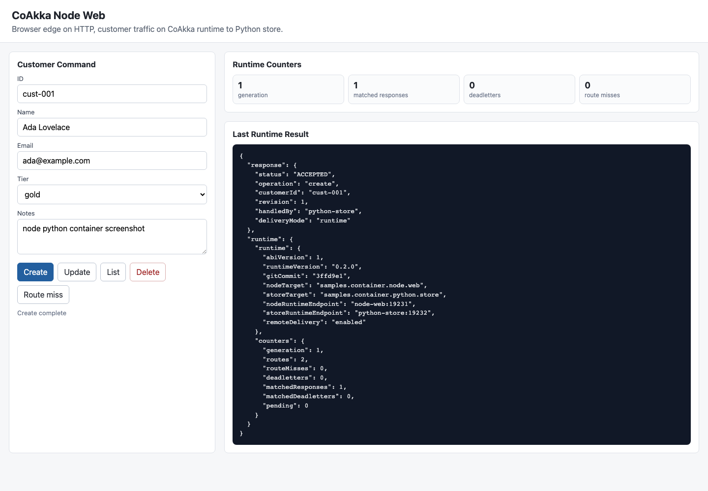
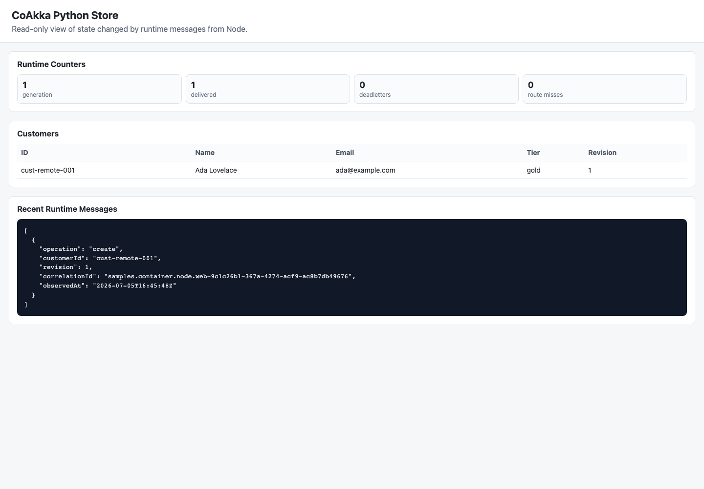
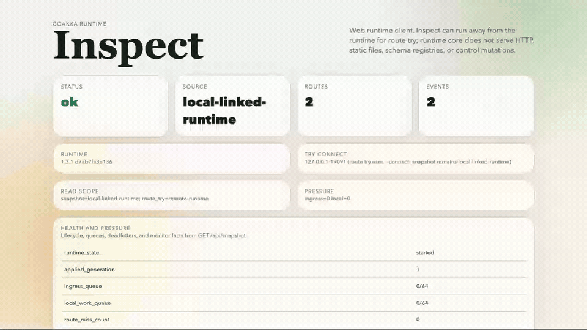

# coakka-samples

[](https://github.com/phuong-tran/coakka-samples/actions/workflows/sample-smoke.yml)

Contribution guide: [CONTRIBUTING.md](CONTRIBUTING.md)
Support: [SUPPORT.md](SUPPORT.md)
Changelog: [CHANGELOG.md](CHANGELOG.md)
New to CoAkka: [docs/new-to-coakka.md](docs/new-to-coakka.md)
First npm smoke: [docs/first-npm-smoke.md](docs/first-npm-smoke.md)
Sample lanes: [docs/sample-lanes.md](docs/sample-lanes.md)
Spring Boot: [docs/coakka-spring-boot.md](docs/coakka-spring-boot.md)
Quarkus: [docs/coakka-quarkus.md](docs/coakka-quarkus.md)

CoAkka is a native-backed runtime and logger toolkit for application-owned
work. It helps an app route work by target name, handle request/reply,
deadletters, bounded queues, diagnostics, and native-backed logging without
turning every internal boundary into another hand-written HTTP endpoint.

If you are new, start with [New To CoAkka](docs/new-to-coakka.md).

Public repository map:

| Repository | Use it for | Link |
| --- | --- | --- |
| `coakka-samples` | Runnable examples and code you can inspect first. | https://github.com/phuong-tran/coakka-samples |
| `coakka-publish` | Released packages, native archives, manifests, checksums, compatibility matrix, and release notes. | https://github.com/phuong-tran/coakka-publish |
| `coakka-runtime-go` | Go module for target routing, request/reply, deadletters, and diagnostics. | https://github.com/phuong-tran/coakka-runtime-go |
| `coakka-logger-go` | Go module for bounded native-backed logging and pressure counters. | https://github.com/phuong-tran/coakka-logger-go |
| `coakka-runtime-swift` | SwiftPM runtime package for macOS ARM64. | https://github.com/phuong-tran/coakka-runtime-swift |
| `coakka-logger-swift` | SwiftPM logger package for macOS ARM64. | https://github.com/phuong-tran/coakka-logger-swift |

Current package links:

| Channel | Runtime | Logger | Sample |
| --- | --- | --- | --- |
| NuGet | [`CoAkka.Runtime` 1.3.3](https://www.nuget.org/packages/CoAkka.Runtime/1.3.3) | [`CoAkka.Logger` 1.2.2](https://www.nuget.org/packages/CoAkka.Logger/1.2.2) | `bash run.sh runtime csharp basic` |
| npm | [`coakka-v2-connector-node` 1.3.9](https://www.npmjs.com/package/coakka-v2-connector-node/v/1.3.9) | [`coakka-logger-node` 1.2.6](https://www.npmjs.com/package/coakka-logger-node/v/1.2.6) | `bash run.sh runtime node basic` |
| PyPI | [`coakka-v2-connector` 1.3.4](https://pypi.org/project/coakka-v2-connector/1.3.4/) | [`coakka-logger` 1.2.2](https://pypi.org/project/coakka-logger/1.2.2/) | `bash run.sh runtime python basic` |
| Go modules | [`coakka-runtime-go` v1.3.10](https://pkg.go.dev/github.com/phuong-tran/coakka-runtime-go@v1.3.10) | [`coakka-logger-go` v1.2.5](https://pkg.go.dev/github.com/phuong-tran/coakka-logger-go@v1.2.5) | `bash run.sh runtime go basic` |
| SwiftPM | [`coakka-runtime-swift` v1.3.2](https://github.com/phuong-tran/coakka-runtime-swift/releases/tag/v1.3.2) | [`coakka-logger-swift` v1.2.1](https://github.com/phuong-tran/coakka-logger-swift/releases/tag/v1.2.1) | `bash run.sh runtime swift basic` |

It gives application hosts a shared runtime vocabulary: target, route snapshot,
typed payload, reply, deadletter, and delivery diagnostics.

Many teams create deployment-owned HTTP endpoints just to move work between
application components or services. That spreads one application-owned contract across
URLs, clients, retries, timeouts, status mapping, and error handling.

This repository shows that model through runnable samples for CoAkka Runtime
connectors, the CoAkka Runtime CLI client, framework adapters, native
integrations, and coakka-logger packages built from the public CoAkka artifact
surface. Runtime samples currently include JVM, Python, Node.js, Bun, Electron,
Tauri, Go, C#, Rust, Swift, Mojo, Zig, and native C/C++ lanes.

## Where Downloads Live

This repository is the runnable sample repository. Public binaries, packages,
checksums, manifests, and release notes live in the artifact distribution
repository:

[`coakka-publish`](https://github.com/phuong-tran/coakka-publish)

Use `coakka-samples` when you want to run examples. Use `coakka-publish` when
you want to download a released archive or package directly. The fastest direct
download entrypoint is the GitHub Release page:

[`CoAkka Public Artifacts 1.3.2`](https://github.com/phuong-tran/coakka-publish/tree/main)

JavaScript runtime/logger samples install the current npm packages. Other
artifact-backed samples resolve artifacts from a sibling `coakka-publish`
checkout when present, or from the public raw GitHub artifact URLs when that
checkout is absent.

## Start Here

| Question | Short answer |
| --- | --- |
| Problem | Internal application work often becomes fake backend HTTP, spreading one contract across URLs, clients, retries, timeout mapping, status mapping, and logs. |
| What CoAkka is | A runtime boundary for application capabilities: callers ask a typed target, route snapshots decide ownership, and replies/deadletters carry runtime diagnostics. |
| What it is not | Not a replacement for public HTTP/gRPC edges, auth, service discovery, deployment policy, CQRS, or ordinary direct calls that are already enough. |
| Where to download | Public artifacts live in [`coakka-publish`](https://github.com/phuong-tran/coakka-publish); this repo consumes those artifacts through runnable samples. |
| Benchmark posture | Benchmarks are evidence and regression guardrails, not the main product claim; the harder shift is modeling app-owned work as runtime targets instead of another L7 API. |
| Run this | `bash run.sh runtime-client` for the published runtime-client CLI, or [First npm Smoke](docs/first-npm-smoke.md) for the smallest Node.js runtime/logger package check. |
| Observe this | The CLI reports runtime build diagnostics from the published client archive. App-host samples then show targets, process ownership, and runtime outcomes instead of hidden REST fallback behavior. |

Fast public path:

```sh
git clone https://github.com/phuong-tran/coakka-samples.git
cd coakka-samples
bash run.sh runtime-client
bash run.sh containers node-python
```

The first sample verifies the published `coakka-client` archive from
`coakka-publish`. The second sample pulls the published Docker Hub
Node.js/Python images and runs a two-process runtime path. Use
[`CoAkka Public Artifacts 1.3.2`](https://github.com/phuong-tran/coakka-publish/tree/main)
for direct archive, package, checksum, manifest, or release-note downloads.

Evidence and repo boundaries:
[Production Evidence](docs/production-evidence.md),
[Repository Boundaries](docs/repository-boundaries.md),
[CoAkka Ecosystem Naming](docs/coakka-ecosystem-naming.md),
[Production Readiness](docs/production-readiness.md),
[How It Works](docs/how-it-works.md),
[CoAkka Spring Boot](docs/coakka-spring-boot.md),
[CoAkka Quarkus](docs/coakka-quarkus.md),
[CoAkka Runtime Client](docs/coakka-runtime-client.md),
[CoAkka Runtime Inspect](docs/coakka-runtime-inspect.md),
[Runtime Glossary](docs/runtime-glossary.md),
[Runtime Message And Routing Model](docs/runtime-message-and-routing-model.md),
[Runtime Integration Guide](docs/runtime-integration-guide.md),
[Incremental Adoption](docs/incremental-adoption.md),
[Cluster Routing](docs/runtime-cluster-routing.md),
[Questions And Answers](docs/qna.md),
and
[Containerized Runtime](docs/containerized-runtime.md).

## Table of Contents

- [Where Downloads Live](#where-downloads-live)
- [Start Here](#start-here)
- [New To CoAkka](docs/new-to-coakka.md)
- [What Problem Does CoAkka Solve?](#what-problem-does-coakka-solve)
- [CoAkka Naming](#coakka-naming)
- [See It In 3 Minutes](#see-it-in-3-minutes)
- [Before And After](#before-and-after)
- [Which Sample Should I Run?](#which-sample-should-i-run)
- [Sample Lanes](docs/sample-lanes.md)
- [When CoAkka Helps](#when-coakka-helps)
- [Incremental Rollout](#incremental-rollout)
- [Core Runtime Vocabulary](#core-runtime-vocabulary)
- [How To Read This Repository](#how-to-read-this-repository)
- [Why CoAkka Exists](#why-coakka-exists)
- [Runtime First](#runtime-first)
- [Architectural Value](#architectural-value)
- [Boundary Patterns](#boundary-patterns)
- [Questions And Answers](#questions-and-answers)
- [How It Works](#how-it-works)
- [Cluster Routing](#cluster-routing)
- [Sample Integration Checklist](#sample-integration-checklist)
- [Runtime Scenarios](#runtime-scenarios)
- [Framework Adapters](#framework-adapters)
- [CoAkka Spring Boot](docs/coakka-spring-boot.md)
- [CoAkka Quarkus](docs/coakka-quarkus.md)
- [CoAkka Runtime Client](#coakka-runtime-client)
- [CoAkka Runtime Inspect](#coakka-runtime-inspect)
- [Logger](#logger)
- [Runtime And Logger Together](#runtime-and-logger-together)
- [Quick Start](#quick-start)
- [Requirements](#requirements)
- [Runtime Configuration Notes](#runtime-configuration-notes)
- [Integration Guide](#integration-guide)
- [Readiness](#readiness)
- [Future Connector Scope](#future-connector-scope)
- [Samples](#samples)
- [Runtime Capability Samples](#runtime-capability-samples)
- [Container Sample Direction](#container-sample-direction)
- [Benchmark And Load Status](#benchmark-and-load-status)
- [Artifact Source](#artifact-source)
- [Public Status](#public-status)
- [Direct Runs](#direct-runs)
- [CI](#ci)
- [Diagnostics](#diagnostics)
- [License And Trademark](#license-and-trademark)

## What Problem Does CoAkka Solve?

CoAkka is for application-owned work that needs a real boundary but should
not have to become another backend network API.

The common failure mode is familiar:

```text
controller -> backend URL -> HTTP client -> backend endpoint
```

That endpoint is not a public product API. It exists because one process, app
module, worker, or language runtime needs to ask another one to do work. Over
time, the contract spreads across path strings, client wrappers, status-code
mapping, retry behavior, timeouts, and logs.

CoAkka keeps the boundary in runtime terms:

```text
controller -> runtime target -> owning handler
```

The caller asks for a typed `target`. The runtime route snapshot decides where
that target is owned. If delivery fails, the result is a runtime failure or
deadletter with source, target, route generation, and reason.

CoAkka does not replace HTTP at real edges, gRPC at real service API
boundaries, CQRS, authorization, ingress, service discovery, or deployment
policy. It gives application hosts a shared runtime vocabulary for application
capabilities that should not need fake REST just to gain a boundary.

## CoAkka Naming

`CoAkka` is the ecosystem and brand prefix. Public sample docs should name the
specific product surface when the distinction matters:

| Name | Meaning |
| --- | --- |
| `CoAkka Runtime` | Runtime product family: targets, route snapshots, replies, deadletters, lifecycle, and diagnostics. |
| `coakka-runtime-core` | Native runtime engine and public C ABI surface. |
| `coakka-runtime-connector` | Host-language and framework connector packages consumed by app-hosts. |
| `coakka-runtime-client` | CLI runtime client. The published command and archive names use `coakka-client`. |
| `coakka-runtime-inspect` | Browser runtime explorer and route-try UI. |
| `coakka-logger` | Bounded logger product surface, separate from runtime routing. |

When using the CLI archive, run `coakka-client`. `coakka-runtime-client` is the
product lane and sample directory name, not an executable name in this release.

The existing `runtime/` and `logger/` directories are stable sample command
categories. Do not read those path names as the full product taxonomy. For the
wording rule, read [CoAkka Ecosystem Naming](docs/coakka-ecosystem-naming.md).

## See It In 3 Minutes

The fastest terminal-first check is the runtime client path:

```sh
bash run.sh runtime-client
```

Watch the runtime-client CLI walkthrough:


Full recording: [coakka-runtime-client.mp4](docs/assets/coakka-runtime-client.mp4)

Read the runtime-client docs for the product introduction, command usage, and
technical notes:
[runtime-client/docs/](runtime-client/docs/)
([public GitHub path](https://github.com/phuong-tran/coakka-samples/tree/main/runtime-client/docs)).
Direct platform downloads are in
[runtime-client/README.md#published-release](runtime-client/README.md#published-release).

That verifies the published `coakka-runtime-client` lane by resolving the
`coakka-client` `1.3.2+caff6d6d` archive, checking its SHA256 against the
public manifest, then running `version` and `doctor` from the unpacked native
prefix.

For a live request/reply path through the published CLI and native service,
run:

```sh
bash run.sh runtime-client docker-bundle
```

Abbreviated expected shape; Docker Compose status lines and generated message
IDs may vary:

```text
created:customer#42
created:customer#ask
created:customer#script
created:customer#script-ask
{
  "ok": true,
  "message_kind": "MESSAGE_KIND_RESPONSE",
  "payload_text": "created:{\"customer_id\":\"script\",\"tier\":\"violet\"}"
}
```

That Docker path is for Linux bundle verification from the published artifact
layout. The older `docker-demo` runner command remains available as a
compatibility alias for the existing release archive path.

For a more visible Docker CLI walkthrough, run:

```sh
bash run.sh runtime-client docker-walkthrough
```

That command uses the same published Docker bundle, starts two native runtime
service containers, prints their service names, ports, and routes, then runs
`coakka-client` from the CLI container against both services. It also runs one
shell script that switches from one runtime endpoint to the other inside the
same CLI session.

For the Docker Hub path with no local artifact unpacking or Compose build, run:

```sh
docker run --rm docker.io/gabrielgun1983/coakka-runtime-client-demo:1.3.2-caff6d6d-remote
```

or through the sample runner:

```sh
bash run.sh runtime-client dockerhub-demo
```

That image starts two native runtime services inside the container and uses the
packaged `coakka-client` to call both routes.

The fastest browser-visible app-host path is the Node.js/Python container path.
It uses the refreshed `1.3.2` runtime artifact line, so you can test a
cross-process runtime delivery path without installing Node.js, Python, Go,
Java, or native build tools.

Docker Hub is not the canonical artifact download surface. It is the prebuilt
sample-image lane. Public native archives, connector packages, CLI client
archives, checksums, and manifests still live in `coakka-publish`.

Docker Hub image tags for this release train:

```text
docker.io/gabrielgun1983/coakka-runtime-client-demo:1.3.2-caff6d6d-remote
docker.io/gabrielgun1983/coakka-runtime-inspect-sample:1.3.2-caff6d6d-remote
docker.io/gabrielgun1983/sample-node-web:1.3.2-caff6d6d-b46f705-remote
docker.io/gabrielgun1983/sample-python-store:1.3.2-caff6d6d-6d5ea58-remote
```

Those tags are the published runtime-client, runtime-inspect, and Node.js/Python
container image lines used by these samples. The runtime-client demo image
bundles the published `coakka-client` `1.3.2+caff6d6d` and native demo service
artifacts. The runtime-inspect sample image copies the published Linux
`coakka-runtime-inspect` Linux `1.3.2+caff6d6d` archives without installing
native implementation runtime packages. The Node.js/Python sample images
install the pinned Node.js connector artifact set
`1.3.2+caff6d6d-b46f705` and Python connector artifact set
`1.3.2+caff6d6d-6d5ea58` over the native runtime base line `1.3.2+caff6d6d`.
Repo-local rebuilds use the same connector set over
`coakka/runtime-base:1.3.2-caff6d6d-local`.

Run the visible container sample:

```sh
bash run.sh containers node-python
```

Then open:

```text
Node.js web -> Python store:
  http://localhost:8080
  http://localhost:8081
```

Stop every container sample:

```sh
bash run.sh containers down
```

These samples show two real processes, two language hosts, browser-visible
state changes, and runtime delivery with no REST fallback between the sample
services.

Current visual evidence from the Node.js web to Python store container sample:





What to observe:

- the browser-visible web app sends application work to another process
- the runtime path uses CoAkka runtime delivery, not REST fallback
- the target owner can be in another language runtime
- delivery stays explicit across language and process boundaries

The sample path is:

```text
browser
  -> web app or app-host
  -> connector
  -> CoAkka runtime
  -> target handler in the owning process
  -> runtime reply
  -> web UI
```

## Before And After

Before, the browser/API edge can be real HTTP, but work owned by the same app
or team often gets a second backend HTTP surface only so another module or
process can call it:

```text
POST /api/customers
  -> fetch("http://customer-store/backend/customers")
  -> POST /backend/customers
  -> store.create(...)
```

After, HTTP stays at the real edge and the fake backend URL becomes a runtime
target:

```text
POST /api/customers
  -> CoAkka target "samples.customer.store.create"
  -> store.create(...)
  -> runtime reply or deadletter
```

The point is not that every backend HTTP call is wrong. The point is that
application-owned work often wants a stable capability name, typed payload,
route ownership, and explicit delivery outcome more than it wants URL wiring,
headers, status mapping, retries, and test fixtures for another private HTTP
surface.

## Which Sample Should I Run?

| Goal | Start with | Why |
| --- | --- | --- |
| See CoAkka work without installing language toolchains | `bash run.sh containers node-python` | Runs two real processes with browser-visible state and no backend HTTP fallback. |
| Understand the smallest runtime API | `bash run.sh runtime jvm basic` | Shows `CoAkka.local`, a local handler, and one ask/reply without route boilerplate. |
| Understand explicit runtime wiring | `bash run.sh runtime jvm java-basic` or the basic sample for another language | Shows start spec, process-owned route, handler registration, ask/reply, and stats. |
| Understand route misses and delivery failures | `bash run.sh runtime jvm deadletter` or `bash run.sh runtime python deadletter` | Shows a missing target becoming a matched deadletter instead of a vague timeout. |
| Understand route generation and reload | `bash run.sh runtime python hot-reload` | Shows newer route snapshots being applied and stale/invalid snapshots rejected. |
| Understand browser runtime exploration | `bash run.sh runtime-inspect check` then `bash run.sh runtime-inspect published-smoke` or `bash run.sh runtime-inspect docker-smoke` | Shows inspect as the UI sibling of `coakka-client` using the public native UI archive or a local Docker image built from it. |
| Understand a normal application workflow | `bash run.sh scenario customer-crud spring-boot-starter-local dev` | Shows browser/API edge plus runtime capabilities in one same-process app. |
| Compare same-process app shape with cross-process shape | `bash run.sh scenario customer-crud spring-boot-spring-boot dev` | Keeps customer traffic runtime-only between web and store processes. |
| Start from Spring Boot annotations | `runtime/scenarios/customer-crud/spring-boot-starter-local` | Uses `@CoAkkaHandler` and `CoAkkaRuntimeClient` instead of manual route/handler wiring. |
| Start from explicit connector wiring | `runtime/scenarios/customer-crud/spring-boot-single-process` | Keeps route declaration and handler registration visible in application code. |

More local starts:

```sh
bash run.sh quickstart
bash run.sh doctor
bash run.sh list
```

For dependency snippets and the minimal host skeleton, read
[runtime/README.md#copy-paste-starter-shapes](runtime/README.md#copy-paste-starter-shapes).
For a longer rollout path, read [docs/integration-path.md](docs/integration-path.md).

## When CoAkka Helps

CoAkka is useful when:

- application work crosses process or language boundaries
- application-owned contracts are spreading across ad-hoc REST or gRPC clients
- teams want explicit delivery diagnostics for route miss, timeout, queue
  pressure, and unavailable endpoints
- a system is migrating gradually across runtimes
- the same capability may start same-process and move cross-process later

CoAkka is probably not necessary when:

- direct in-process calls are already enough
- the boundary is a real public HTTP or gRPC API
- the added runtime vocabulary does not solve a coordination or diagnostics
  problem
- the team does not need route ownership, request/reply matching, deadletters,
  or runtime delivery stats at that boundary

Logger samples are included because the public artifact surface ships logger
packages too, but the main README story is runtime capability delivery.

## Incremental Rollout

CoAkka is not a rewrite-first platform. It does not ask teams to break working
legacy systems, replace public APIs, standardize every service on one
framework, or migrate the whole architecture at once.

The practical rollout path is smaller:

```text
pick one runtime boundary
  -> add a host-language connector
  -> route one typed target through CoAkka
  -> inspect delivery, reply, stats, or deadletter evidence
  -> expand only if the boundary becomes clearer
```

This matters because many architectural ideas are rejected for operational
reasons rather than conceptual ones. A model may be sound, but if the first
step requires a rewrite, a platform reset, or a large migration event, most
teams will not adopt it.

CoAkka is more useful when setup stays simple, configuration stays lightweight,
and legacy systems can remain in place. In that shape, it becomes a practical
boundary improvement rather than a disruptive architecture bet: reduce fake
backend HTTP, standardize runtime capability delivery, and improve diagnostics
one boundary at a time.

## Core Runtime Vocabulary

- `Target`: the stable capability address the caller asks for, not a URL,
  class, or function name.
- `Envelope`: the runtime message wrapper carrying target, source, payload
  identity, payload bytes, request context, timeout, and matching metadata.
- `Payload identity`: the message type, schema version, and payload format used
  to version request, reply, and event bodies.
- `Headers` / metadata / extra params: small request context such as tenant,
  request id, trace id, or idempotency key; business arguments belong in the
  payload.
- `Route generation`: the version of the route snapshot used to decide where a
  target can be delivered.
- `Deadletter`: a structured terminal delivery result for route miss, queue
  pressure, unavailable endpoint, or another explicit delivery failure.
- `Timeout`: the caller's wait budget for an ask, enforced by
  runtime/connector pending-request matching; it is not a business retry policy
  by itself.
- `Retry`: caller/application policy unless a sample explicitly says
  otherwise; retry only with idempotency and a bounded budget.

For the detailed connector, routing, envelope, deadletter, timeout, retry, and
tuning model, read
[Runtime Message And Routing Model](docs/runtime-message-and-routing-model.md).
For the cluster-style endpoint selection and failover model, read
[Runtime Cluster Routing](docs/runtime-cluster-routing.md).

## How To Read This Repository

Use this order for a first pass:

1. Run one container sample first. It shows the visible path without requiring
   a local language toolchain.
2. Open one basic sample in a language you know and look for five things:
   start spec, route target, process-owned handler registration, typed ask or
   event, and stats or deadletter output.
3. Read a customer CRUD scenario. Those samples show why the runtime boundary
   is useful in a normal application workflow.
4. Then read the model sections below when you want the full vocabulary and
   architectural rationale.

Shortest non-container paths:

```sh
bash run.sh runtime jvm basic
bash run.sh runtime native basic
bash run.sh runtime native pressure
```

## Why CoAkka Exists

CoAkka is aimed at systems where process, language, and deployment boundaries
are part of the design problem.

Modern systems are rarely rewritten in one clean step. A JVM service may be
stable, a Python worker may own a data path, a Node.js service may sit at the
edge, a Go utility may handle operational work, and a desktop application may
still be part of the real workflow.

CoAkka exists to give those pieces a shared runtime contract that can be adopted
gradually. The goal is not to replace a working legacy system before value can
be measured. The goal is to put a typed, inspectable boundary around one
workflow, one process, or one integration point at a time.

That coexistence is part of the design advantage. Existing public edges can
stay public, direct in-process calls can stay direct, and legacy services can
keep running while one noisy runtime boundary is made explicit. If the first
step is small and reversible, a team can evaluate the runtime model from real
delivery evidence instead of committing to a migration plan up front.

The intended rollout path is incremental:

- keep the existing service or desktop application
- add a small host-language connector at the boundary
- route typed requests, replies, events, and diagnostics through the shared
  native runtime contract
- migrate one process, one integration point, or one workflow at a time

### Adopt One Boundary At A Time

CoAkka does not require a team to migrate a whole system before learning whether
the runtime boundary helps. A team can wrap one noisy runtime integration, one
polyglot handoff, one workflow, or one failure-prone route first. The existing
HTTP APIs, framework controllers, services, jobs, and deployment shape can keep
running around that experiment.

This matters for real systems because the first useful result is often not a
rewrite. It is a clearer answer to one operational question:

```text
Who sent the work, which target owned it, which route snapshot was active, and
why did delivery succeed, time out, or become a deadletter?
```

If that answer is valuable for one boundary, the team can expand from there. If
direct calls are already enough for a small path, that path can stay direct.

That boundary can be embedded inside an application, placed beside a service as
a sidecar, or used as the point where adapters talk to existing integration
systems. Camel, MQTT, message brokers, files, serial devices, HTTP services, and
other legacy entrypoints are natural places to attach adapters. The samples in
this repository do not claim every adapter is already shipped; they show the
runtime contract those adapters can share.

The samples are meant to be easy to run on a local development machine, but
Linux validation is part of the runtime story. Native loading, service
supervision, memory pressure, and deployment packaging are part of the system,
not an afterthought.

## Runtime First

Runtime v2 is the main CoAkka surface in this repository.

It is not presented here as a generic framework. These samples focus on a
smaller boundary problem: once services cross process and language
boundaries, each connector can end up reinventing framing, routing,
request/reply, one-way event delivery, lifecycle, deadletter behavior, and
diagnostics.

Runtime v2 provides one native runtime contract for those concerns. Host
languages keep local ergonomics, while the native runtime owns the shared
routing table, request correlation, deadletter accounting, lifecycle snapshots,
and version diagnostics.

Messages are typed. A runtime payload declares:

- message type
- payload schema version
- payload format

The samples use JSON where readability matters. The runtime contract also has
payload format space for Protobuf, Thrift, MessagePack, plain text, and binary
payloads when a workflow needs a different wire shape.

When run with a matching public artifact set, basic same-process samples and
cross-process customer scenarios keep business traffic on the runtime path; if
runtime delivery fails, the UI/API returns an explicit runtime error instead of
hiding the failure behind a REST fallback.

## Architectural Value

The value is not adding one more transport option. The value is standardizing
the boundary between an application host and the runtime so the same delivery
terms apply across services and languages:

- one runtime contract for JVM, Python, Node.js, Bun, Electron, Tauri, Go, C#,
  Rust, Mojo and Zig source packages, and native C/C++
- one vocabulary for target names, route snapshots, generations, and handler
  ownership
- one diagnostic model for request/reply, deadletters, queue pressure, and
  lifecycle
- application hosts keep feeding config from their own environment
- the C/C++ runtime core keeps behavior consistent instead of each framework
  inventing a different routing, correlation, or failure model

That helps when a system has started to accumulate informal application-owned contracts:

- a small service change requires edits in several other services
- each team implements routing, retry, correlation, and error handling
  differently
- moving one implementation to another language forces client and config churn
- failures show up as vague timeouts instead of route and delivery evidence
- the real contract is scattered across code, config, logs, and team memory

The hard part is usually not the transport mechanics. It is the mindset shift:
keep real HTTP/gRPC at API edges, and stop promoting app-owned handoffs into
extra L7 services when a runtime target is the cleaner boundary.

For that value to stay reliable in production, every release and deployment
profile has to keep three properties explicit:

1. the remote transporter runs reliably under load, reconnect, process restart,
   and controlled route reload
2. connector ergonomics stay simple when an application feeds config, registers
   handlers, and sends asks/events
3. diagnostics are sharp enough for operators to identify the route,
   generation, target, pending work, and deadletter reason quickly

The intended shape is a small runtime core, host-language connectors that feed
startup config and business handlers, route snapshots that can be re-applied
with defined semantics when needed, and infrastructure that still owns ingress,
discovery, and deployment policy. That gives an organization a shared
integration substrate without forcing every service into the same application
framework.

## Boundary Patterns

These are the practical patterns the samples are trying to make concrete.

**Name application-owned work by target, not URL.** In REST, teams often encode an application-owned
call shape across method, path, query string, and headers:

```text
POST /backend/customers/cust-001/hold?tenant=acme
x-request-id: req-123
```

With CoAkka, responsibility is split more directly:

```text
target  = customer.hold
payload = {"customerId":"cust-001","reason":"manual_review"}
headers = {"tenant":"acme","x-request-id":"req-123"}
```

Do not use envelope headers as a second payload schema. If a value is part of
the business command or query, put it in the payload and version it through
payload identity. Use headers for small request context that should stay next
to the envelope.

**Move implementations without renaming the capability.**

```text
target = customer.store
generation 12 -> Go store
generation 13 -> JVM store, Node.js store, or replicated store endpoints
```

The target and payload contract can stay stable while endpoint placement
changes through route config.

**Start same-process and move later when needed.**

```text
controller -> CoAkka target -> same-process handler
controller -> CoAkka target -> peer-runtime handler
```

The first version can stay compact. If the handler moves later, the app keeps
the same target, source, route-generation, and deadletter vocabulary.

**Make delivery failure answerable.** CoAkka diagnostics should help identify:

- who sent the work
- which target was requested
- which route generation was active
- whether delivery missed a route, hit queue pressure, timed out, or matched a
  response/deadletter

For deeper comparisons with REST/gRPC, service mesh, CQRS, Event Sourcing,
workflow engines, brokers, security policy, observability, and business versus
runtime boundaries, read [docs/qna.md](docs/qna.md).

## Questions And Answers

Common positioning questions are collected in [docs/qna.md](docs/qna.md).
Start there for the quick decision table and comparisons with gRPC, Dapr,
Akka/Erlang/Elixir, CQRS, Event Sourcing, Temporal-style workflow engines,
Kafka/RabbitMQ, Saga, Istio, mTLS, auth/authz, observability, and logger scope.

## How It Works

The public runtime mental model, startup configuration flow, route-apply
semantics, same-process delivery path, and multi-process delivery path now live
in [How It Works](docs/how-it-works.md). That document is shared with
`coakka-publish` so both public repos present the same runtime explanation.

## Cluster Routing

Cluster-style delivery is still the same call-site shape. The app asks for a
target; the route snapshot may contain several eligible peer endpoints; the
runtime selects and, when safe, fails over within the same request lifecycle.
The app still owns business retry policy after a terminal timeout or
deadletter.

Read [Runtime Cluster Routing](docs/runtime-cluster-routing.md) for the
Mermaid diagrams, route snapshot examples, call-site sample, and the transport
compatibility rule.

## Sample Integration Checklist

The samples are written as an integration path, not only as API snippets. A
useful runtime sample should make these boundaries visible:

1. Start the runtime participant.
2. Feed route config from the app host into the runtime.
3. Register the process-owned handler for the target this process owns.
4. Send a typed ask or event to a peer target.
5. Handle route miss and delivery deadletters explicitly.
6. Observe active generation, pending requests, matched responses, and
   deadletter counters.
7. Shut the runtime down through the host framework lifecycle.

The customer scenarios expose the important config knobs in application config:

- `local-target`
- `local-host`
- `local-port`
- `peer-target`
- `peer-host`
- `peer-port`
- `generation`

The shared `customer-contract` module holds the cross-service contract:

- message type constants
- payload schema version and format
- request and response DTOs
- delivery mode values used by API/UI diagnostics

`/api/customers/runtime` shows the route config that the connector fed into
the runtime, including `configuredGeneration`, `localEndpoint`, and
`peerEndpoint`.

The API responses distinguish how a request was handled:

- `runtime` for runtime delivery

There is no store REST fallback on the customer web path. If cross-process
runtime delivery fails, the web API returns `RUNTIME_DELIVERY_FAILED` so the
runtime failure is visible instead of hidden by a second transport.
Store and audit services run headless; even the Spring Boot store is configured
as a non-web application, so `8081` is the only browser/API HTTP surface.

The route hot reload capability is covered by `runtime/python/hot-reload` and
by the Spring Boot single-process customer scenario. Treat it as an operational
tool, not the normal happy path. Most container deployments can start with a
route snapshot derived from platform config and change routes by rolling out a
new pod set. The samples keep `routes.yml`, `reload-routes`, and generation
diagnostics visible so the apply semantics are concrete when live route changes
are needed.

## Runtime Scenarios

The customer CRUD scenarios make the runtime boundary visible through an
ordinary workflow: add, edit, delete, and list customer data.

The workflow is web-based because a browser is easy to inspect, but the runtime
is not web-specific. The same request/reply, one-way event, deadletter, and
diagnostic contract can be used by services, workers, CLI tools, desktop
applications, and sidecar-style adapters.

Current customer topologies:

| Scenario | Purpose |
| --- | --- |
| `runtime/scenarios/customer-crud/spring-boot-single-process` | Spring Boot web service plus same-process runtime store target |
| `runtime/scenarios/customer-crud/spring-boot-starter-local` | Spring Boot starter with same-process `@CoAkkaHandler` targets |
| `runtime/scenarios/customer-crud/quarkus-local` | Quarkus Kotlin web service plus same-process runtime store target |
| `runtime/scenarios/customer-crud/kotlin-desktop-local` | Kotlin desktop app with two process-owned runtime handles |
| `runtime/scenarios/customer-crud/python-desktop-local` | Python desktop app with one process-owned `RuntimeHost` |
| `runtime/scenarios/customer-crud/spring-boot-spring-boot` | Spring Boot web service to Spring Boot store |
| `runtime/scenarios/customer-crud/spring-boot-node` | Spring Boot web service to Node.js store |
| `runtime/scenarios/customer-crud/spring-boot-go` | Spring Boot web service to Go store |
| `runtime/scenarios/customer-crud/spring-boot-csharp` | Spring Boot web service to C# store |
| `runtime/scenarios/customer-crud/spring-boot-nodes` | Spring Boot web service to Node.js store plus Node.js audit service |

## Framework Adapters

Spring Boot and Quarkus samples show the same boundary inside familiar
framework code: keep HTTP at the browser/API edge, and route selected store work
as runtime capabilities instead of inventing private backend HTTP endpoints.

Read the shared framework onboarding docs:

- [CoAkka Spring Boot](docs/coakka-spring-boot.md)
- [CoAkka Quarkus](docs/coakka-quarkus.md)

Then inspect the concrete sample paths:

- `runtime/scenarios/customer-crud/spring-boot-starter-local`
- `runtime/scenarios/customer-crud/quarkus-local`

For teams that want to see the runtime connector surface without framework
adapter help, `runtime/scenarios/customer-crud/spring-boot-single-process` keeps
route declaration and handler registration explicit.

## CoAkka Runtime Client

`coakka-runtime-client` is the CLI runtime client lane. Its published command
and archive prefix is `coakka-client`.

If a shell reports `coakka-runtime-client: command not found`, use
`coakka-client --help`. The longer name is the product lane, not the binary.

The published CLI runtime-client release is `1.3.2+caff6d6d`. It lives under
`coakka-publish/coakka-tools/coakka-client/releases/1.3.2+caff6d6d/` for macOS ARM64, Linux x86_64,
Linux ARM64, Windows x86_64, and Windows ARM64. The Docker verification
release is still under
`coakka-publish/coakka-tools/coakka-client/docker-demo/releases/1.3.2+caff6d6d/`.

This lane is for native CLI verification of runtime behavior: `version`,
`doctor`, request/reply calls, `ask` alias behavior, and bounded script mode.
It is not a dashboard, inspect product, topology authority, or business schema
registry.

For a live request/reply path without source checkout or host build tools, run
`bash run.sh runtime-client docker-bundle`. That uses the published Linux
Docker verification bundle and verifies `call`, `ask`, and `shell --script`
against the bundled native customer service.

For a more guided Docker CLI experience, run
`bash run.sh runtime-client docker-walkthrough`. It starts two native runtime
services from the same published bundle, prints each service name, port, and
route, then drives both with `coakka-client` from a Docker CLI container.

For the Docker Hub one-command path, run
`bash run.sh runtime-client dockerhub-demo` or
`docker run --rm docker.io/gabrielgun1983/coakka-runtime-client-demo:1.3.2-caff6d6d-remote`.
That image starts the native runtime services and runs `coakka-client` inside
one container.

Read the sample lane landing page at [runtime-client/README.md](runtime-client/README.md).

## CoAkka Runtime Inspect

`coakka-runtime-inspect` is the browser runtime explorer lane for CoAkka
Runtime. It is close to `coakka-client`, but visual: it renders runtime
identity, route catalog, endpoint topology, health, pressure, recent events,
and a Try Route form that can copy an equivalent `coakka-client` command.

Watch the runtime-inspect browser walkthrough:



Full recording: [coakka-runtime-inspect.mp4](docs/assets/coakka-runtime-inspect.mp4)

The inspect lane is not a dashboard, schema registry, service discovery
server, mTLS control plane, or topology authority. Runtime core remains the
source of truth; inspect reads and renders runtime facts.

Current sample status: the macOS ARM64, Linux x86_64, Linux ARM64, Windows
x86_64, and Windows ARM64 inspect archives are published in `coakka-publish`.

```sh
bash run.sh runtime-inspect check
bash run.sh runtime-inspect published-smoke
bash run.sh runtime-inspect local-smoke
bash run.sh runtime-inspect serve
bash run.sh runtime-inspect docker-smoke
bash run.sh runtime-inspect docker-serve
bash run.sh runtime-inspect dockerhub-smoke
```

For Docker, run `bash run.sh runtime-inspect docker-smoke` to build and smoke a
local image from the published Linux archive, or
`bash run.sh runtime-inspect docker-serve` to expose the browser UI on
`http://127.0.0.1:18080`.

For the Docker Hub zero-install path, run
`bash run.sh runtime-inspect dockerhub-smoke` or
`docker run --rm docker.io/gabrielgun1983/coakka-runtime-inspect-sample:1.3.2-caff6d6d-remote`.

Read the sample lane landing page at [runtime-inspect/README.md](runtime-inspect/README.md).

## Logger

The logger is the second CoAkka surface in this repository.

It is not positioned as a full replacement for SLF4J, Log4J, Logback, or each
language's standard logging ecosystem. It is a bounded native logging core with
small host-language connectors.

The logger samples cover:

- bounded queue capacity
- pressure rejection and dropped counters
- manual drain behavior
- native ABI/version/git diagnostics
- the same logging behavior from JVM, Python, Node.js, Go, C#, Rust, Swift,
  Mojo, Zig, and native C/C++

Use it when the useful property is predictable logging behavior across language
ports, especially under constrained machines, queue pressure, or incident
debugging.

## Runtime And Logger Together

Runtime and logger can be used independently. They are also meant to fit
together in a system.

Runtime owns message routing, request/reply, one-way events, deadletters,
lifecycle, and runtime diagnostics. Logger owns bounded log emission, pressure
behavior, sink lifecycle, and logger diagnostics.

Together they give a service boundary both a communication contract and an
observability contract. A legacy service can first adopt runtime at one
integration point, then add the logger where bounded logging behavior matters,
without requiring the whole application to be rewritten.

## Quick Start

Run the default quickstart from the repository root. It checks the local
toolchain and runs the smallest published JVM logger sample:

```sh
bash run.sh quickstart
```

The repository root command is the same quickstart:

```sh
bash run.sh
```

Check what your machine can run without launching a sample:

```sh
bash run.sh doctor
```

List the available samples:

```sh
bash run.sh list
```

Run one artifact-backed sample from the repository root:

```sh
bash run.sh logger basic
bash run.sh logger node basic
bash run.sh logger native basic
bash run.sh logger zig basic
bash run.sh logger mojo basic
```

Run public runtime native samples:

```sh
bash run.sh runtime native basic
bash run.sh runtime native pressure
```

Run public JVM/language connector samples:

```sh
bash run.sh runtime jvm basic
bash run.sh runtime python basic
bash run.sh runtime node basic
bash run.sh runtime go basic
bash run.sh runtime csharp basic
bash run.sh runtime rust basic
bash run.sh runtime zig basic
bash run.sh runtime mojo basic
```

Run from inside a sample directory:

```sh
cd logger/jvm/basic
bash run.sh
```

Run every sample in one lane:

```sh
bash run.sh logger
```

List the larger scenario tracks:

```sh
bash run.sh scenarios
```

Check that every scenario can build or prepare its services:

```sh
bash run.sh scenarios check
```

Run a scenario command from the repository root:

```sh
bash run.sh scenario customer-crud spring-boot-nodes check
bash run.sh runtime/scenarios/customer-crud/spring-boot-node smoke
```

The scripts create temporary install/build directories for Python, Node.js, Go,
C#, Rust, Mojo, Zig, and native C/C++ package or source examples. JVM samples
resolve artifacts through a Maven repository; package lanes use their ecosystem
or native package archives.

If a command is missing, run `bash run.sh doctor`. It reports which language
lane is affected. Use `COAKKA_PUBLISH_ROOT` to point samples at a local public
publish checkout.

## Requirements

Install only the toolchain for the language you want to try:

| Language | Required locally |
| --- | --- |
| JVM | JDK 17 or newer |
| Python | Python 3.11 or newer with `pip` |
| Node.js | Node.js 20 or newer with `npm` |
| Go logger | Go 1.22 or newer |
| Go runtime v2 | Go 1.23 or newer |
| C# samples | .NET SDK 10 or newer |
| Rust samples | Rust/Cargo 1.74 or newer |
| Mojo logger/runtime samples | Mojo 1.0 beta or newer |
| Zig logger/runtime samples | Zig 0.16 or newer |
| Native C/C++ samples | CMake plus C and C++ compilers |

The scripts check these commands before running and print a direct error when a
tool is missing.

## Runtime Configuration Notes

The Kotlin JVM basic sample starts at the Level 1 connector API:
`CoAkka.local(...)`, `handler(...)`, and `ask(...)`.

Most other runtime samples intentionally use the explicit start-spec shape
across JVM, Python, Node.js, Go, C#, and Rust so route snapshots and diagnostics
stay visible. The native C/C++, Mojo, and Zig runtime samples use the lower C
ABI directly and make the same route snapshot and generation concepts visible:

Read the sample config as one startup declaration for one runtime process:

```text
RuntimeStartSpec
  this process identity
  runtime queue and delivery policy
  initial route table
```

The route table is nested:

```text
RuntimeRouteSpec      = one target/capability route
RuntimeEndpointSpec   = one place that can handle that target
RuntimeEndpointFlags  = endpoint state, such as LOCAL or UNAVAILABLE
```

| Item | Question it answers | Plain meaning |
| --- | --- | --- |
| `RuntimeStartSpec` | What does this process declare when joining runtime? | Startup declaration for one runtime participant/process. |
| `RuntimeRouteSpec` | Which target/capability is routed where? | One route-table row: target/capability to endpoint list. |
| `RuntimeEndpointSpec` | Where can that target be handled? | One concrete endpoint with `host`, `port`, and flags. |
| `systemName` | Which logical service do I belong to? | Logical runtime participant name used in diagnostics, such as `customer-store`. |
| `nodeId` | Which concrete instance/process am I? | Concrete process identity used in logs and runtime snapshots; samples may hard-code it, but production should supply a unique value per process/pod at runtime, not bake it into the image. |
| `queueCapacity = 128` | How much work can runtime buffer before applying pressure? | Bounded queue that is large enough for a sample flow but still prevents unbounded memory growth. |
| `strictNoDrop = true` | Should overload be visible instead of silently dropping work? | Overload becomes visible as an error/deadletter instead of silently dropping work. |
| delivered-request lane | Should runtime keep delivered requests on their own runtime lane? | Enabled by default in current connectors; it separates incoming requests this process must handle from replies/deadletters that complete asks this process already sent. |
| `generation = 1` | Which version of the route table is this? | First route-table snapshot applied at startup. Real services should increment this when applying a new route snapshot. |
| `routes` | What targets does this runtime know how to route? | Maps a target name such as `samples.customer.store` to one or more endpoints. |
| `target` | What capability is the caller asking for? | Stable capability address, not a class name, function name, or URL. |
| `source` | Who is sending this request or reply? | Caller or responder identity used for diagnostics, correlation, and reply naming. |
| `headers` | Which request context should travel with this envelope? | Small string map for host-side context such as tenant, request id, idempotency key, or diagnostics. Business arguments should stay in payload. |
| `strategy` | If a target has multiple eligible endpoints, how should runtime choose one? | Route selection policy such as single owner, weighted round robin, or rendezvous hash. |
| `host` / `port` | What endpoint identity should runtime use? | Endpoint address for a process-owned listener or remote runtime handoff; samples may use `127.0.0.1`, but production should read it from env, platform metadata, service discovery, or a control-plane route snapshot. Replicas of the same app role should normally share the same runtime port while host identity comes from service DNS, pod DNS/IP, or the control plane. |
| `RuntimeEndpointFlags.LOCAL` | Is the handler in this process? | This process owns the target and should register the handler. |
| `RuntimeEndpointFlags.UNAVAILABLE` | Should this endpoint stay visible but receive no new work? | Endpoint remains in the snapshot but is excluded from new route selection. |
| no `LOCAL` flag | Is this a peer endpoint instead of my handler? | The endpoint is a peer/remote endpoint, not a handler owned by this process. |

`separateDeliveredRequestLane` is mostly about protecting ask completion. A
runtime process can be doing two things at once: receiving new requests for its
local handlers, and waiting for replies or deadletters for asks it sent out.
With `true`, those two flows do not share the same runtime delivery lane, so a
burst of inbound handler work is less likely to delay response/deadletter
matching. With `false`, they share a lane; use that only for very small,
mostly one-way hosts after measurement. The samples use `true` as the normal
default.
The [detailed runtime model](docs/runtime-message-and-routing-model.md#delivered-request-lane)
includes billing-style diagrams for the `true`/`false` cases.

Samples construct route specs directly so the runtime pieces are visible.
Real integrations should usually generate route specs from config, service
discovery, or a control plane. CoAkka does not remove the need to know which
capability a system calls; it centralizes that knowledge in a route snapshot
with generation, strategy, endpoint flags, diagnostics, and deadletters instead
of scattering it across clients.

For example, a route with `target = "samples.runtime.jvm.echo"` and one
endpoint marked `LOCAL` means:

```text
When a request targets samples.runtime.jvm.echo, deliver it to the handler
registered in this process. The 127.0.0.1:19301 address is the endpoint
identity for this runtime participant.
```

If the same target points to an endpoint without `LOCAL`, the current process
does not own the handler. Runtime treats that endpoint as a peer destination.

When sending a request, `source` names the caller and `target` names the
capability being called:

```text
source = samples.customer.frontend
target = samples.customer.store
```

The runtime routes by `target`. `source` stays with the envelope so logs,
deadletters, and replies can explain who sent the work.

Parameters do not become URL path or query segments. Keep the target stable,
put business data in the typed payload, and use envelope `headers` only for
small request context:

```text
target  = samples.customer.hold
payload = {"customerId":"cust-001","reason":"manual_review"}
headers = {"tenant":"acme","x-request-id":"req-123"}
```

Customer scenarios intentionally do not include a store REST fallback. The
single-process scenario can complete CRUD through a same-process runtime store target.
Cross-process scenarios use the same runtime-only customer traffic across
processes and languages. Only the browser-facing web surface exposes HTTP;
store and audit processes are runtime handlers without a REST API.

That shape is deliberate for polyglot work. Once a store is a runtime target,
changing the owner from Spring Boot to Node.js, Go, C#, Python, or another
connector does not require inventing a new backend HTTP mini-service for each
language.

## Integration Guide

After running the sample flows, use
[Runtime Integration Guide](docs/runtime-integration-guide.md) for the
production-facing shape: dependencies, start spec, route targets, endpoint
flags, payload identities, request headers/extra parameters, handler ownership,
caller timeouts, deadletter handling, queue policy, and shutdown.
For containerized deployments, read
[Containerized Runtime Notes](docs/containerized-runtime.md) for build-time
versus runtime identity, Kubernetes metadata supplied at startup, and `nodeId`
guidance.

For vocabulary such as envelope, target, route snapshot, deadletter, timeout,
and delivered-request lane, see [Runtime Glossary](docs/runtime-glossary.md).

Language-specific entry points:

- [JVM runtime samples](runtime/jvm/README.md)
- [Python runtime samples](runtime/python/README.md)
- [Node.js runtime samples](runtime/node/README.md)
- [Bun runtime samples](runtime/bun/README.md)
- [Electron runtime samples](runtime/electron/README.md)
- [Tauri runtime samples](runtime/tauri/README.md)
- [Go runtime samples](runtime/go/README.md)
- [C# runtime samples](runtime/csharp/README.md)
- [Rust runtime samples](runtime/rust/README.md)
- [Mojo runtime samples](runtime/mojo/README.md)
- [Zig runtime samples](runtime/zig/README.md)
- [Logger samples](logger/README.md)
- [Native C/C++ runtime samples](runtime/native/README.md)

## Readiness

CoAkka is a published runtime product surface. It is a good fit when
target-based runtime delivery, payload identity, deadletters, route snapshots,
and multi-language handler ownership should be part of the application model.
A small system that only needs one ordinary REST or gRPC call can keep that
direct shape.

For production fit, measurement checklist, learning path, and config ownership,
read [Production Readiness](docs/production-readiness.md). For a stricter
current-evidence ledger, read
[Production Evidence](docs/production-evidence.md). For what this repository
does and does not contain, read
[Repository Boundaries](docs/repository-boundaries.md).

## Future Connector Scope

Android and PHP are intentionally not in the current sample matrix yet.

Bun and Electron now have public runtime package samples, and Tauri has a
public source connector sample lane. Mojo and Zig have logger basic samples
plus public source-package runtime lifecycle, raw request/reply, and
route-miss deadletter samples. Swift now has public SwiftPM runtime and logger
basic samples for macOS ARM64. Package-manager lanes for source-package
connectors remain planned; they should grow through the same connector boundary
before any framework or scenario sample claims.

Android is a likely future connector target, but it is a different kind of
runtime host. The useful Android shape is not "Spring Boot on a phone"; it is a
long-lived app, dashboard, field tablet, sensor surface, or edge operator UI
that can own a runtime target or connect to one. That points toward an
AAR packaging lane, Android lifecycle handling, foreground/background policy,
ABI splits, and device smoke coverage. The Android path should start as an
experiment in the connector workspace before it is presented here as a sample.

PHP is deliberately lower priority. Traditional PHP-FPM request lifecycle does
not match CoAkka's long-lived `RuntimeHost` model: each request is too short to
own a clean runtime lifecycle, and production FFI/native-extension policy is
often constrained by hosting and framework setup. A PHP connector, if it ever
exists, should target long-running worker hosts such as RoadRunner, Swoole, or
Laravel Octane. Generic request-per-process PHP is out of scope until there is
a clear worker-host story.

## Samples

### Runtime Capability Samples

Runtime features are listed separately from language coverage so a capability
does not look missing just because it is shown through one host
connector first.

| Capability | Public sample | What it shows |
| --- | --- | --- |
| Request/reply | JVM, Python, Node.js, Bun, Electron, Go, C#, Rust, native C/C++ basic samples | Typed request/reply through a process-owned route and runtime counters |
| Desktop intent bridge | Tauri and Electron intent samples | Frontend code sends intent-shaped work to the host process; Rust or Electron main owns runtime execution |
| Raw request/reply | Zig and Mojo basic samples | Raw envelope request/reply through the public C ask-client helpers and delivered-request lane |
| Runtime lifecycle/control | Zig and Mojo basic samples | Public native runtime load, route snapshot apply, start, stats read, and stop |
| Deadletter | JVM, Java, Python, Node.js, Go deadletter samples; Zig and Mojo basic route miss; native basic route miss | Missing-route accounting and matched pending requests |
| Route snapshot apply/reload | `runtime/python/hot-reload`; `runtime/scenarios/customer-crud/spring-boot-single-process/routes.yml` and `runtime/scenarios/customer-crud/spring-boot-spring-boot/routes.yml` with `bash run.sh reload-routes` | Apply the startup route snapshot, optionally apply a newer snapshot later, reject stale/invalid snapshots, and observe generation changes |
| Queue pressure | `runtime/native/pressure`; status notes in [`runtime/README.md`](runtime/README.md) | Bounded runtime queue rejection and deadletter counters at the public C ABI intake boundary |
| Logger basic | Mojo and Zig basic samples; JVM, Java, Python, Node.js, Go, C#, Rust, and native logger basic samples | One bounded logger record through the public logger contract |
| Logger pressure | JVM, Java, Python, Node.js, Go, C#, Rust, native logger pressure samples | Bounded logger queue rejection and dropped counters |
| Customer CRUD scenarios | Spring Boot, Quarkus, desktop, Node.js, Go, and C# scenario tracks | Real workflow shape across same-process and cross-process runtime boundaries |

Current gaps:

| Gap | Status |
| --- | --- |
| Cross-process route apply/reload scenario | Route apply covered by `runtime/scenarios/customer-crud/spring-boot-spring-boot/routes.yml`; live cross-host delivery capture pending |
| Language connector runtime pressure samples | Tracked separately from native intake pressure; pinned connector samples cover request/reply, deadletter, and route snapshot apply/reload |
| Two-machine Linux walkthrough | Manual setup documented in [`docs/two-machine-linux.md`](docs/two-machine-linux.md); live two-host capture pending |
| Repeatable benchmark harness | Manual smoke-load harness present; Linux CI workflow is manual; Linux hardware benchmark remains pending |

### Container Sample Direction

Containerized samples are the low-friction public path. The current refreshed
target is a lightweight Node.js web UI calling a Python customer store through
the CoAkka runtime.

Run the wave 1 sample:

```sh
bash run.sh containers node-python
```

Then open:

```text
http://localhost:8080
http://localhost:8081
```

Stop all container samples:

```sh
bash run.sh containers down
```

Or run Compose directly:

```sh
docker compose -f containers/node-python/compose.yaml up
podman compose -f containers/node-python/compose.yaml up
podman-compose -f containers/node-python/compose.yaml up
```

The intent is to show two real processes, two language hosts, and one runtime
delivery path with browser-visible state changes. The Spring Boot JVM to Go
container lane remains a compose skeleton until its image-source path is
refreshed onto the same `1.3.2` runtime line; the Spring-Go source scenario is
the supported framework path for this train.

Framework native-image builds are deliberately not the primary public sample
path. For Java and Kotlin framework applications, the JVM remains the expected
runtime: it keeps the normal dependency model, diagnostics, profiling, and
steady-state behavior. For native deployment, the sample matrix uses native
language hosts such as Go, Rust, C, and C++ instead of treating native-image as
the default way to run Spring Boot or Quarkus.

Spring Boot native-image and Quarkus native-image may be explored later as
optional advanced lanes if they become useful for a concrete deployment case,
but they are not a promise or a requirement for the container story.

The default container path uses pinned Docker Hub images so users can try a
runtime generation without building connector packages, transport
dependencies, or native runtime artifacts locally.

Those Docker images are convenience wrappers around published CoAkka artifacts.
They are not the primary release location; use `coakka-publish` for direct
artifact downloads and checksums.

Planning note: [Container Samples Plan](docs/container-samples-plan.md).

### Samples By Language

| Lane | JVM | Python | Node.js | Bun | Electron | Tauri | Go | C# | Rust | Mojo | Zig | Native C/C++ |
| --- | --- | --- | --- | --- | --- | --- | --- | --- | --- | --- | --- | --- |
| Runtime v2 basic | `runtime/jvm/basic`, `runtime/jvm/java-basic` | `runtime/python/basic` | `runtime/node/basic` | `runtime/bun/basic` | `runtime/electron/basic` | `runtime/tauri/intent-command` | `runtime/go/basic` | `runtime/csharp/basic` | `runtime/rust/basic` | `runtime/mojo/basic` | `runtime/zig/basic` | `runtime/native/basic` |
| Runtime v2 desktop intent | - | - | - | - | `runtime/electron/basic` | `runtime/tauri/desktop-intent` | - | - | - | - | - | - |
| Runtime v2 deadletter | `runtime/jvm/deadletter`, `runtime/jvm/java-deadletter` | `runtime/python/deadletter` | `runtime/node/deadletter` | - | - | - | `runtime/go/deadletter` | - | - | - | - | - |
| Runtime v2 pressure | - | - | - | - | - | - | - | - | - | - | - | `runtime/native/pressure` |
| Logger basic | `logger/jvm/basic`, `logger/jvm/java-basic` | `logger/python/basic` | `logger/node/basic` | `logger/bun/basic` | `logger/electron/basic` | `logger/tauri/basic` | `logger/go/basic` | `logger/csharp/basic` | `logger/rust/basic` | `logger/mojo/basic` | `logger/zig/basic` | `logger/native/basic` |
| Logger pressure | `logger/jvm/pressure`, `logger/jvm/java-pressure` | `logger/python/pressure` | `logger/node/pressure` | `logger/bun/pressure` | - | - | `logger/go/pressure` | `logger/csharp/pressure` | `logger/rust/pressure` | - | - | `logger/native/pressure` |

### Benchmark And Load Status

This repository keeps benchmark files as reference evidence. macOS results are
useful for shape checks and local regression comparison on the same machine.
Linux results are the comparison path to prefer when readers want a broader
view of runtime behavior.

Benchmark results are not the primary positioning for CoAkka, even when the
runtime path has practical advantages. The product argument is about changing
the boundary model first; numbers are there to validate regressions and
deployment profiles after that model is understood.

Benchmark comparisons should stay at CoAkka's runtime/L4 boundary: route
lookup, bounded admission, framing, delivery outcome, and reply matching. Do
not frame these numbers as L7 HTTP/gRPC replacement benchmarks; HTTP and gRPC
belong at service API edges with different middleware, semantics, and tooling.
If no same-class runtime comparator exists, use benchmarks for CoAkka release
regression and deployment-profile evidence instead of forcing an uneven
protocol comparison.

Benchmark and load result policy lives in [`bench/README.md`](bench/README.md).
The harness keeps macOS reference output under `bench/macos-smoke/` and Linux
runner output under `bench/linux-ci/` so readers can separate local guardrails
from Linux runner evidence.

The current harness is manual:

```sh
python3 bench/run_smoke_load.py --profile runtime-native-pressure
python3 bench/run_smoke_load.py --profile runtime-python-hot-reload
python3 bench/validate_smoke_load.py bench/linux-ci/<commit>-<profile>.json
```

The `bench-smoke` GitHub Actions workflow uses the same JSON format on
`ubuntu-latest` when triggered through `workflow_dispatch`. It validates the
JSON artifact before upload so Linux CI evidence fails closed if the profile
does not emit the expected diagnostics.

Repository layout:

```text
runtime/
  jvm/
    basic/
    java-basic/
    deadletter/
    java-deadletter/
  python/
    basic/
    deadletter/
    hot-reload/
  node/
    basic/
    deadletter/
  go/
    basic/
    deadletter/
  csharp/
    basic/
  rust/
    basic/
  mojo/
    basic/
  zig/
    basic/
  native/
    basic/
    pressure/
  scenarios/
    customer-crud/
logger/
  jvm/
    basic/
    java-basic/
    pressure/
    java-pressure/
  python/
    basic/
    pressure/
  node/
    basic/
    pressure/
  go/
    basic/
    pressure/
  csharp/
    basic/
    pressure/
  rust/
    basic/
    pressure/
  mojo/
    basic/
  zig/
    basic/
  native/
    basic/
    pressure/
```

## Artifact Source

Public artifact downloads are owned by
[`coakka-publish`](https://github.com/phuong-tran/coakka-publish), not by this
sample repository. That repository contains logger package downloads, the
public native runtime C ABI package, runtime connector packages, framework
adapters, the `coakka-runtime-client` CLI lane, release notes, manifests, and
checksums.

The sample runner resolves public artifacts from a sibling `coakka-publish`
checkout when present, then falls back to the public raw GitHub URL:

```text
https://raw.githubusercontent.com/phuong-tran/coakka-publish/main/
```

Logger JVM samples use the Maven repository from the public publish checkout:

```kotlin
repositories {
    mavenCentral()
    maven {
        url = uri("/path/to/coakka-publish/maven")
    }
}

dependencies {
    implementation("coakka.logger:coakka-jvm-native-logger:1.2.1-gf50756ebff0d")
}
```

For local development, the root Gradle build checks a sibling
`coakka-publish` Maven directory first:

```text
workspace-root/
  coakka-publish/maven/
  coakka-samples-public/
```

Override the local Maven repository path with:

```sh
COAKKA_PUBLISH_MAVEN_LOCAL=/path/to/coakka-publish/maven bash run.sh logger
```

Python, Node.js, Go, C#, Rust, native C/C++, Mojo, Zig, and non-Maven package
lanes first look for a sibling `coakka-publish` checkout. Use
`COAKKA_PUBLISH_ROOT` to point samples at another public artifact checkout:

```sh
COAKKA_PUBLISH_ROOT=/path/to/coakka-publish bash run.sh logger
COAKKA_PUBLISH_ROOT=/path/to/coakka-publish bash run.sh runtime native basic
COAKKA_PUBLISH_ROOT=/path/to/coakka-publish bash run.sh runtime
```

Artifact-backed package downloads are pinned through
`coakka-publish/artifacts/public-artifacts.tsv`. When a sample resolves an
artifact from the local public checkout or from the public raw GitHub URL, it
verifies the artifact SHA256 from that manifest before unpacking or installing
the package. JavaScript runtime/logger samples use registry-verified npm
coordinates instead.

The npm package-manager lane is published and verified for JavaScript runtime
and logger samples. The Go module lane is published and verified for Go
runtime/logger samples. Future package-manager lanes such as crates.io and
apt/deb belong to the public distribution roadmap in `coakka-publish`. Samples
should continue to use the manifest-backed release surface until those channels
are published and verified as current.

Docker samples follow the same ownership rule. Docker Hub image tags provide a
ready-to-run sample path, while the runtime and connector artifacts bundled by
those images are still sourced from the public publish surface.

The sample artifact-pin smoke validates manifest rows by default. The heavier
local `coakka-publish` surface gate is opt-in:

```sh
COAKKA_PIN_CHECK_PUBLISH_GATE=1 bash scripts/check-artifact-pins.sh
```

Pinned public artifact lines used by these samples:

| Lane | Release |
| --- | --- |
| Logger JVM | `coakka.logger:coakka-jvm-native-logger:1.2.1-gf50756ebff0d` |
| Logger Python, Node.js, Go, C#, Rust, Mojo, Zig, and native C/C++ | `1.2.1+f50756ebff0d` |
| Runtime native C/C++ | `1.3.2+caff6d6d` |
| Runtime JVM | `coakka.v2:coakka-jvm-native-runtime-v2:1.3.2-gcaff6d6d-6d5ea58` |
| Runtime Python and Go | `1.3.2+caff6d6d-6d5ea58` |
| Runtime Node.js, Bun, and Electron | `1.3.2+caff6d6d-b46f705` |
| Runtime Tauri samples | `1.3.2+caff6d6d-6d5ea58` |
| Runtime C# | `1.3.2+caff6d6d-6d5ea58` |
| Runtime Rust | `1.3.2+caff6d6d-6d5ea58` |
| Runtime Mojo and Zig samples | `1.3.2+caff6d6d-6d5ea58` source packages |
| Runtime CLI client | `coakka-runtime-client` lane, `coakka-client` command, `1.3.2+caff6d6d` |
| Runtime inspect | `1.3.2+caff6d6d` macOS ARM64, Linux x86_64/ARM64, and Windows x86_64/ARM64 archives |
| Spring Boot starter | `coakka.spring:coakka-spring-boot-starter:1.3.2-gcaff6d6d-6d5ea58` |
| Quarkus extension | `coakka.quarkus:coakka-quarkus-extension:1.3.2-gcaff6d6d-6d5ea58` |

The matching runtime hotfix note is published at
`https://github.com/phuong-tran/coakka-publish/blob/main/docs/releases/2026-07-25-runtime-tooling-1.3.2-caff6d6d.md`.

## Public Status

Pinned runtime connector/native generation: `1.3.2+caff6d6d`.
Published runtime-client CLI generation: `1.3.2+caff6d6d`.
Runtime inspect public artifact: `1.3.2+caff6d6d` for macOS ARM64, Linux
x86_64/ARM64, and Windows x86_64/ARM64.

| Lane | Public artifact status | First command |
| --- | --- | --- |
| Logger JVM | public | `bash run.sh logger basic` |
| Logger Python | public | `bash run.sh logger python basic` |
| Logger Node.js | public | `bash run.sh logger node basic` |
| Logger Bun | public | `bash run.sh logger bun basic` |
| Logger Electron | public | `bash run.sh logger electron basic` |
| Logger Tauri | public source sample | `bash run.sh logger tauri basic` |
| Logger Go | public | `bash run.sh logger go basic` |
| Logger C# | public | `bash run.sh logger csharp basic` |
| Logger Rust | public | `bash run.sh logger rust basic` |
| Logger native C/C++ | public | `bash run.sh logger native basic` |
| Runtime native C/C++ | public | `bash run.sh runtime native basic` |
| Runtime JVM | public | `bash run.sh runtime jvm basic` |
| Runtime Python | public | `bash run.sh runtime python basic` |
| Runtime Node.js | public | `bash run.sh runtime node basic` |
| Runtime Bun | public | `bash run.sh runtime bun basic` |
| Runtime Electron | public | `bash run.sh runtime electron basic` |
| Runtime Tauri | public source sample | `bash run.sh runtime tauri intent-command` |
| Runtime Go | public | `bash run.sh runtime go basic` |
| Runtime C# | public | `bash run.sh runtime csharp basic` |
| Runtime Rust | public | `bash run.sh runtime rust basic` |
| Runtime CLI client | public | `bash run.sh runtime-client` |
| Runtime inspect | public macOS ARM64, Linux x86_64/ARM64, and Windows x86_64/ARM64 archives, local/native fallback, local Docker image wrapper | `bash run.sh runtime-inspect check` |
| Logger Mojo | source sample | `bash run.sh logger mojo basic` |
| Logger Zig | source sample | `bash run.sh logger zig basic` |
| Runtime Mojo | source sample | `bash run.sh runtime mojo basic` |
| Runtime Zig | source sample | `bash run.sh runtime zig basic` |
| Runtime Spring Boot and Quarkus adapters | public | `bash run.sh scenarios check` |
| Runtime container sample: Node.js -> Python | public Docker Hub images | `bash run.sh containers node-python` |

Samples resolve public downloads through
`coakka-publish/artifacts/public-artifacts.tsv` or the matching public
raw GitHub URL and verify SHA256 before unpacking or installing an artifact.
Runtime language and framework samples in this status table are aligned to the
same native package generation unless a later release note declares otherwise.

## Direct Runs

Runtime language/framework direct runs consume the public runtime artifacts:

```sh
./gradlew :runtime:jvm:basic:run
./gradlew :runtime:jvm:java-basic:run
```

Expected output shape:

```text
coakka_runtime_info abi=1 version=1.3.2 git=<git>
coakka_runtime_response payload={"echo":"hello-runtime-jvm"}
coakka_runtime_stats generation=1 routes=1 delivered=1 matchedResponses=1
```

The JVM runtime lane includes both Kotlin and Java entrypoints. The Java basic
sample prints the same flow with `language=java`:

```text
coakka_runtime_response payload={"echo":"hello-runtime-java"}
coakka_runtime_stats generation=1 routes=1 delivered=1 matchedResponses=1 language=java
```

Run the runtime v2 samples:

```sh
bash run.sh runtime
```

Run the C# runtime package smoke directly:

```sh
bash run.sh runtime csharp basic
```

Run the native C/C++ runtime v2 sample directly:

```sh
bash run.sh runtime native basic
```

Expected output shape:

```text
coakka_runtime_info abi=1 version=1.3.2 git=<git> language=c
coakka_runtime_stats generation=1 routes=1 routeMisses=1 deadletters=1 language=c
coakka_runtime_info abi=1 version=1.3.2 git=<git> language=cpp
coakka_runtime_stats generation=1 routes=1 routeMisses=1 deadletters=1 language=cpp
```

Run the native runtime pressure sample directly:

```sh
bash run.sh runtime native pressure
```

Expected output shape:

```text
coakka_runtime_info abi=1 version=1.3.2 git=<git> language=c
coakka_runtime_pressure attempts=64 delivered=<n> rejected=<n> capacity=2 highWatermark=<n> language=c
coakka_runtime_stats generation=1 routes=1 queueRejected=<n> deadletters=<n> language=c
```

The runtime lane also includes deadletter samples that send one request to a
missing route, observe the deadletter stream, and verify route-miss accounting:

```text
coakka_runtime_deadletter reason=DEADLETTER_REASON_ROUTE_MISS target=samples.runtime.jvm.deadletter.missing generation=1
coakka_runtime_deadletter_observed matchedPending=true target=samples.runtime.jvm.deadletter.missing
coakka_runtime_stats routeMisses=1 deadletters=1 matchedDeadletters=1
```

Run the smallest JVM logger sample directly through Gradle:

```sh
./gradlew :logger:jvm:basic:run
./gradlew :logger:jvm:java-basic:run
```

Expected output shape:

```text
coakka_logger_info abi=10 version=1.2.1 git=<git>
coakka_logger_record sequence=1 level=info category=samples.logger.jvm.basic message={"event":"hello","language":"jvm"}
coakka_logger_stats emitted=1 delivered=1 dropped=0
```

The JVM logger lane also includes Java basic and pressure samples:

```sh
./gradlew :logger:jvm:java-basic:run
./gradlew :logger:jvm:java-pressure:run
```

The exact sequence number can change if the sample is extended.

Run every published logger sample across JVM, Python, Node.js, Go, C#, Rust,
Mojo, Zig, and native C/C++:

```sh
bash run.sh logger
```

The logger lane also includes pressure samples that fill a queue with capacity
`2` and verify rejected writes are counted as dropped:

```text
coakka_logger_pressure attempts=8 accepted=2 rejected=6 capacity=2 highWatermark=2
coakka_logger_stats emitted=2 delivered=2 dropped=6
```

Check the customer scenario services without keeping servers running:

```sh
bash run.sh scenarios check
```

Run one scenario check directly:

```sh
bash run.sh runtime/scenarios/customer-crud/spring-boot-spring-boot
bash run.sh runtime/scenarios/customer-crud/kotlin-desktop-local smoke
bash run.sh runtime/scenarios/customer-crud/python-desktop-local smoke
```

The default command for each scenario is `check`, so opening a scenario
`run.sh` from a shell still performs a real build/preparation step. Long-running
scenario commands such as `web`, `store`, and `audit` start services and should
be run in separate terminals. `dev` builds and starts the whole topology from
one shell. Local desktop/single-process scenarios and cross-process customer
scenarios all keep customer traffic on the runtime path and avoid a store REST
fallback.

## CI

GitHub Actions currently runs a public surface check. It verifies script
syntax, Python/Node sample syntax, sample listing, artifact pins, selected
logger package smoke samples, and selected runtime smoke samples.

## Diagnostics

If native loading fails, first check:

- the selected publish repo path
- the relevant `manifest.json` under the local publish checkout
- Runtime v2 JVM/Python/Node.js/Bun/Electron/Go/C#/Rust samples consume
  language artifacts that bundle or resolve the supported-platform native
  runtime; no separate per-platform native download is required for normal
  sample use.
- Logger JVM/Python/Node.js/Go/C#/Rust samples use all-in-one language
  artifacts for supported platforms.
- Tauri, Mojo, and Zig runtime samples use public source connector packages with
  bundled native runtime libraries.
- Mojo and Zig logger samples use the published native logger archive.
- Native C/C++ samples use the published native archive and select the current
  platform with CMake.
- whether the current OS/architecture is one of:
  - `macos-aarch64`
  - `linux-aarch64`
  - `linux-x86_64`

The JVM logger jar also accepts an explicit native override:

```sh
./gradlew :logger:jvm:basic:run -Dcoakka.logger.lib=/abs/path/to/libcoakka_logger_core.dylib
```

## License And Trademark

The sample code, scripts, and documentation in this repository are licensed
under the [Apache License, Version 2.0](LICENSE). See [NOTICE](NOTICE) for the
repository notice.

Runtime binaries, connector packages, Maven artifacts, and other released
artifacts consumed by these samples come from `coakka-publish` and are
covered by the license terms in that artifact repository or the terms included
with the specific release artifact.

The CoAkka name and `coakka` package, artifact, and image prefixes identify
the official project surface. See [TRADEMARKS.md](TRADEMARKS.md) before using
the name for forks, derived samples, hosted services, or product branding.
