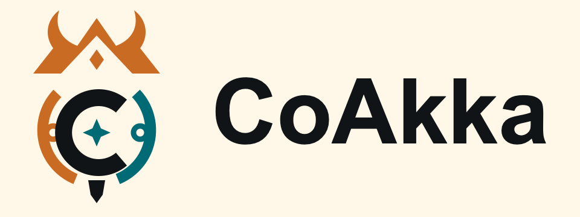

# coakka-samples

<p align="center">
  
</p>

[](https://github.com/phuong-tran/coakka-samples/actions/workflows/sample-smoke.yml)

Troubleshooting: [docs/troubleshooting.md](docs/troubleshooting.md)
Runtime addons: [docs/runtime-addons.md](docs/runtime-addons.md)
Contact: `gabrielgun1983@gmail.com`

This is a rolling sample repository, not a release product. It does not publish
GitHub Releases. Git tags may preserve useful checkpoints; the current branch,
exact dependency pins, and passing CI define the sample surface users should
run.

## Featured Runtime Samples

`coakka-samples` contains reviewable source and consumer projects only. Its
sample binaries are versioned files in `coakka-publish/main`, never GitHub
Release attachments.

| Sample | Source and run guide | Published binaries |
| --- | --- | --- |
| Raspberry Pi camera livestream | [`runtime-streaming-demo/rpi-camera/`](runtime-streaming-demo/rpi-camera/README.md) | [`coakka-publish/samples/runtime/native/rpi-camera/releases/1.1.0/`](https://github.com/phuong-tran/coakka-publish/tree/main/samples/runtime/native/rpi-camera/releases/1.1.0) |
| SFTP artifact publisher | [`runtime-addons/artifact-publisher-sftp/`](runtime-addons/artifact-publisher-sftp/README.md) | [`coakka-publish/runtime-addons/artifact-publisher-sftp/native/releases/1.1.0+42841ae2/`](https://github.com/phuong-tran/coakka-publish/tree/main/runtime-addons/artifact-publisher-sftp/native/releases/1.1.0+42841ae2) |

[`runtime-streaming-demo/`](runtime-streaming-demo/README.md) is the top-level
lane for complete Stream Lane workflows. It is a sibling of
[`runtime-addons/`](runtime-addons/README.md), not a subdirectory of one
language binding.

**CoAkka is a polyglot, multi-language, multi-platform runtime ecosystem.**

CoAkka Runtime is a native-backed capability runtime for application-owned
work across processes and languages. It helps an app route work by stable
target name, handle request/reply, report deadletters, enforce bounded
admission, and expose delivery diagnostics without turning every internal
handoff into another hand-written HTTP endpoint.

Application-owned work means capability code governed by the same product or
application boundary, even when it runs in another process, language,
container, or host.

CoAkka Logger is a separate bounded logging surface in the same ecosystem.

One native core and a stable public C ABI support native C/C++, JVM and
framework adapters, JavaScript runtimes, Python, Go, C#, Rust, Swift, Zig,
Mojo, and related host integrations according to each release's compatibility
row.

Kubernetes is a first-class deployment lane because topology, rollout, and
scale require deep operational guidance. It is not a prerequisite. The same
target, request/reply, bounded-admission, and deadletter contract also applies
to standalone Linux services, macOS and Windows hosts, containers, VMs, bare
metal, and architecture-matched edge deployments. Check the
[Ecosystem Overview](docs/ecosystem-overview.md) and the
[Compatibility Matrix](https://github.com/phuong-tran/coakka-publish/blob/main/docs/compatibility-matrix.md)
for exact package, OS, CPU, and release-channel evidence.

## Runtime Addons

[Runtime addons](docs/runtime-addons.md) are optional, independently released
capabilities that compose with public Runtime features without entering runtime
core or every runtime package. The current SFTP artifact-publisher lane shows
how Service A can acquire and verify a file, then distribute it through File
Lane.

SFTP artifact publisher `1.1.0+42841ae2` is available for Linux ARM64/x86-64,
macOS ARM64, and Windows 11 ARM64/x86-64 in the isolated
[`runtime-addons/`](runtime-addons/README.md) tree. Its native sample consumes
the immutable addon archive and Runtime `2.3.0`. The addon is still not added to
the root main lane because its release cadence is independent from Runtime and
Logger.

## Runtime Transport

Runtime transport configuration is available through the full host-language
connectors. Use the canonical guides for the supported modes, effective
capabilities, lifecycle rules, and connector examples:

- [TLS and mTLS](docs/tls-and-mtls.md)
- [Connection strategies](docs/connection-strategies.md)
- [Runtime file transfer](docs/runtime-file-transfer.md)
- [Runtime streaming](docs/runtime-streaming.md)
- [AI-assisted integration](docs/ai-assisted-integration.md)

Runtime `2.1.0` introduced the bounded File Lane. Runtime `2.3.0` adds the
official Stream Lane artifact train and neutral publisher/subscriber pressure
signals while keeping adaptation policy in the app-host. Keep commands and
authorization in the application's control plane; keep file and stream bytes
out of ordinary runtime message payloads.

Native, JVM/Maven, connector-archive, coakka-client, and
coakka-runtime-inspect sample pins resolve exact generation
`2.3.0+a83ab412`. Registry-backed npm, PyPI, and NuGet samples use `2.3.0`
and expose both File Lane and Stream Lane.

## Runtime Test

Start with the root-level [`runtime-test/`](runtime-test/README.md) when you
want to audit the native runtime boundary before choosing a language connector.
The C11 harness uses only the public C ABI and covers request/reply invariants,
bounded admission, all four connection strategies, and structured rejection on
Windows, macOS, and Linux. It also covers multi-producer race behavior,
submit-versus-stop convergence, independent lifecycle contention, and atomic
route-snapshot hot reload. Static analysis, consumer-side ASan/UBSan, and
separate ThreadSanitizer controls are included for supported Clang/GCC hosts.

```sh
bash run.sh runtime-test smoke
bash run.sh runtime-test pressure --requests 512 --queue-capacity 2
bash run.sh runtime-test file-lane
bash run.sh runtime-test stream-lane
bash run.sh runtime-test race --threads 4 --requests 256
bash run.sh runtime-test hot-reload --threads 4 --requests 256 --generations 64
```

The optional [`bench/`](bench/README.md) tooling adds environment-local load
measurements. It does not replace the correctness checks and opt-in sanitizer
runs in `runtime-test/`.

Route application-owned work without inventing another internal REST API.

## First Run

Use this as the main front door when Docker is available:

```sh
git clone https://github.com/phuong-tran/coakka-samples.git
cd coakka-samples
bash run.sh containers node-python
```

This runs two real processes in two languages with browser-visible state and
no backend HTTP fallback. It is the best first proof that CoAkka is not just a
local function-call wrapper. The committed screenshots live in
[Production Evidence](docs/production-evidence.md#visual-evidence).

If Docker is not available, use the smallest local runtime fallback:

```sh
bash run.sh runtime node basic
```

For native public-ABI smoke, pressure, stress, and soak evidence with final
JSON output, see [Runtime Test](runtime-test/README.md) or run
`bash run.sh runtime-test smoke`.
Prefer Linux for deployment-oriented measurements; Windows and macOS runs are
portable correctness gates, and VM throughput is not a comparison point.

## What To Notice

Before CoAkka, internal application work often becomes another backend HTTP
surface:

```text
controller -> backend URL -> HTTP client -> backend endpoint
```

That endpoint may not be a real public product API. It often exists only
because a capability needs an address across process, language, or deployment
boundaries.

With CoAkka, the public edge can stay public and the internal handoff can use
a runtime target:

```text
controller -> CoAkka target -> owning handler -> reply or deadletter
```

A tiny before/after shape:

```text
before:
  public createCustomer(request)
    -> customerClient.post("/internal/customers", request)
    -> customerStore.create(request)

after:
  public createCustomer(request)
    -> runtime.ask("customer.create", request)
    -> handler "customer.create"
    -> customerStore.create(request)
```

The useful shift is not "HTTP is bad." Public HTTP, gRPC, browser APIs,
auth, API gateways, Nginx, TLS/mTLS, and deployment policy still belong at
real external or platform boundaries. CoAkka focuses on application-owned work
that needs a runtime boundary without becoming another L7 service API by
default.

The runtime vocabulary is intentionally small:

```text
target
route snapshot
generation
bounded admission
reply
timeout
rejection
deadletter
delivery diagnostics
```

Callers submit an identified payload to a stable capability target. Connector
APIs may add stronger typing in their host language, but the common contract is
the target, payload identity, route snapshot, reply/deadletter, and evidence.
Stable targets name capabilities and should evolve more slowly than URLs,
transport settings, or deployment topology.

## Why Teams Adopt CoAkka

- Remove private REST handoffs that only exist to give app-owned work an
  address.
- Keep public HTTP and gRPC edges unchanged.
- Move handlers across process, language, container, or host boundaries without
  changing the caller vocabulary.
- Get bounded admission, timeout, rejection, and deadletter evidence instead of
  hidden retries and vague failures.

Typical targets look like domain capabilities: `checkout.place-order`,
`billing.charge`, `customer.create`, or `inventory.reserve`.

The container sample demonstrates this with two real processes in two
languages.

A minimal Runtime call shape:

```kotlin
runtime.handler("customer.create") { request ->
    customerStore.create(request)
}

val reply = runtime.ask(
    target = "customer.create",
    payload = request
)
```

Exact APIs vary by connector, but the runtime idea is the same: register the
owning handler, then ask the stable target.

## When To Use It

CoAkka is useful when:

- work is still owned by the same product or application boundary;
- the handler may move across process, language, container, or host;
- a stable target is clearer than another private URL and client wrapper;
- bounded admission, timeout, rejection, and deadletter evidence matter;
- the same capability should be callable consistently across multiple
  languages.

Do not add CoAkka when:

- an ordinary in-process function call is enough;
- the boundary is a real public API or independently owned service API;
- HTTP/gRPC/OpenAPI semantics are the product contract;
- the system needs durable broker topics, replay, consumer groups, or workflow
  history;
- the problem is auth, authorization, deployment policy, service-mesh policy,
  or business transaction design.

## Repository Map

| Repository | Use it for |
| --- | --- |
| [`coakka-samples`](https://github.com/phuong-tran/coakka-samples) | Runnable examples and code you can inspect first. |
| [`coakka-publish`](https://github.com/phuong-tran/coakka-publish) | Released packages, native archives, manifests, checksums, compatibility matrix, and release notes. |
| [`coakka-runtime-go`](https://github.com/phuong-tran/coakka-runtime-go) | Public Go module for CoAkka Runtime. |
| [`coakka-logger-go`](https://github.com/phuong-tran/coakka-logger-go) | Public Go module for CoAkka Logger. |
| [`coakka-runtime-swift`](https://github.com/phuong-tran/coakka-runtime-swift) | Public SwiftPM runtime package with all five native payloads; Swift execution is verified on macOS ARM64. |
| [`coakka-logger-swift`](https://github.com/phuong-tran/coakka-logger-swift) | Public SwiftPM logger package for macOS ARM64. |

Use `coakka-samples` when you want to run examples. Use `coakka-publish` when
you need exact released files, checksums, compatibility status, or release
history.

## Packages

Published package lanes are available for JVM, Node.js, Python, Go, C#, Swift,
and other runtime/logger surfaces. Package versions are independent across the
ecosystem; they do not need to share the same number.

Current package-manager entrypoints live in
[docs/current-packages.md](docs/current-packages.md). Compatibility and release
history live in
[`coakka-publish/docs/compatibility-matrix.md`](https://github.com/phuong-tran/coakka-publish/blob/main/docs/compatibility-matrix.md)
and
[`coakka-publish/docs/releases`](https://github.com/phuong-tran/coakka-publish/tree/main/docs/releases).

## Choose A Sample

| Goal | Command or doc |
| --- | --- |
| First proof across two processes and two languages | `bash run.sh containers node-python` |
| Smallest local Runtime API | `bash run.sh runtime node basic` |
| Smallest local Logger API | `bash run.sh logger node basic` |
| Route miss and deadletter evidence | `bash run.sh runtime node deadletter` |
| Route generation and hot reload | `bash run.sh runtime python hot-reload` |
| Native public-ABI correctness and connection-strategy evidence | `bash run.sh runtime-test smoke` |
| Framework handoff shape | `bash run.sh list` then choose a `runtime/scenarios/customer-crud/*` lane |
| Published npm without cloning samples | [docs/first-npm-smoke.md](docs/first-npm-smoke.md) |

Use `bash run.sh doctor` to check local prerequisites and `bash run.sh list`
to see available lanes.

## Docs Map

Start here:

- [New To CoAkka](docs/new-to-coakka.md)
- [Runtime Field Guide](docs/runtime-field-guide.md)
- [How It Works](docs/how-it-works.md)
- [Questions And Answers](docs/qna.md)

Core runtime model:

- [Runtime TLS And mTLS](docs/tls-and-mtls.md)
- [Runtime Connection Strategies](docs/connection-strategies.md)
- [Runtime Message And Routing Model](docs/runtime-message-and-routing-model.md)
- [Envelope And Deadletter Map](docs/envelope-deadletter-map.md)
- [Runtime Integration Guide](docs/runtime-integration-guide.md)
- [Runtime Glossary](docs/runtime-glossary.md)
- [Runtime Cluster Routing](docs/runtime-cluster-routing.md)
- [Runtime Logging And Observability](docs/runtime-logging-observability.md)
- [Containerized Runtime](docs/containerized-runtime.md)
- [Edge, IoT, And Industrial Android](docs/edge-iot-android.md)

Adoption and evidence:

- [Incremental Adoption](docs/incremental-adoption.md)
- [Integration Path](docs/integration-path.md)
- [Production Evidence](docs/production-evidence.md)
- [Production Readiness](docs/production-readiness.md)
- [Architecture Review Guide](docs/architecture-review-guide.md)
- [AI Reviewer Onboarding](docs/ai-reviewer-onboarding.md)
- [The CoAkka Story](docs/coakka-story.md)

Frameworks and tools:

- [CoAkka Spring Boot](docs/coakka-spring-boot.md)
- [CoAkka Quarkus](docs/coakka-quarkus.md)
- [CoAkka Runtime Client](docs/coakka-runtime-client.md)
- [CoAkka Runtime Inspect](docs/coakka-runtime-inspect.md)
- [Sample Lanes](docs/sample-lanes.md)

Repository and package boundaries:

- [Current Packages](docs/current-packages.md)
- [Repository Boundaries](docs/repository-boundaries.md)
- [CoAkka Ecosystem Naming](docs/coakka-ecosystem-naming.md)

## Boring First Production Shape

For a Kubernetes deployment, the boring first shape is:

```text
public request
  -> nginx or API gateway
    -> app-host policy
      -> CoAkka target
        -> Kubernetes Service DNS endpoint
          -> runtime handler
```

Kubernetes can own pod membership, readiness, pod churn, and pod-level
distribution. Business code does not need to see the Service DNS endpoint in
this shape. CoAkka does not need to discover individual pods in that common
shape. The app or connector maps normal platform configuration into a route
snapshot, often with a stable generation such as `1`.

Advanced expanded endpoints, weighted routing, affinity, pressure-aware
routing, and generation changes are covered in
[Runtime Cluster Routing](docs/runtime-cluster-routing.md) and
[Runtime Field Guide](docs/runtime-field-guide.md).

## CI

The public sample smoke workflow runs the supported quick lanes from published
artifacts where possible:

```sh
bash run.sh doctor
bash run.sh containers node-python smoke
bash run.sh runtime node basic
bash run.sh logger csharp basic
bash run.sh logger rust basic
bash run.sh runtime-client
```

Individual sample READMEs document lane-specific prerequisites and expected
output.

## License And Trademark

See [TRADEMARKS.md](TRADEMARKS.md) for CoAkka naming and trademark guidance.
Sample source licensing and published artifact licensing are documented
separately. Use the license terms shipped with each release artifact for that
artifact, and the repository license files for sample source and docs.
