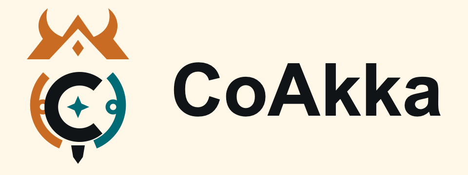

# CoAkka Documentation

  

CoAkka is a polyglot, multi-language, multi-platform distributed runtime ecosystem.
Start with **CoAkka Runtime**: its connectors project target, request/reply,
bounded-admission, deadletter, capability and configuration contracts into
their host languages. Logger, Runtime addons and the independent HTTP
server/client have separate guides and distribution channels.
Kubernetes is a first-class deployment shape, not a prerequisite; the same
runtime contract also applies to standalone hosts, containers, VMs, bare metal,
and architecture-matched edge deployments.

## Start Here

- [New to CoAkka](new-to-coakka.md)
- [How CoAkka works](how-it-works.md)
- [Ecosystem overview](ecosystem-overview.md)
- [Integration path](integration-path.md)
- [Questions and answers](qna.md)

## Choose A Product

| Product | Runnable examples | Package guidance |
| --- | --- | --- |
| CoAkka Runtime | [Language samples](../runtime/README.md), [multi-process containers](../containers/README.md) | [Published packages](current-packages.md) |
| CoAkka Logger | [Logging and pressure samples](../logger/README.md) | [Independent Logger coordinates](current-packages.md#package-and-source-entrypoints) |
| Runtime Addons | [Native integration samples](../runtime-addons/README.md) | [Addon capabilities and distribution](runtime-addons.md) |
| CoAkka HTTP Runtime | [HTTP language samples](../coakka-http-runtime/README.md), [feature index](../coakka-http-runtime/FEATURES.md) | [HTTP guide](coakka-http-runtime/README.md); repository archives, not registry packages |

For an introduction to HTTP Runtime, read
[why it exists, the shared-runtime benefits and supported features](coakka-http-runtime-introduction.md),
then use its [detailed guide](coakka-http-runtime/README.md).

The sections below follow the Runtime learning path. For HTTP server/client
configuration, TLS, monitoring and benchmarks, stay within the HTTP product
guide; Runtime settings and install coordinates are not interchangeable.

## Build And Integrate Runtime

- [Runtime integration guide](runtime-integration-guide.md)
- [AI-assisted integration](ai-assisted-integration.md)
- [Runtime file transfer](runtime-file-transfer.md)
- [Runtime streaming](runtime-streaming.md)
- [Current packages](current-packages.md)
- [Sample lanes](sample-lanes.md)
- [First npm smoke](first-npm-smoke.md)
- [Spring Boot](coakka-spring-boot.md)
- [Quarkus](coakka-quarkus.md)
- [Two-machine Linux setup](two-machine-linux.md)

## Runtime Transport And Security

- [Connection strategies](connection-strategies.md)
- [TLS and mTLS](tls-and-mtls.md)
- [Runtime message and routing model](runtime-message-and-routing-model.md)
- [Envelope and deadletter map](envelope-deadletter-map.md)
- [Replica-owner File and Stream grants](runtime-lane-owner-grants.md)
- [Cluster routing](runtime-cluster-routing.md)
- [Containerized runtime](containerized-runtime.md)
- [Edge, IoT, and industrial Android](edge-iot-android.md)

## Operate And Verify Runtime

- [Runtime field guide](runtime-field-guide.md)
- [Logging and observability](runtime-logging-observability.md)
- [CoAkka client](coakka-runtime-client.md)
- [Runtime inspect](coakka-runtime-inspect.md)
- [Native Runtime test harness](../runtime-test/README.md)
- [Troubleshooting](troubleshooting.md)
- [Production readiness](production-readiness.md)
- [Production evidence](production-evidence.md)
- [Runtime package and platform evidence](runtime-package-platform-evidence.md)
- [Signing and platform trust](runtime-release-signing-and-platform-trust.md)

## Reference And Support

- [Runtime story](coakka-story.md)
- [Architecture review guide](architecture-review-guide.md)
- [AI reviewer onboarding](ai-reviewer-onboarding.md)
- [Brand assets](brand-assets.md)
- [Runtime glossary](runtime-glossary.md)
- [Ecosystem naming](coakka-ecosystem-naming.md)
- [Repository boundaries](repository-boundaries.md)
- [Contact and support](contact-and-support.md)

For exact package, OS, CPU, and native-generation evidence, use the public
[compatibility matrix](https://github.com/phuong-tran/coakka-publish/blob/main/docs/compatibility-matrix.md).
