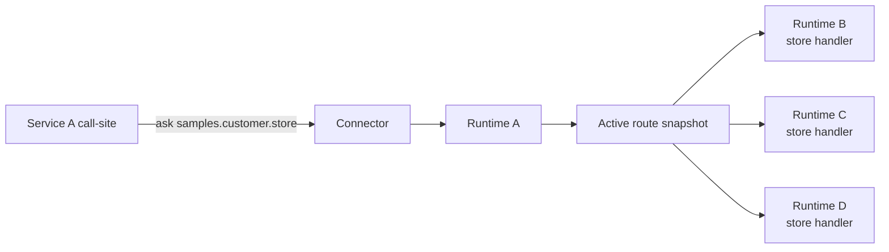
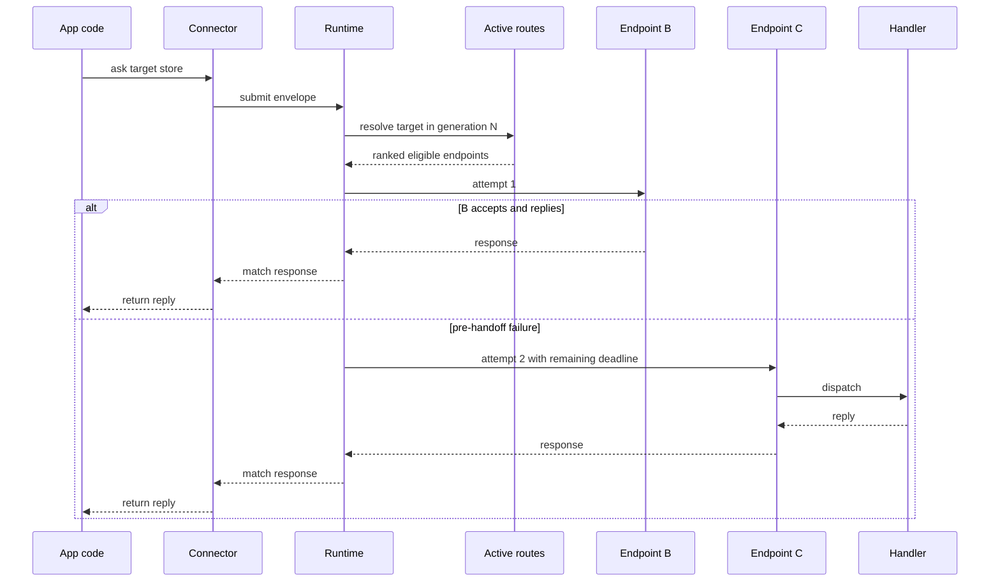
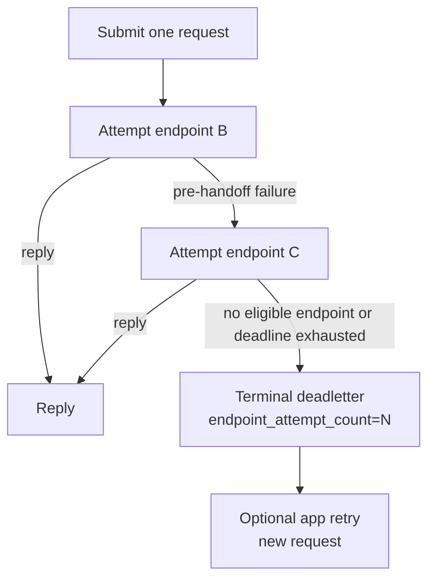
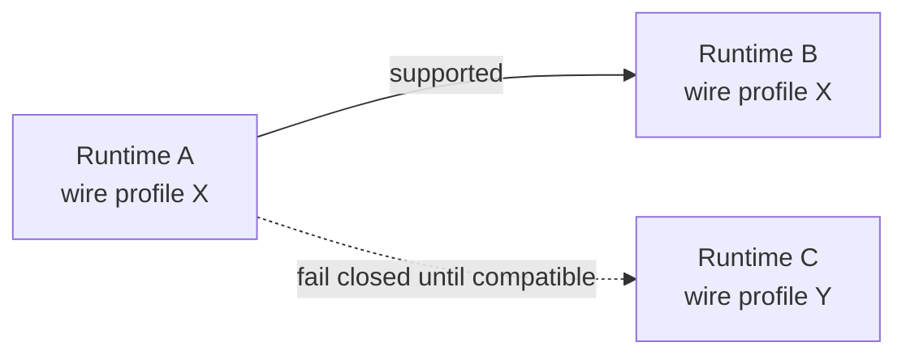

# Runtime Cluster Routing

This note explains the cluster-style routing model behind the samples. It is a
runtime delivery feature, not an application-host feature. The call-site asks
for a target; the runtime decides which eligible endpoint handles that target
inside the active route generation.

## What Cluster Means Here

In CoAkka, a cluster is not a membership system, a service mesh, or a business
workflow coordinator.

It is a route shape:

```text
target = samples.customer.store
endpoints = customer-store-a, customer-store-b, customer-store-c
strategy = WEIGHTED_ROUND_ROBIN or RENDEZVOUS_HASH
```

The caller does not choose `customer-store-a` directly. It submits the request
to `samples.customer.store`. The runtime owns endpoint selection, bounded
delivery attempts, reply matching, deadletter evidence, and counters.



The important boundary is boring by design:

```text
call-site: ask(target, payload, timeout)
runtime: resolve route, select endpoint, deliver, match reply or deadletter
```

## Responsibility Split

| Layer | Owns |
| --- | --- |
| App host | Business validation, idempotency, user retry policy, HTTP or UI mapping. |
| Connector | Host-language API, config mapping, payload encoding, handler registration. |
| Runtime | Route generation, endpoint selection, failover attempt chain, correlation, timeout budget, deadletters, stats. |
| Transporter | Runtime-to-runtime delivery mechanics for one compatible wire profile. |

This is why cluster routing belongs in the runtime. It is not the app-host
guessing which peer is busy, and it is not call-site code maintaining a list of
hosts. The app-host still owns business meaning; the runtime owns delivery.

## Request Path



The second attempt is still the same request lifecycle. It keeps the same
business intent, correlation, active generation, and monotonic deadline budget.

## Route Generation Discipline

`generation` is a route-snapshot version, not a distributed consensus term.
The runtime applies a newer snapshot locally and rejects stale snapshots, but it
does not elect a leader, merge competing snapshots, or repair split-brain by
itself.

Use these rules when publishing route snapshots:

- one generation number must describe one exact route snapshot for a target set
- a topology change, endpoint flag change, strategy change, or rollback is a
  new snapshot with a higher generation
- two partitions must not independently mint different snapshots with the same
  generation
- if a partition cannot reach the route publisher, it should keep its current
  accepted generation or drain affected endpoints instead of inventing a new
  one
- after a partition heals, reconciliation is another explicit snapshot with a
  higher generation

This keeps the runtime boundary small. The runtime can fail closed on stale or
incompatible route state and report the active generation in diagnostics; the
deployment control plane owns the single-writer or quorum rule that decides
which route snapshot is next.

## Retry Versus Failover

Use different words for two different things:

| Term | Meaning |
| --- | --- |
| Endpoint failover attempt | Runtime tries another eligible endpoint inside the same request lifecycle after evidence that the previous endpoint did not accept ownership. |
| User retry | App or caller submits a new request after a terminal result, using business idempotency and a bounded retry budget. |

Example:

```text
user request #1
  runtime attempt endpoint B
  B is down before handoff
  runtime attempt endpoint C
  C replies OK
  user sees success
```

That is not a user retry. It is one request with two endpoint attempts.

If every eligible endpoint fails before the request can complete, runtime emits
one terminal deadletter or timeout. That terminal outcome can include endpoint
attempt evidence, such as `endpoint_attempt_count = 3`. Only after that result
does application retry policy decide whether to submit a new request.



## Safe Failover Evidence

Runtime only moves to another endpoint when the failure evidence is safe for
delivery-level failover.

Safe evidence:

- endpoint was unavailable or drained before selection
- connect or send failed before accepted handoff
- remote runtime rejected admission before handler ownership
- forwarded remote deadletter proves pre-handler rejection, such as queue
  rejection or local handoff failure

Terminal evidence:

- selected endpoint may have accepted the envelope
- remote handler may have started
- reply timed out after ownership was accepted
- business handler returned an application failure
- remote deadletter means invalid envelope, route mismatch, or business
  failure

Terminal evidence does not trigger another runtime endpoint attempt by default.
The app can still retry above the runtime if the operation is safe to run
again.

## Route Snapshot Example

The app host or connector maps platform config into a route snapshot. The shape
below is illustrative and mirrors the route vocabulary used by the samples:

```yaml
generation: 42
routes:
  - target: samples.customer.store
    strategy: WEIGHTED_ROUND_ROBIN
    endpoints:
      - host: customer-store-a.default.svc.cluster.local
        port: 19301
        weight: 1
        flags: [NONE]
      - host: customer-store-b.default.svc.cluster.local
        port: 19301
        weight: 1
        flags: [NONE]
      - host: customer-store-c.default.svc.cluster.local
        port: 19301
        weight: 1
        flags: [NONE]
```

For ownership-bound work, use a strategy that preserves ownership:

```yaml
generation: 43
routes:
  - target: samples.order.command
    strategy: RENDEZVOUS_HASH
    routeKeyHint: order_id
    endpoints:
      - host: order-worker-a.default.svc.cluster.local
        port: 19301
        flags: [NONE]
      - host: order-worker-b.default.svc.cluster.local
        port: 19301
        flags: [NONE]
      - host: order-worker-c.default.svc.cluster.local
        port: 19301
        flags: [NONE]
```

`SINGLE_OWNER` remains the conservative shape for one owner. Multi-endpoint
failover belongs to multi-endpoint strategies such as weighted selection or
rendezvous selection after excluding endpoints already failed by the current
request.

## Rendezvous Hash Stability

`RENDEZVOUS_HASH` is for stable key-to-endpoint selection across route
generations. It is not a promise that a key can never move. It minimizes
movement when the endpoint set changes.

Keep these inputs stable:

- `routeKeyHint` should name a field or header that every caller can supply
  deterministically
- the hinted value should be normalized the same way in every connector, for
  example the same tenant id or order id string, not a language-specific object
  rendering
- endpoint identity should be stable across generations; changing host, port,
  wire profile, or endpoint id is treated like removing one endpoint and adding
  another
- every runtime that may select for the same target should use the same active
  generation before expecting the same key to pick the same endpoint

When adding endpoint D to `[A, B, C]`, rendezvous hashing should only move keys
whose best score becomes D. Keys that still score highest for A, B, or C remain
there. Removing B only remaps keys that previously chose B. This is the reason
to use rendezvous for sharded or ownership-bound work instead of simple
round-robin.

## Call-Site Shape

The call-site stays intentionally plain. It should not know which endpoint will
handle the request.

```kotlin
val reply = runtime.askJson(
    target = "samples.customer.store",
    messageType = "samples.customer.create.request.v1",
    payload = CreateCustomerRequest(id = "cust-001", name = "Ada"),
    timeoutMs = 1500,
    headers = mapOf("tenant" to "acme", "request_id" to "req-123"),
)
```

If the first selected endpoint fails before handoff and another eligible
endpoint completes the request, this call still returns one normal reply. If
all eligible endpoints fail, the connector surfaces one delivery failure with
runtime evidence:

```text
reason=REMOTE_TRANSPORT_FAILED
target=samples.customer.store
generation=42
endpoint_attempt_count=3
```

The app may log this, map it to an HTTP response, or decide whether a new user
retry is allowed. It should not rebuild endpoint failover in the controller.

## Transport Compatibility

All runtimes participating in one remote route must speak a compatible
runtime-to-runtime wire profile.



The published remote hardening path requires matching runtime-to-runtime
wire profiles. A future transporter can be added behind the same host-facing C
ABI only when compatibility is made explicit. Do not assume a route can mix
transport engines just because every process exposes the same connector API.

## Operator Reading

Useful counters and evidence:

| Evidence | Meaning |
| --- | --- |
| `remote_failover_attempt_count` | Runtime selected a replacement endpoint inside the same request lifecycle. |
| `remote_failover_success_count` | A request that used failover later completed with a response. |
| `remote_failover_exhausted_count` | Runtime had failover evidence but no eligible next endpoint, matching generation, or remaining deadline. |
| `endpoint_attempt_count` | Terminal deadletter evidence for how many endpoint attempts were consumed by one request. |

Read these as runtime delivery evidence, not business retry evidence.

## Design Rule

Cluster routing is a missing runtime capability, not a request for app-hosts to
think harder.

Keep call-sites boring:

```text
ask target -> get reply, timeout, or deadletter
```

Keep topology in route snapshots:

```text
target -> strategy -> eligible endpoints -> generation
```

Keep business policy above the runtime:

```text
idempotency, retry budget, user-facing error mapping
```
