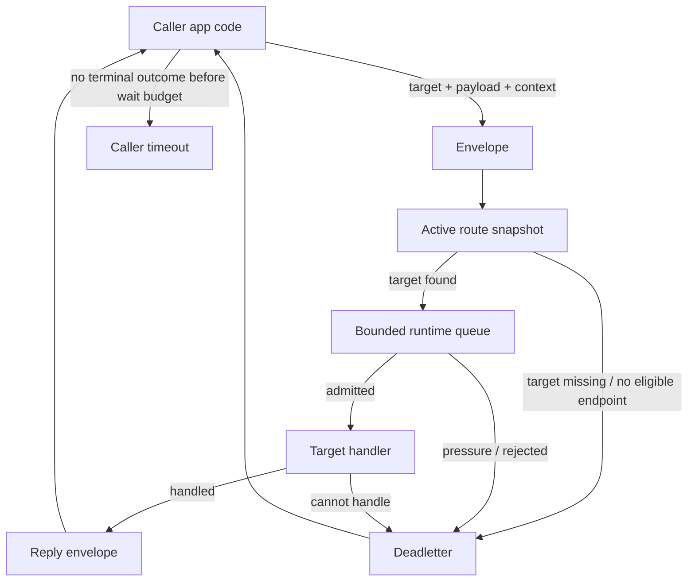
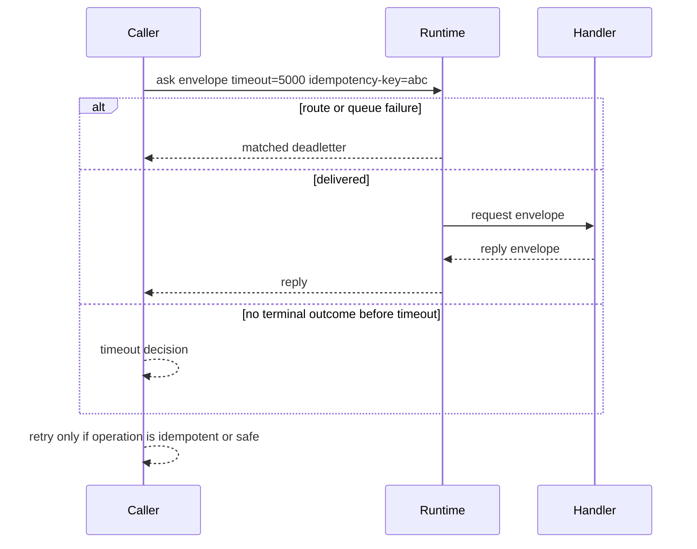

# Envelope And Deadletter Map

This page explains the runtime message shape used by the samples. It is a
mental model first, not a connector API reference. Connector names vary by
language, but the runtime vocabulary is the same.

## One-Screen Flow



## What An Envelope Carries

An envelope is the runtime wrapper around one piece of work. It is not only the
payload. It carries routing, payload identity, request context, and matching
metadata so the runtime can deliver or fail the work explicitly.

| Field or concept | Plain meaning | Tune or choose it when |
| --- | --- | --- |
| `target` | Stable capability address, such as `samples.customer.store`. | You decide what capability the caller wants. Keep it stable across language/process moves. |
| `source` | Caller or responder identity used in diagnostics and replies. | You want logs/deadletters to show who sent the work. |
| `payload` | Business command/query/event bytes. Samples usually use JSON for readability. | You change business data. Put business arguments here, not in headers. |
| payload identity | Message type, schema version, and payload format. | You version a request/reply/event contract. |
| `headers`, metadata, or extra params | Small request context next to the envelope. | You need tenant, request id, idempotency key, trace id, or diagnostics context. |
| `operation` | Human operation label for logs and diagnostics. | You want readable traces such as `create_customer` or `route_miss`. |
| timeout / `timeoutMs` / `timeout_ms` | Caller wait budget for an ask. | You choose how long this caller should wait for a reply or terminal failure. |
| correlation id | Runtime/request matching identity, visible to handlers in some connector APIs. | You trace one ask/reply/deadletter path. Usually let the connector/runtime create or preserve it. |
| route generation | Version of the active route snapshot used for routing. | You apply new route config or debug why a target resolved a certain way. |

Use this split:

```text
target  = where this work should go
payload = business data
headers = small request context
timeout = how long this caller is willing to wait
```

Do not use headers as a second payload schema. If a value changes the business
meaning of the command or query, put it in the typed payload and version it
through payload identity.

## Deadletter Meaning

A deadletter is a structured terminal delivery result. It says "this envelope
did not reach a successful handler/reply path" and carries enough context for a
caller, test, or operator to understand why.

| Case | Typical evidence | Caller should |
| --- | --- | --- |
| target is not in the active route snapshot | route-miss deadletter with target and generation | fix route config or target name |
| endpoint exists but is unavailable or drained | no eligible endpoint / unavailable evidence | wait for route/endpoint recovery or fail fast |
| runtime queue is full or pressure policy rejects intake | queue-rejected deadletter and counters | reduce burst, increase capacity carefully, or add backpressure |
| handler cannot decode or rejects the payload | handler/application failure evidence, depending on connector path | fix payload contract or handler validation |
| route snapshot is stale or invalid during reload | stale/invalid apply result, active generation unchanged | publish a newer valid generation |
| no reply/deadletter arrives before caller wait budget | caller timeout | decide whether retry is safe for that operation |

The public samples currently make route-miss and queue-pressure behavior the
most visible. More connector paths may expose additional deadletter reasons as
the runtime surface grows, but the ownership rule stays the same: failures
should be explicit outcomes, not silent drops.

## Retry Ownership

CoAkka does not make business retry decisions for the samples. Retry belongs to
the caller/application unless a specific sample says otherwise.



Use retries only after answering these questions:

| Question | Why it matters |
| --- | --- |
| Is the operation idempotent? | Retrying `create` can duplicate work unless the payload carries an idempotency key. |
| Did runtime return a deadletter? | Route miss and queue rejection are different failures and should not use the same retry rule. |
| Did the caller only time out? | The handler may still complete later; retry can create duplicate effects. |
| Is there a bounded retry budget? | Unbounded retries can turn a small outage into queue pressure. |
| Is the retry context in headers or payload? | Idempotency keys and tenant/trace context must survive each attempt. |

Practical defaults:

| Work type | Retry stance |
| --- | --- |
| read/query | retry can be reasonable with a short bounded budget |
| idempotent command | retry only with an idempotency key or natural idempotent business key |
| non-idempotent command | do not auto-retry after timeout without application-level reconciliation |
| route miss | usually fix route/config, do not blind retry |
| queue pressure | back off or shed load; increasing queue size is not the first fix |

## Tuning Parameters

| Parameter | Start with | Increase when | Decrease when |
| --- | --- | --- | --- |
| `timeoutMs` / `timeout_ms` | a caller-specific wait budget, not a global constant | the handler normally needs more time and duplicate retry would be worse | callers need fast fallback or overload protection |
| `queueCapacity` | conservative bounded value | measured bursts are legitimate and memory budget allows it | latency grows, memory budget is tight, or pressure should surface earlier |
| `strictNoDrop` | `true` while integrating | almost always keep true for visible failures | only when a specific fire-and-forget path can safely drop |
| `separateDeliveredRequestLane` | `true` for request/reply hosts | inbound work competes with replies/deadletters | only for a tiny one-way-only host after measurement |
| route `generation` | start at `1`, increment on updates | applying new route snapshots | never reuse old values for new topology |
| endpoint flags | `LOCAL` only where this process owns the handler | a process starts owning a target | an endpoint is draining or temporarily unavailable |
| `headers` | minimal context | diagnostics need tenant/request/idempotency/trace context | data is really business payload |

## Where To Put A Value

| Value | Put it in | Example |
| --- | --- | --- |
| capability being called | `target` | `samples.customer.store` |
| command/query body | `payload` | `{ "customerId": "cust-001" }` |
| schema and format | payload identity | `samples.customer.create.request.v1`, JSON |
| tenant or request id | headers / metadata / extra params | `tenant=acme`, `x-request-id=req-123` |
| retry dedupe key | payload or headers, depending on business ownership | `idempotency-key=create-cust-001-42` |
| caller wait budget | timeout | `timeoutMs = 5000` |
| operation label for logs | operation | `create_customer` |
| process owns handler | route endpoint flag | `LOCAL` |

## Reading A Sample

When you open a sample, find these in order:

1. start spec: `systemName`, `nodeId`, queue policy, route generation
2. route table: which `target` points to which endpoint
3. handler registration: which target this process owns locally
4. ask/event call: target, source, payload identity, payload, timeout, operation
5. failure handling: deadletter/timeout branch and stats output

That is the runtime boundary. The surrounding web controller, CLI, desktop UI,
or job code is only the app-host deciding when to submit work into that
boundary.
