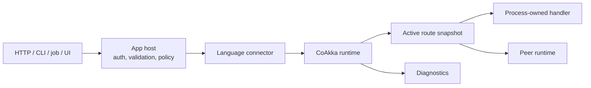
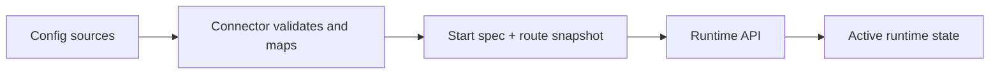
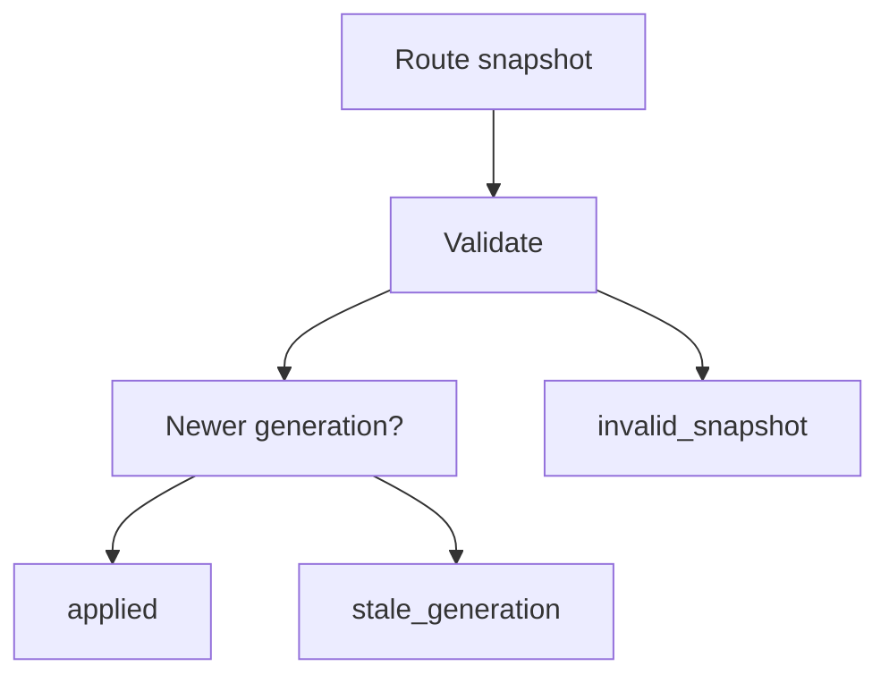
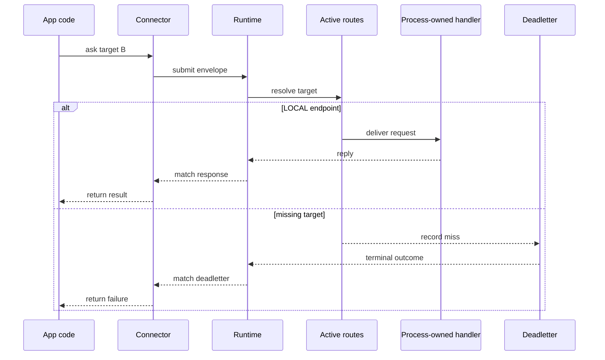
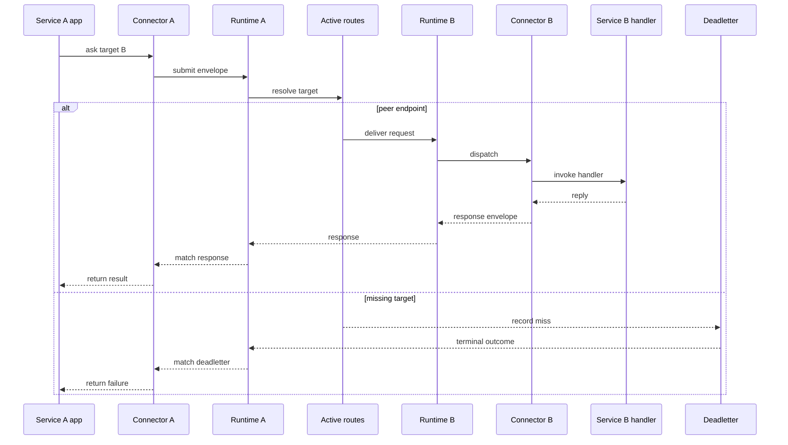

# How It Works

CoAkka keeps a hard boundary between the application host, the connector, and
the native runtime. The app keeps owning framework concerns and business
policy. The runtime owns delivery by target, route generation, bounded
admission, reply matching, deadletters, stats, and diagnostics.



The connector adapts the host language and framework. It reads host
configuration, builds the runtime start spec, applies route snapshots,
registers process-owned handlers, maps payloads, and ties framework lifecycle
to runtime start and shutdown.

The runtime core stays platform-agnostic. The connector receives framework and
platform configuration, then passes explicit start specs, route snapshots,
handlers, envelopes, and lifecycle calls into the runtime.

## Startup Configuration

The connector or framework adapter reads the host environment, validates the
shape, builds a start spec and route snapshot, then passes those values through
the runtime API.



Configuration sources can be files, process environment, framework config,
Kubernetes ConfigMaps or Secrets, Service DNS, Helm values, static deployment
config, or another config service. The connector maps those sources into the
runtime contract.

For most container deployments this is startup work, not a continuous hostname
update loop. A pod or service gets its advertised host from Kubernetes
metadata, Service DNS, or environment when the process starts.
Replicas of the same app role normally share the same runtime port.

The separation keeps responsibilities testable:

- runtime tests focus on route application, target resolution, correlation,
  queue pressure, deadletters, and lifecycle
- connector tests focus on config mapping, payload encoding, handler
  registration, and framework shutdown behavior

## Route Apply

Route apply is the critical API shape. Startup uses it for the initial route
snapshot. Hot reload uses the same shape later if an operator needs to change
routes without restarting the process.

```text
applyRoutes(generation, routes) -> applied | stale_generation | invalid_snapshot
```



The result is intentionally small:

- `applied`: runtime atomically swaps to the new route table
- `stale_generation`: runtime keeps the current route table because the
  snapshot is not newer
- `invalid_snapshot`: runtime keeps the current route table because the
  snapshot shape is not acceptable

## Same-Process Delivery

Same-process delivery is the compact case. The caller asks a target, the
active route snapshot resolves that target to a local handler, and the runtime
matches the reply or deadletter back to the caller.



## Multi-Process Delivery

Multi-process delivery uses the same target vocabulary, but the active route
points to a peer runtime. The caller still asks a target instead of calling a
private backend HTTP controller.



The caller does not call a backend HTTP controller in either path. It asks a
runtime `target`; the active route snapshot decides whether that target maps to
a handler owned by this process, a peer runtime, or a deadletter.

## Strict Semantics

The runtime semantics stay strict:

- `generation` must increase for a new snapshot
- route apply is atomic; a failed apply leaves the active route table
  untouched
- diagnostics report the active generation
- route misses produce deadletters with target, reason, and generation context
- in-flight requests continue to be matched by correlation
- new sends observe the active route snapshot at send time
- rollback is another explicit snapshot with a newer generation, not a partial
  mutation of runtime state

For adoption guidance, read [Incremental Adoption](incremental-adoption.md).
For vocabulary and full routing details, read
[Runtime Message And Routing Model](runtime-message-and-routing-model.md) and
[Runtime Glossary](runtime-glossary.md).
