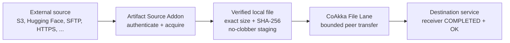
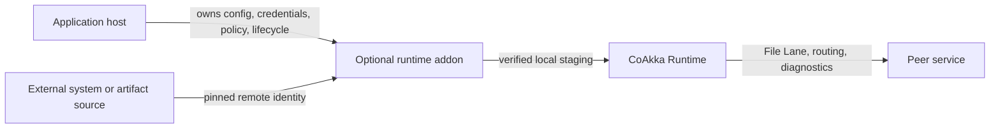
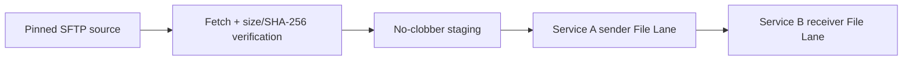

# Runtime Addons

Runtime addons are optional, independently released capabilities that compose
with CoAkka Runtime without becoming part of runtime core or the default runtime
package. Each addon owns one focused external workflow or protocol family and
uses stable runtime features such as File Lane when distribution is needed.

The current released family is **Artifact Source Addons**, also described in
user-facing material as **file acquisition providers** or provider-specific
downloaders. They answer a question that File Lane intentionally does not
answer: how does an application obtain the exact file before a point-to-point
transfer can begin?

## Why These Addons Exist

File Lane starts with a stable local source file. It moves that known file
between two trusted CoAkka application hosts with bounded I/O, explicit
authorization, resume, cancellation, exact size and SHA-256 verification, and
terminal outcomes on both peers.

Real workflows often begin one step earlier. The required file may exist only
as an S3 object version, Hugging Face commit, GitHub release asset, Google Drive
revision, SFTP path, or immutable HTTPS resource. Runtime core should not own
every provider SDK, credential format, retry law, redirect rule, or remote
identity model. An Artifact Source Addon acquires and realizes that remote
identity as one verified local file; File Lane can then distribute it.



This is the boundary:

- **Artifact Source Addon:** obtain one pinned external file and make its local
  identity trustworthy;
- **File Lane:** transfer already-realized bytes between CoAkka peers;
- **application host:** own credentials, authorization, business rollout,
  destination choice, and the decision to activate the received artifact.

If a diagnostic bundle or generated media file already exists locally, no
source addon is required; send it through File Lane directly. If the bundle is
retained in an external store and another workflow must acquire that exact
revision first, select the matching source addon.

## A Practical AI-Era Story

An inference worker may require an 8 GB model, tokenizer, embedding index, or
dataset shard that is not installed on its host. Sending a small `load-model`
command does not create those bytes, and embedding them in an ordinary runtime
message would destroy the bounded message contract.

A production-shaped workflow is:

1. the application selects an immutable model identity, expected size, and
   SHA-256 digest;
2. the matching Hugging Face, S3, OCI, HTTPS, or other source addon authenticates
   and acquires that exact remote revision;
3. the addon stages the verified file without replacing an existing path;
4. File Lane transfers the staged file to the selected inference worker;
5. the worker activates the model only after its receiver reaches
   `COMPLETED + OK` and application policy accepts the identity.

The same shape applies to large media inputs, checkpoints, build artifacts,
firmware, backup fragments, archived logs, and diagnostic bundles. Addons do
not turn Runtime into a content catalog or cloud-storage SDK; they provide the
small protocol-specific bridge needed before Runtime can move the file.

## Why Not Add Another Internal HTTP File Server?

HTTP remains the right choice for browser downloads, public APIs, CDN caching,
and broadly shared long-lived objects. It can also transfer large files when an
application deliberately engineers the complete upload/download contract.
The problem is repeatedly creating an internal HTTP server solely to hand one
large application-owned file to another service.

| Concern | Ad hoc internal HTTP endpoint | Artifact Source Addon + File Lane |
| --- | --- | --- |
| External provider acquisition | Each service implements provider credentials, redirects, revisions, retries, and staging. | One focused addon owns the provider protocol and remote identity law. |
| Large-byte path | The application must design streaming, request-thread isolation, body limits, temporary files, and memory bounds around its HTTP framework. | File bytes use a dedicated bounded lane and stay out of ordinary message envelopes. |
| Integrity | Size, digest, partial-download cleanup, and final-file publication are application-specific unless implemented explicitly. | The source is size/SHA-256 verified; the receiver verifies a temporary file before atomic publication. |
| Resume and cancellation | Range semantics, committed offsets, cancellation, and retry identity need a custom contract. | File Lane exposes committed-offset resume, cooperative cancellation, waits, and retained terminal state. |
| Completion | A successful client response can be confused with durable receiver acceptance unless both sides define it carefully. | Sender and receiver outcomes are distinct; the destination may use the file only after receiver `COMPLETED + OK`. |
| Reuse | Every internal file endpoint adds routing, authentication, observability, and lifecycle surface. | Provider mechanics remain in an optional addon; peer delivery reuses the Runtime lifecycle and diagnostics contract. |

This is not a claim that HTTP cannot move large files. It is a reason not to
invent another private HTTP API when the application needs a bounded,
identity-verified, point-to-point file handoff between CoAkka peers.

> **Current status:** eleven artifact-source addons are public at native
> `1.1.0+d1032f6d`; SFTP is public at replacement native
> `1.2.0+88b9a047`. They remain separate from the default Runtime package and
> expose native C ABIs only; no high-level language addon connector is claimed.

## Language Connectors: Ready To Port, Demand-Driven

Artifact-source addons are supported as native C ABI products first. The native
implementation, package evidence, and C11 consumer sample are the maintained
integration boundary for each released addon.

There are currently no released addon-specific connectors for JVM, Python,
Node.js, Go, .NET, Swift, or other high-level hosts. This is a scope decision,
not a protocol-engine blocker. The public C ABI already isolates lifecycle,
bounded inputs and outputs, cancellation, failure reporting, and Runtime/File
Lane composition so a language connector can wrap the addon without rewriting
its provider engine.

Supporting every provider across every host language and native platform still
requires substantial ownership work: lifetime-safe bindings, callback and
threading laws, package layout, credential handling, failure mapping,
matching-host execution, and long-term compatibility. Addon connectors will be
released when demonstrated demand justifies that matrix. Until then, only the
documented native C ABI and C11 samples are claimed as supported surfaces;
portability readiness must not be presented as an already-published connector.

## Where Addons Fit



The host starts Runtime and explicitly starts the addon it selected. Runtime
does not discover every external protocol, own addon credentials, or absorb
addon policy. The addon owns its protocol mechanics and bounded workflow while
Runtime keeps ownership of routing, lane semantics, lifecycle contracts,
deadletters, and runtime diagnostics.

This separation keeps ordinary runtime consumers small and predictable:

- users who do not need an addon do not receive its dependencies or workers;
- one addon does not become a collection of unrelated protocols;
- addon and runtime versions can advance independently;
- external protocol code does not widen the runtime core ABI;
- a release can be audited and rolled back without replacing Runtime.

## When To Use One

Use a runtime addon when an application host needs a reusable external
capability that is broader than one app's helper function but does not belong in
runtime core. Examples include acquiring a verified artifact from SFTP and then
publishing it through File Lane, or a future storage integration with its own
credentials, retry policy, and protocol-specific failure model.

Keep the workflow in the app host when it is application-specific, has no
stable cross-service contract, or does not benefit from a separately versioned
and audited native capability. Do not add a protocol to an existing addon only
because both protocols move files; separate dependencies, security models, and
failure semantics should remain separate addon products.

## Package And Compatibility Contract

A promoted addon is a separate archive under:

```text
runtime-addons/<addon>/native/releases/<release>/
```

Its manifest declares:

- addon identity and independent version;
- required runtime ABI major and minimum native runtime version;
- required public runtime features;
- exact native platforms and exported C symbols;
- owned native dependencies and matching-host evidence;
- the archive digest and install metadata.

The archive contains the addon, not another copy of CoAkka Runtime. Protocol,
crypto, and compression dependencies must be self-contained when their licenses
permit it; target users must not be asked to install ambient implementation
libraries. Operating-system libraries remain explicit platform dependencies.

Never infer availability from a source directory or package template. A runtime
addon is installable only when its immutable archive appears in
[`artifacts/public-artifacts.tsv`](https://github.com/phuong-tran/coakka-publish/blob/main/artifacts/public-artifacts.tsv)
with its manifest and `SHA256SUMS`.

## Choose A File Acquisition Provider

Choose the addon from the file's current authoritative location, not from the
language of the consuming service:

| File currently lives in | Artifact Source Addon |
| --- | --- |
| Immutable or digest-pinned web resource | HTTPS |
| S3 or MinIO versioned object | S3/MinIO |
| Azure Blob exact object version | Azure Blob |
| Google Cloud Storage generation | GCS |
| Strong-ETag WebDAV resource | WebDAV |
| Content-addressed container-registry blob | OCI Distribution |
| Commit-pinned model or dataset file | Hugging Face Hub |
| Exact GitHub release asset | GitHub Release |
| Retained Google Drive blob revision | Google Drive |
| Exact Dropbox revision | Dropbox |
| Stable file below an application-owned drop root | Local Drop |
| Host-key-pinned remote path | SFTP |

Release directories retain the established `artifact-publisher-<source>` name.
In this family, `publisher` means the addon publishes the acquired, verified
file into the File Lane workflow; it does not mean the addon uploads a new file
to S3, Hugging Face, SFTP, or another external provider.

## Current Addon Releases

| Addon | Workflow | Public status |
| --- | --- | --- |
| HTTPS, S3/MinIO, Azure Blob, GCS, WebDAV, OCI Distribution, Hugging Face Hub, GitHub Release, Google Drive, Dropbox | Acquire one immutable remote identity, verify size/SHA-256, stage without replacement, and distribute through File Lane. | Public native `1.1.0+d1032f6d`; [native C11 samples](https://github.com/phuong-tran/coakka-samples/tree/main/runtime-addons). |
| Local Drop | Acquire one stable file below an anchored POSIX drop root and distribute through File Lane. | Public native `1.1.0+d1032f6d` for Linux ARM64/x86-64 and macOS ARM64; native C11 sample. |
| [SFTP artifact publisher](https://github.com/phuong-tran/coakka-publish/tree/main/runtime-addons/artifact-publisher-sftp) | Acquire one host-key-pinned SFTP file and distribute through File Lane. | Replacement native `1.2.0+88b9a047` for five targets; [native C11 sample](https://github.com/phuong-tran/coakka-samples/tree/main/runtime-addons/artifact-publisher-sftp/native). |

The SFTP workflow composes existing boundaries:



Fetching alone is not a successful publish. The addon reaches aggregate
success only after the verified artifact has reached the required File Lane
terminal outcomes. The app host still owns credentials, authorization grants,
business retry/rollout policy, and the lifecycle ordering of Runtime, File Lane,
and the addon.

## Release Evidence

Every advertised platform needs matching-host module execution and dynamic
dependency inspection. Cross-compilation proves that an artifact can be built;
it does not prove that it loads, transfers data, cancels, or shuts down on that
platform. Package templates and source candidates must stay visibly distinct
from promoted public coordinates.

The current immutable coordinate is:

```text
runtime-addons/artifact-publisher-sftp/native/releases/1.2.0+88b9a047/
  coakka-runtime-addon-artifact-publisher-sftp-native-1.2.0.tar.gz
```

Its matching-host evidence covers all five packaged modules, reviewed exports,
dynamic dependencies, pinned-host SFTP failures, cancellation and shutdown
paths, and File Lane delivery. Windows staging is directory-handle-relative and
rejects reparse roots. Linux sanitizer evidence covers ASan plus UBSan and TSan
on both architectures.

For exact current coordinates, read [Current Packages](current-packages.md).
For ownership across repositories, read
[Repository Boundaries](repository-boundaries.md).
