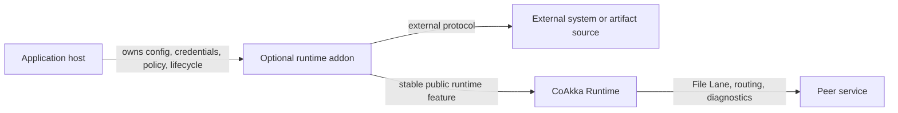
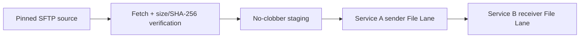

# Runtime Addons

Runtime addons are optional, independently released capabilities that compose
with CoAkka Runtime without becoming part of runtime core or the default runtime
package. Each addon owns one focused external workflow or protocol family and
uses stable runtime features such as File Lane when distribution is needed.

> **Current status:** eleven artifact-source addons are public at native
> `1.1.0+d1032f6d`; SFTP is public at replacement native
> `1.2.0+88b9a047`. They remain separate from the default Runtime package and
> expose native C ABIs only; no high-level language addon connector is claimed.

## Where Addons Fit



The host starts Runtime and explicitly starts the addon it selected. Runtime
does not discover every external protocol, own addon credentials, or absorb
addon policy. The addon owns its protocol mechanics and bounded workflow while
Runtime keeps ownership of routing, lane semantics, lifecycle contracts,
deadletters, and runtime diagnostics.

This separation keeps ordinary runtime consumers small and predictable:

- users who do not need an addon do not receive its dependencies or workers;
- one addon does not become a collection of unrelated protocols;
- addon and runtime versions can advance independently;
- external protocol code does not widen the runtime core ABI;
- a release can be audited and rolled back without replacing Runtime.

## When To Use One

Use a runtime addon when an application host needs a reusable external
capability that is broader than one app's helper function but does not belong in
runtime core. Examples include acquiring a verified artifact from SFTP and then
publishing it through File Lane, or a future storage integration with its own
credentials, retry policy, and protocol-specific failure model.

Keep the workflow in the app host when it is application-specific, has no
stable cross-service contract, or does not benefit from a separately versioned
and audited native capability. Do not add a protocol to an existing addon only
because both protocols move files; separate dependencies, security models, and
failure semantics should remain separate addon products.

## Package And Compatibility Contract

A promoted addon is a separate archive under:

```text
runtime-addons/<addon>/native/releases/<release>/
```

Its manifest declares:

- addon identity and independent version;
- required runtime ABI major and minimum native runtime version;
- required public runtime features;
- exact native platforms and exported C symbols;
- owned native dependencies and matching-host evidence;
- the archive digest and install metadata.

The archive contains the addon, not another copy of CoAkka Runtime. Protocol,
crypto, and compression dependencies must be self-contained when their licenses
permit it; target users must not be asked to install ambient implementation
libraries. Operating-system libraries remain explicit platform dependencies.

Never infer availability from a source directory or package template. A runtime
addon is installable only when its immutable archive appears in
[`artifacts/public-artifacts.tsv`](https://github.com/phuong-tran/coakka-publish/blob/main/artifacts/public-artifacts.tsv)
with its manifest and `SHA256SUMS`.

## Current Addon Lanes

| Addon | Workflow | Public status |
| --- | --- | --- |
| HTTPS, S3/MinIO, Azure Blob, GCS, WebDAV, OCI Distribution, Hugging Face Hub, GitHub Release, Google Drive, Dropbox | Acquire one immutable remote identity, verify size/SHA-256, stage without replacement, and distribute through File Lane. | Public native `1.1.0+d1032f6d`; [native C11 samples](https://github.com/phuong-tran/coakka-samples/tree/main/runtime-addons). |
| Local Drop | Acquire one stable file below an anchored POSIX drop root and distribute through File Lane. | Public native `1.1.0+d1032f6d` for Linux ARM64/x86-64 and macOS ARM64; native C11 sample. |
| [SFTP artifact publisher](https://github.com/phuong-tran/coakka-publish/tree/main/runtime-addons/artifact-publisher-sftp) | Acquire one host-key-pinned SFTP file and distribute through File Lane. | Replacement native `1.2.0+88b9a047` for five targets; [native C11 sample](https://github.com/phuong-tran/coakka-samples/tree/main/runtime-addons/artifact-publisher-sftp/native). |

The SFTP workflow composes existing boundaries:



Fetching alone is not a successful publish. The addon reaches aggregate
success only after the verified artifact has reached the required File Lane
terminal outcomes. The app host still owns credentials, authorization grants,
business retry/rollout policy, and the lifecycle ordering of Runtime, File Lane,
and the addon.

## Release Evidence

Every advertised platform needs matching-host module execution and dynamic
dependency inspection. Cross-compilation proves that an artifact can be built;
it does not prove that it loads, transfers data, cancels, or shuts down on that
platform. Package templates and source candidates must stay visibly distinct
from promoted public coordinates.

The current immutable coordinate is:

```text
runtime-addons/artifact-publisher-sftp/native/releases/1.2.0+88b9a047/
  coakka-runtime-addon-artifact-publisher-sftp-native-1.2.0.tar.gz
```

Its matching-host evidence covers all five packaged modules, reviewed exports,
dynamic dependencies, pinned-host SFTP failures, cancellation and shutdown
paths, and File Lane delivery. Windows staging is directory-handle-relative and
rejects reparse roots. Linux sanitizer evidence covers ASan plus UBSan and TSan
on both architectures.

For exact current coordinates, read [Current Packages](current-packages.md).
For ownership across repositories, read
[Repository Boundaries](repository-boundaries.md).
