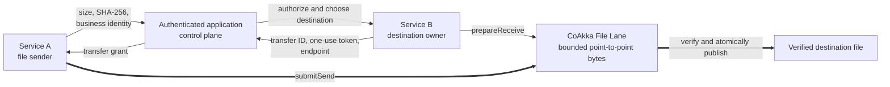
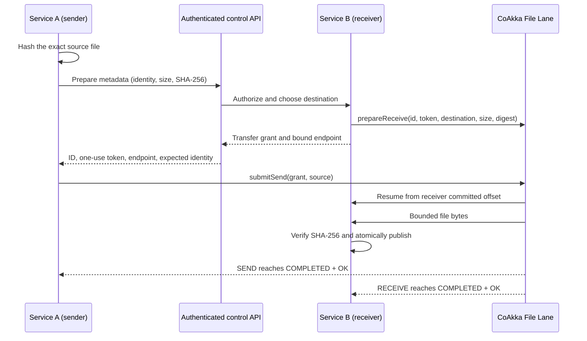

# Runtime File Transfer

CoAkka Runtime 2.1.0 introduces a bounded file-transfer path for moving large,
immutable files directly between trusted application hosts. The public API is
called the **file lane**. The runtime selects an appropriate bounded transfer
path for the configured security profile. Applications use the same connector
contract and do not depend on the internal transfer mechanism.

The file lane is separate from runtime messages:



Keep business commands, authorization decisions, and transfer metadata in the
application's existing control plane. Put the file bytes on the file lane. Do
not put a large file into an `Envelope` payload.

## Good Use Cases

- moving media, model, dataset, backup, checkpoint, or build-artifact files
  between services;
- uploading an edge-device diagnostic bundle to a trusted collector;
- transferring an immutable input before a remote worker starts CPU-heavy
  processing;
- handing off a large file between application nodes without introducing a
  broker payload or an extra in-memory copy in the application process.

Use an object store, CDN, or ordinary HTTPS endpoint when the file must be
shared broadly, cached publicly, addressed for a long time, or downloaded by a
browser. Use normal runtime messages for small commands and events. The file
lane is a point-to-point transfer primitive, not a filesystem, content catalog,
or replacement for application authorization.

## Transfer Workflow

1. The application authorizes the operation and computes the source file's
   exact size and SHA-256 digest.
2. It creates a unique transfer ID and a cryptographically strong, single-use
   authorization token. Tokens must not be logged.
3. The receiver opens a receiver-capable lane and calls `prepareReceive` with
   the destination path, size, digest, ID, and token.
4. After the receiver reports its bound port, the sender calls `submitSend`
   with the same metadata and the receiver endpoint.
5. Both sides call `waitTransfer` after each observed update sequence. This is
   a blocking, notification-driven wait; applications should not busy-poll.
6. The application treats the file as available only when the receiver reaches
   `COMPLETED` with result `OK`. It then performs its own business action.
7. After recording the outcome, the application calls `forget` on retained
   terminal records. `cancel` requests cooperative cancellation for active
   work.

The receiver writes and verifies a temporary file before publishing the final
destination. A successful sender result does not replace the receiver result:
the receiving application must observe its own `COMPLETED + OK` state before
using the file.

When the receiver target has multiple replicas, the prepared transfer belongs
to the exact replica that admitted it. The application-defined grant in the
current published package train must preserve that owner's direct endpoint; do
not reconnect through a load-balancing Service address. A source-candidate
native owner-grant ABI now formalizes this rule. See
[Runtime Lane Owner Grants](runtime-lane-owner-grants.md) for its availability,
Kubernetes addressing, explicit one/all distribution, and owner-loss contract.

## Service A To Service B Connector Example

The example uses Kotlin syntax only to make the service workflow concrete.
File Lane is a core runtime capability exposed through the official
connectors; applications use the equivalent lane, transfer specification,
snapshot, wait, cancel, and forget operations provided by their connector.
The workflow is not Kotlin-specific.

The two code blocks run in different service processes, usually on different
hosts. The application API carries only a small grant:



These are the control-plane values exchanged between the services. The token
is a secret, single-use capability and must not be logged.

```kotlin
data class PrepareFileRequest(
    val objectKey: String,
    val size: Long,
    val sha256Base64: String,
)

data class TransferGrant(
    val transferId: String,
    val authorizationToken: String,
    val receiverHost: String,
    val receiverPort: Int,
    val expectedSize: Long,
    val expectedSha256Base64: String,
)
```

### Service B: Authorize And Receive

Service B owns one long-lived receiver lane. Its authenticated API handler
authorizes the business operation, chooses a server-side destination, prepares
the receive, and returns the grant. A bounded worker then waits for receiver
completion outside the request thread.

```kotlin
class FileReceiverService(
    private val advertisedHost: String,
    private val destinationFor: (objectKey: String) -> Path,
    private val onFileReady: (objectKey: String, path: Path) -> Unit,
) : AutoCloseable {
    private data class PendingFile(val objectKey: String, val destination: Path)

    private val secureRandom = SecureRandom()
    private val pending = ConcurrentHashMap<String, PendingFile>()
    private val lane = FileLane.open(
        FileLaneConfig(
            flags = FileLaneFlags.RECEIVER,
            bindHost = "0.0.0.0",
        )
    )

    // Called by Service B's authenticated control API.
    fun prepareUpload(caller: ServiceIdentity, request: PrepareFileRequest): TransferGrant {
        require(caller.mayUpload(request.objectKey)) { "upload is not authorized" }
        require(request.size >= 0)

        val digest = Base64.getDecoder().decode(request.sha256Base64)
        require(digest.size == 32) { "SHA-256 must contain 32 bytes" }

        val transferId = UUID.randomUUID().toString()
        val tokenBytes = ByteArray(32).also { secureRandom.nextBytes(it) }
        val token = Base64.getUrlEncoder().withoutPadding().encodeToString(tokenBytes)
        val destination = destinationFor(request.objectKey) // Never accept a raw client path.

        lane.prepareReceive(
            FileReceiveSpec(transferId, token, destination, request.size, digest)
        )
        pending[transferId] = PendingFile(request.objectKey, destination)

        return TransferGrant(
            transferId,
            token,
            advertisedHost,
            lane.boundPort,
            request.size,
            request.sha256Base64,
        )
    }

    // Called by a bounded Service B worker after prepareUpload returns.
    fun awaitUpload(transferId: String) {
        val prepared = checkNotNull(pending[transferId]) { "unknown transfer" }
        val received = waitUntilTerminal(lane, transferId, FileTransferDirection.RECEIVE)
        try {
            check(received.completed) {
                "receive ended as ${received.state}/${received.result}: ${received.detail}"
            }
            onFileReady(prepared.objectKey, prepared.destination)
        } finally {
            lane.forget(transferId, FileTransferDirection.RECEIVE)
            pending.remove(transferId)
        }
    }

    override fun close() = lane.close()
}

// Service B's authenticated endpoint. receiveWaiters is a bounded Executor.
fun prepareUploadEndpoint(
    caller: ServiceIdentity,
    request: PrepareFileRequest,
): TransferGrant {
    val grant = fileReceiverService.prepareUpload(caller, request)
    receiveWaiters.execute {
        fileReceiverService.awaitUpload(grant.transferId)
    }
    return grant
}
```

### Service A: Request A Grant And Send

Service A hashes the exact source, asks Service B to prepare that identity, and
uses the returned endpoint and one-use token. It observes its own sender result;
this does not replace Service B's receiver result.

```kotlin
fun sendFile(
    source: Path,
    objectKey: String,
    receiverApi: ReceiverControlApi,
) {
    val digest = FileLane.sha256(source)
    val digestBase64 = Base64.getEncoder().encodeToString(digest.sha256)
    val grant = receiverApi.prepareUpload(
        PrepareFileRequest(objectKey, digest.size, digestBase64)
    )

    check(grant.expectedSize == digest.size)
    check(grant.expectedSha256Base64 == digestBase64)

    FileLane.open(FileLaneConfig(flags = FileLaneFlags.SENDER)).use { lane ->
        lane.submitSend(
            FileSendSpec(
                grant.transferId,
                grant.authorizationToken,
                grant.receiverHost,
                grant.receiverPort,
                source,
                grant.expectedSize,
                digest.sha256,
            )
        )

        val sent = waitUntilTerminal(
            lane,
            grant.transferId,
            FileTransferDirection.SEND,
        )
        try {
            check(sent.completed) {
                "send ended as ${sent.state}/${sent.result}: ${sent.detail}"
            }
        } finally {
            lane.forget(grant.transferId, FileTransferDirection.SEND)
        }
    }
}
```

Both services use the same blocking helper. Passing the last observed sequence
prevents busy-polling and waits only for a newer state change:

```kotlin
fun waitUntilTerminal(
    lane: FileLane,
    transferId: String,
    direction: FileTransferDirection,
): FileTransferSnapshot {
    var afterSequence = 0L
    while (true) {
        val snapshot = lane.waitTransfer(
            transferId,
            direction,
            afterUpdateSequence = afterSequence,
            timeoutMs = 30_000,
        )
        if (snapshot.terminal) return snapshot
        afterSequence = snapshot.updateSequence
    }
}
```

`ReceiverControlApi` and `ServiceIdentity` stand for the application's existing
authenticated service API and identity model. The application sends the
request and grant over that control plane. It does not send a `FileLane` object
or expose the token to a browser, renderer, or WebView.

## Security Profiles

| Mode | Intended boundary |
| --- | --- |
| Direct | Loopback or an already protected private network. The runtime selects the transfer path. |
| TLS | Server-authenticated encrypted transport. Configure a CA bundle and receiver certificate/private key. |
| Mutual TLS | Encrypted transport with certificates for both peers. Use this for service identities across less trusted networks. |

File-lane credentials are startup configuration. Protect private-key files
with operating-system permissions and rotate them by creating a new lane with a
new credential generation. The one-use transfer token remains necessary even
with TLS or mutual TLS because it authorizes one prepared transfer; it is not a
user session or a long-lived bearer credential.

## Bounded Operation

The lane bounds queued work and concurrent transfers. Zero-valued tuning fields
select conservative runtime defaults. Start with those defaults, then measure
before changing queue capacity, file-size limit, checkpoint interval, progress
thresholds, I/O timeout, or concurrency.

`QUEUE_FULL`, `SIZE_LIMIT`, timeouts, source changes, integrity failures,
storage failures, and certificate failures are explicit outcomes. The runtime
does not silently retain unbounded work. Snapshot timing is monotonic and must
not be interpreted as wall-clock time.

Receiver checkpoints allow an interrupted transfer to resume from a durable,
verified offset. The transfer ID, size, digest, destination, and authorization
must still match. A changed source is rejected rather than resumed as if it
were the original file.

## Ownership And UI Boundaries

- The application owns file meaning, authorization, destination selection, and
  all post-transfer behavior.
- Each connector owns its lane lifecycle. Close a lane only after concurrent
  calls have returned; connector shutdown stops and drains the lane.
- Blocking waits belong on a worker, coroutine dispatcher, or dedicated
  process when the host has a UI or event loop.
- Electron and Tauri renderer/WebView code must not receive raw paths, tokens,
  or unrestricted File Lane access. Expose narrow validated application
  intents from trusted host code instead.

## Availability And Evidence

The File Lane capability first belongs to runtime generation `2.1.0`. A
connector must fail explicitly when paired with an older core runtime; it must
not silently emulate the transfer through message payloads.

Repository-level tests exercise large transfers through the public runtime
contract and verify SHA-256, durable receiver completion, progress, and
counters. Release promotion still requires exact runtime packages, manifests,
hashes, connector packages, and supported-environment evidence listed by the
public compatibility matrix. Source-level evidence is not a published artifact
claim.

This document is projected identically from the CoAkka documentation authority.
Connector READMEs link to its public `coakka-publish` copy for connector-specific
entry points and blocking behavior.
