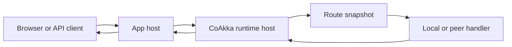
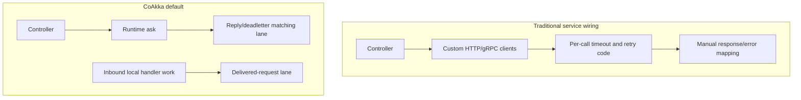

# Runtime Glossary

This page keeps the runtime vocabulary out of the README first screen while
still giving readers one place to answer "what is this thing?" when they start
building requests.

## Data Path



The app host is still a normal service, job, CLI, desktop process, or
containerized process. CoAkka adds a runtime host inside that process so
business code can call target names instead of hand-wiring every
transport detail.

## Core Terms

| Term | Short meaning |
| --- | --- |
| Runtime host | The runtime instance owned by one process. |
| App host | The application process that starts the runtime host. |
| Target | A stable business address such as `samples.customer.store`. |
| Route snapshot | A versioned table that maps targets to endpoints. |
| Endpoint | A host/port plus flags describing where a target can be reached. |
| Local endpoint | A target handled inside the current process. |
| Handler | Business code registered for a local target. |
| Envelope | The request/event/reply container passed through the runtime. |
| Deadletter | A terminal failure result for a request that could not be delivered or completed. |
| Generation | The route-table version used to reject stale route updates. |

## Envelope

An envelope is CoAkka's explicit message container. Erlang, Elixir, and Akka
often let people talk about "messages" directly; CoAkka exposes the container
because it must carry the same routing and payload contract across JVM, Python,
Node.js, Go, C#, Rust, Mojo and Zig source samples, and native C/C++.

| Field | Why it exists |
| --- | --- |
| `messageId` | Unique id for this message. |
| `correlationId` | Joins a reply/deadletter back to the original request. |
| `source` | Caller target or diagnostic source. |
| `target` | Business target to route to. |
| `replyTo` | Where a reply should go. |
| `kind` | Request, response, or event. |
| `oneWay` | Delivery expectation saying no business response is expected; admission and later delivery failures remain observable. |
| `timeoutMs` | Runtime delivery/wait budget hint, not automatic retry policy. |
| `payload` | Raw bytes carried by the envelope. |
| `messageType` | Stable payload contract name. |
| `payloadSchemaVersion` | Schema version for that payload contract. |
| `payloadFormat` | JSON, typed binary, text, binary, and so on. |

Read [Envelope And Deadletter Map](envelope-deadletter-map.md) for all fields,
valid `REQUEST`/`RESPONSE`/`EVENT` combinations, delivery hints, and stable
deadletter reasons.

## Timeout And Retry

Timeout is part of the request contract. If a business operation calls three
targets, each request can carry its own timeout:

```text
request 1 -> 10s
request 2 -> 15s
request 3 -> 20s
```

The caller should not build a custom queue to "protect" those deadlines. The
connector submits the request and waits for the terminal outcome: reply or
deadletter. Retries, when needed, should be a business policy above the runtime:
which operation is safe to retry, how often, and whether retrying would amplify
load.

## Delivered-Request Lane

Current connectors enable the delivered-request lane by default. Most samples
do not set it explicitly anymore.



The useful default is simple:

| Case | Default behavior |
| --- | --- |
| Business logic sends many requests | Keep the default lane split so inbound handler work does not sit in front of reply/deadletter matching. |
| Business logic sends one request | Keep the same default; there is no extra setup for the caller. |
| Tiny one-way host after measurement | Advanced users may disable the lane if sharing is proven harmless. |
