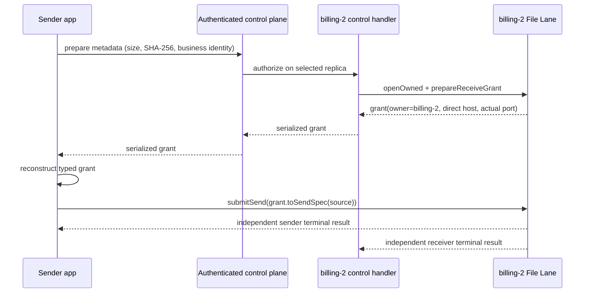
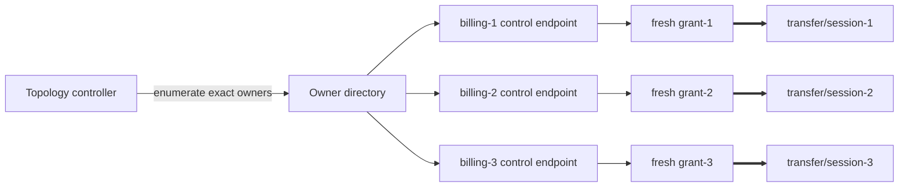

# Runtime Lane Owner Grants

> **Connector availability:** typed owner grants begin in the corrective
> connector `2.5.2` source train over exact native generation
> `2.5.0+4b65d0b2256037bf7fc180bfa6df8c41efc1dd6a`. Use an exact coordinate
> from [Current Packages](current-packages.md); do not generate these methods
> against `2.5.1` or an older connector merely because it carries that native
> generation.

Runtime messages and lane sessions have different ownership laws:

```text
message request: target-owned; any eligible replica may handle it
lane session:    instance-owned; one prepared receiver/publisher must keep it
```

This is an end-user connector contract, not a native-only feature. A receiver
or publisher opens an owner-aware lane, prepares local state, and returns a
typed capability containing the exact owner endpoint. The remote sender or
subscriber reconstructs that capability from its authenticated control-plane
response and derives the send or subscribe specification from it.

## Connector API

Every full connector in the `2.5.2` train projects the same four operations.
Names follow host-language conventions:

| Host surface | Open exact owner | Prepare capability | Derive remote job |
| --- | --- | --- | --- |
| JVM/Kotlin/Java | `FileLane.openOwned`, `StreamLane.openOwned` | `prepareReceiveGrant`, `preparePublishGrant` | `toSendSpec`, `toSubscribeSpec` |
| Python | `FileLane.open_owned`, `StreamLane.open_owned` | `prepare_receive_grant`, `prepare_publish_grant` | `to_send_spec`, `to_subscribe_spec` |
| Node.js | `FileLane.openOwned`, `StreamLane.openOwned` | `prepareReceiveGrant`, `preparePublishGrant` | `toSendSpec`, `toSubscribeSpec` |
| Bun | `FileLane.openOwned`, `StreamLane.openOwned` | `prepareReceiveGrant`, `preparePublishGrant` | `toSendSpec`, mailbox `toSubscribeSpec` |
| Electron main process | Same Node.js exports | Same Node.js methods | Same Node.js helpers; never expose grants to preload/renderer |
| C# | `FileLane.OpenOwned`, `StreamLane.OpenOwned` | `PrepareReceiveGrant`, `PreparePublishGrant` | `ToSendSpec`, `ToSubscribeSpec` |
| Go | `OpenOwnedFileLane`, `OpenOwnedStreamLane` | `PrepareReceiveGrant`, `PreparePublishGrant` | `ToSendSpec`, `ToSubscribeSpec` |
| Swift | `FileLane.openOwned`, `StreamLane.openOwned` | `prepareReceiveGrant`, `preparePublishGrant` | `sendSpec`, `subscribeSpec` |
| Rust | `FileLane::open_owned`, `StreamLane::open_owned` | `prepare_receive_grant`, `prepare_publish_grant` | `to_send_spec`, `to_subscribe_spec` |
| Zig | `openOwnedFileLane`, `openOwnedStreamLane` | `prepareReceiveGrant`, `preparePublishGrant` | `toSendSpec`, `toSubscribeSpec` |

Swift grant values are `Codable`. Node/Bun grants accept the object shape
returned by `toJSON()`. Python dataclasses, Go structs, public JVM/C#
constructors, and Rust `from_control_plane` constructors support explicit
reconstruction. Keep serialization inside the authenticated application
control plane and ensure logs redact the bearer token.

Tauri intentionally does not expose lanes to WebView code. Its trusted Rust
host uses the Rust API above. Mojo currently has a C conformance shim proving
the native File and Stream grant path, not a stable high-level Mojo grant API.

The Simple API remains supported for a single stable lane instance or for an
application that already pins the selected process endpoint. Owner-aware is
required when prepare may land on one replica while a later data connection
could otherwise land on another.

## One Owner Workflow

Replica-transparent routing may select a receiver only until one owner accepts
the prepare command:



The grant contains:

- `ownerInstanceId`: exact pod/process incarnation retaining prepared state;
- `advertisedHost` and the listener's actual bound port;
- transfer/session ID and secret bearer token;
- File Lane size and SHA-256, or Stream Lane format and frame bound.

Never replace the grant endpoint with a ClusterIP, ingress, or another
replica-balancing address. Protocol v1 pins by endpoint. `ownerInstanceId` is a
diagnostic/orchestration identity and is not a second routing key in the File
Offer or Stream Open handshake.

## All Replicas Workflow

One grant always names one owner and one point-to-point transfer or session.
`ALL` is an application topology policy:



Do not implement `ALL` by calling a load-balancing Service N times. That can
select the same replica repeatedly and skip another replica. Enumerate stable
owner incarnations first, call each exact owner's authenticated control
endpoint once, and require the returned `ownerInstanceId` to match the owner
requested.

File fan-out may reuse one verified immutable source and its size/SHA-256. It
still needs one fresh transfer ID and token, one prepare, one send record, and
one terminal outcome per owner. Partial success, retry, cancellation, and
pressure remain independent.

Live Stream fan-out needs one grant per publisher owner plus an
application-owned bounded tee, journal, or independent source cursor. Stream
Lane does not silently multiplex one callback across several sessions.

## Connector File Example

This Kotlin sample shows the complete distributed shape. `FileGrantDto` is the
application control-plane payload. The equivalent language constructor or
decode operation from the API table reconstructs the connector grant at the
sender.

```kotlin
data class FileGrantDto(
    val ownerInstanceId: String,
    val advertisedHost: String,
    val port: Int,
    val transferId: String,
    val authorizationToken: String,
    val expectedSize: Long,
    val expectedSha256: ByteArray,
) {
    override fun toString() =
        "FileGrantDto(ownerInstanceId=$ownerInstanceId, transferId=$transferId, " +
            "authorizationToken=<redacted>, expectedSize=$expectedSize)"
}

fun FileReceiveGrant.toDto() = FileGrantDto(
    owner.ownerInstanceId,
    owner.advertisedHost,
    owner.port,
    transferId,
    authorizationToken,
    expectedSize,
    expectedSha256,
)

fun FileGrantDto.toConnectorGrant() = FileReceiveGrant(
    LaneOwnerEndpoint(ownerInstanceId, advertisedHost, port),
    transferId,
    authorizationToken,
    expectedSize,
    expectedSha256,
)
```

Each replica owns one long-lived receiver lane. Its authenticated handler
chooses the destination and creates a fresh capability locally:

```kotlin
class ReplicaFileReceiver(
    ownerInstanceId: String,
    advertisedHost: String,
    private val destinationFor: (String) -> Path,
) : AutoCloseable {
    private val random = SecureRandom()
    private val lane = FileLane.openOwned(
        FileLaneConfig(flags = FileLaneFlags.RECEIVER, bindHost = "0.0.0.0"),
        LaneOwnerConfig(ownerInstanceId, advertisedHost),
    )

    // Called only through this replica's authenticated control endpoint.
    fun prepare(objectKey: String, size: Long, sha256: ByteArray): FileGrantDto {
        val transferId = UUID.randomUUID().toString()
        val tokenBytes = ByteArray(32).also(random::nextBytes)
        val token = Base64.getUrlEncoder().withoutPadding().encodeToString(tokenBytes)
        val grant = lane.prepareReceiveGrant(
            FileReceiveSpec(
                transferId,
                token,
                destinationFor(objectKey), // Never accept a remote raw path.
                size,
                sha256,
            )
        )
        return grant.toDto()
    }

    override fun close() = lane.close()
}
```

The sender hashes once, obtains one grant from every exact owner, verifies the
owner identity, and submits independent sends:

```kotlin
data class ReplicaControl(
    val expectedOwnerInstanceId: String,
    val prepareFile: (objectKey: String, size: Long, sha256: ByteArray) -> FileGrantDto,
)

fun sendToAllReplicas(source: Path, objectKey: String, owners: List<ReplicaControl>) {
    val digest = FileLane.sha256(source)
    FileLane.open(FileLaneConfig(flags = FileLaneFlags.SENDER)).use { sender ->
        val grants = owners.map { owner ->
            val dto = owner.prepareFile(objectKey, digest.size, digest.sha256)
            check(dto.ownerInstanceId == owner.expectedOwnerInstanceId) {
                "control endpoint returned a grant for another replica"
            }
            dto.toConnectorGrant()
        }

        grants.forEach { grant -> sender.submitSend(grant.toSendSpec(source)) }
        grants.forEach { grant ->
            val sent = waitUntilTerminal(sender, grant.transferId, FileTransferDirection.SEND)
            check(sent.completed) {
                "${grant.owner.ownerInstanceId}: ${sent.state}/${sent.result} ${sent.detail}"
            }
            sender.forget(grant.transferId, FileTransferDirection.SEND)
        }
    }
}
```

The receiver must independently observe `RECEIVE COMPLETED + OK` before using
its file, then forget its local record. Sender success cannot replace that
receiver check. Waits are blocking and notification-driven; run them on bounded
workers, not latency-sensitive request or UI threads.

## Connector Stream Example

Stream uses the same control-plane handoff, but its grant is single-admission.
The publisher owner prepares its bounded source callback and returns a DTO:

```kotlin
data class StreamGrantDto(
    val ownerInstanceId: String,
    val advertisedHost: String,
    val port: Int,
    val sessionId: String,
    val authorizationToken: String,
    val formatId: Long,
    val maxFrameBytes: Int,
) {
    override fun toString() =
        "StreamGrantDto(ownerInstanceId=$ownerInstanceId, sessionId=$sessionId, " +
            "authorizationToken=<redacted>, formatId=$formatId)"
}

val publisher = StreamLane.openOwned(
    StreamLaneConfig(flags = StreamLaneFlags.PUBLISHER, bindHost = "0.0.0.0"),
    LaneOwnerConfig("camera-3", "camera-3.camera-headless.default.svc.cluster.local"),
)
val localGrant = publisher.preparePublishGrant(
    StreamPublishSpec(sessionId, freshToken, formatId, maxFrameBytes, boundedSource)
)
val response = StreamGrantDto(
    localGrant.owner.ownerInstanceId,
    localGrant.owner.advertisedHost,
    localGrant.owner.port,
    localGrant.sessionId,
    localGrant.authorizationToken,
    localGrant.formatId,
    localGrant.maxFrameBytes,
)
```

The subscriber reconstructs the typed capability and never substitutes a
Service address:

```kotlin
val receivedGrant = StreamPublishGrant(
    LaneOwnerEndpoint(response.ownerInstanceId, response.advertisedHost, response.port),
    response.sessionId,
    response.authorizationToken,
    response.formatId,
    response.maxFrameBytes,
)
subscriber.subscribe(
    receivedGrant.toSubscribeSpec(
        initialWindowBytes = response.maxFrameBytes * 2,
        consumer = boundedConsumer,
    )
)
```

After the first valid `OPEN`, reconnecting requires another prepare and a fresh
grant. For `ALL`, prepare one publisher session per exact owner and give each
session its own bounded source cursor or tee branch and terminal result.

## Token Lifetime

File and Stream grants deliberately have different lifetime laws:

- A File token is scoped to one prepared transfer identity. It may be reused
  only for bounded resume and idempotent completed-status handling while the
  exact owner retains that record. It is not a one-network-attempt token.
- A Stream token is single-admission. The first valid `OPEN` consumes it.
  Transport failure after admission requires a new prepare and fresh grant.
  Invalid authentication or format attempts do not consume it.

Neither token is a user session or general-purpose credential. Do not log it,
persist a complete grant, reuse it for another owner, or expose it to browser,
Electron renderer, or Tauri WebView code.

## Kubernetes Addressing

The ordinary Runtime message route may use a ClusterIP Service. The lane owner
must advertise a directly reachable per-owner address, commonly:

- StatefulSet pod DNS behind a headless Service;
- pod hostname/subdomain DNS;
- Pod IP supplied through the Downward API when network and certificate policy
  permit it.

Bind and advertise are separate. A lane may bind `0.0.0.0:0`; its grant returns
the configured direct host plus the actual listener port. TLS/mTLS validates
the connection host, so certificates need a matching DNS/IP identity. A
separate TLS server-name override is not part of this grant contract.

NetworkPolicy must allow the direct lane connection. A gateway or staging
service is an application/deployment choice only when owner reachability is not
available; it does not change the point-to-point grant law.

## Owner Loss

Stopping or destroying a lane invalidates every grant it issued. Pod loss has
the same effect. CoAkka does not migrate prepared state because another replica
does not own the token record, destination or source callback, committed
offset, or pressure state.

Recovery is explicit:

1. record the failed/lost owner's outcome;
2. select an exact replacement owner;
3. issue a new prepare command and fresh ID/token grant;
4. resume a durable file according to application policy, or start a new stream
   and report discontinuity.

Do not reuse a prior token after process/pod incarnation changes, even when
StatefulSet DNS and port are reused.

## Native Contract

Connectors feature-detect
`COAKKA_V2_RUNTIME_FEATURE_LANE_OWNER_GRANTS` before resolving additive native
symbols. Owner-aware native creation embeds the frozen Simple config in
`coakka_v2_file_lane_owned_config_t` or
`coakka_v2_stream_lane_owned_config_t`, then uses
`coakka_v2_file_lane_prepare_receive_grant()` or
`coakka_v2_stream_lane_prepare_publish_grant()`.

The fixed-size native grant owns its strings and adds no unbounded state beyond
the already admitted transfer/session record. Existing create and prepare APIs
remain available for Simple deployments. Release evidence exercises both
profiles:

```sh
bash run.sh runtime-test file-lane-simple
bash run.sh runtime-test file-lane-owner-aware
bash run.sh runtime-test stream-lane-simple
bash run.sh runtime-test stream-lane-owner-aware
```
