# Runtime Message And Routing Model

This document is the public mental model for CoAkka runtime samples. It explains
what a connector installs, what a runtime start spec declares, how routes are
applied, what an envelope carries, and how deadletters, timeouts, and retries
fit together.

CoAkka does not assume every participant lives inside one actor runtime such as
BEAM or a JVM actor system. The boundary is an app-host plus connector boundary:
JVM, Python, Node.js, Go, C#, Rust, planned Mojo and Zig connectors, and native
hosts submit the same runtime shape through language-specific connector APIs.

## Table Of Contents

- [Runtime Shape](#runtime-shape)
- [Install Connector vs Start Runtime](#install-connector-vs-start-runtime)
- [Business Request Shape](#business-request-shape)
- [Core Vocabulary](#core-vocabulary)
- [RuntimeStartSpec](#runtimestartspec)
- [Delivered Request Lane](#delivered-request-lane)
- [Route Snapshot](#route-snapshot)
- [Envelope](#envelope)
- [Ask, Reply, And Event](#ask-reply-and-event)
- [Deadletter](#deadletter)
- [Business Timeout And Retry Shape](#business-timeout-and-retry-shape)
- [Timeout Is A Wait Budget](#timeout-is-a-wait-budget)
- [Retry Is Caller Policy](#retry-is-caller-policy)
- [Cluster Routing](#cluster-routing)
- [Tuning Parameters](#tuning-parameters)
- [Reading A Sample](#reading-a-sample)

## Runtime Shape

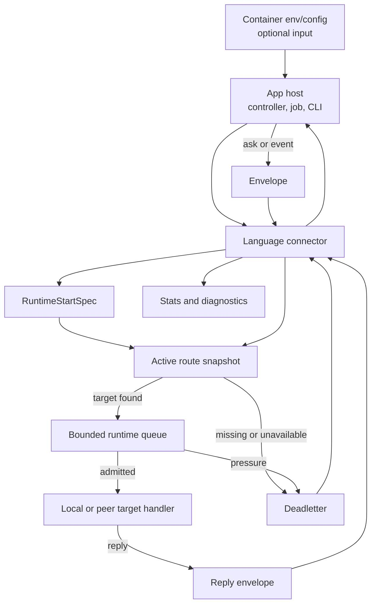

The connector is the host-language face. The runtime owns the delivery
vocabulary: target resolution, active route generation, queue pressure,
request/reply matching, deadletters, and stats.

Containerized deployment does not change this model. The image is still a
normal application image, and operators still provide environment variables,
config files, service DNS, pod identity, or control-plane route data the way
they would for any app. The app or connector reads that configuration at
startup and maps it into `RuntimeStartSpec` plus route snapshots. CoAkka runtime
does not require a special container image shape and does not fetch Docker or
Kubernetes metadata by itself.

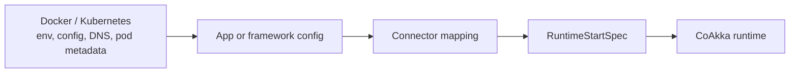

For container details, read
[Containerized Runtime Notes](containerized-runtime.md).

## Install Connector vs Start Runtime

Installing a connector and starting a runtime are different steps.

| Step | Plain meaning | Example |
| --- | --- | --- |
| install connector | Add the host-language package that knows how to talk to the native runtime contract. | JVM jar, Python wheel, Node package, Go source package, C# NuGet package. |
| build start spec | Declare this process identity, queue policy, and initial route snapshot. | `RuntimeStartSpec(systemName, nodeId, generation, routes, queueCapacity)`. |
| start runtime host | Create one runtime participant for this process. | `RuntimeHost.start(...)`, `RuntimeHost.Start(...)`, or language equivalent. |
| register handler | Attach code for targets this process owns locally. | `samples.customer.store` handler. |
| send ask/event | Submit an envelope to a target through the connector. | `askJson(...)`, `AskJSON(...)`, `askBlocking(...)`. |

The package install does not decide routing. Routing begins when the process
starts with a `RuntimeStartSpec` and applies a route snapshot.

One practical rule: start one runtime host per process. The app framework still
owns HTTP, UI, jobs, lifecycle hooks, authentication, authorization, and
business validation. CoAkka starts after app code decides there is application work
to deliver.

## Business Request Shape

Start from a user-facing request, not from the runtime. A frontend may call a
REST endpoint such as `POST /checkout`. The app still validates the HTTP
request, checks auth, reads the body, and decides which business work must run.
CoAkka begins when that app code needs to call an runtime target.

Most business logic has one of two shapes.

### Business Logic = One Request

One app request may need one runtime target:

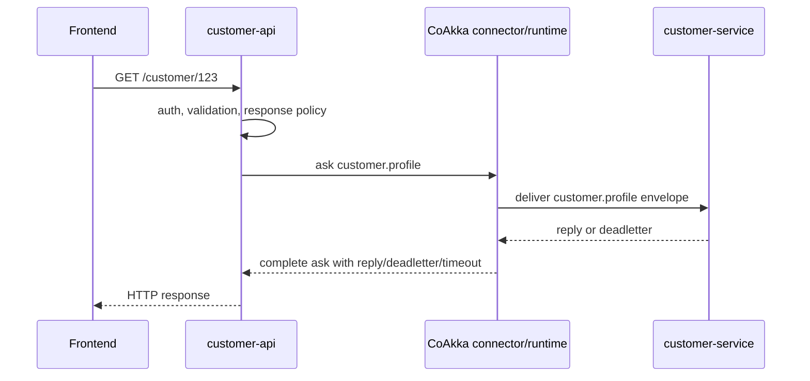

Without CoAkka, the app or framework code usually chooses a concrete endpoint,
sends a request, tracks timeout/correlation, maps transport failures, and
decides how the result becomes an HTTP response. With CoAkka, the app still
owns the business decision, but the service-to-service call uses target,
envelope, ask completion, deadletter, timeout, and diagnostics through the
connector/runtime.

### Business Logic = Many Requests

Many app requests need several runtime targets before the business decision is
known. Checkout is a typical shape:

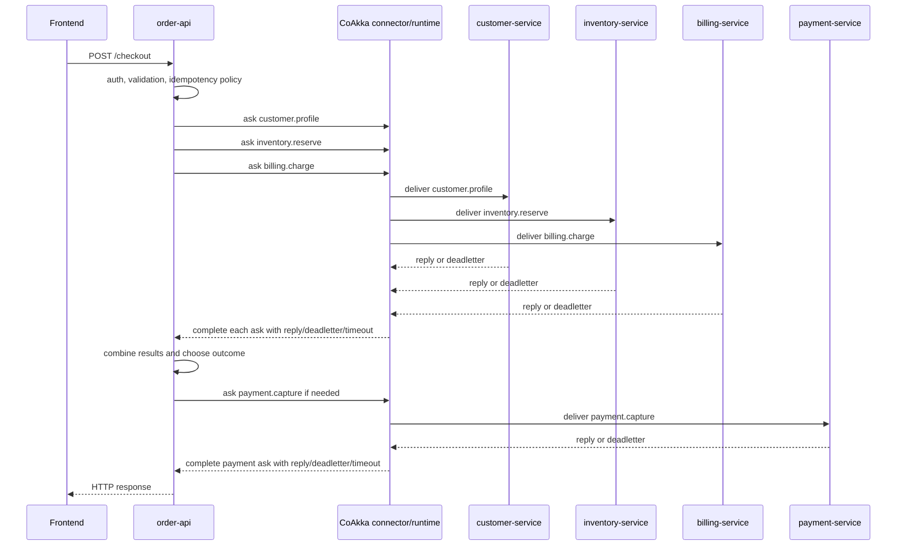

This is still ordinary business orchestration. CoAkka does not decide whether a
checkout succeeds, whether to compensate inventory, or whether to retry a
payment. It standardizes the runtime calls that make up the business flow:
stable targets instead of scattered endpoint strings, envelopes instead of
ad-hoc message wrappers, route snapshots instead of caller-owned topology, and
structured reply/deadletter/timeout completion instead of each integration
inventing its own convention.

`separateDeliveredRequestLane` matters in the many-request shape because a
service often plays both roles at once. `billing-service` receives
`billing.charge` from `order-api`, then asks `fraud.check` or `tax.calculate`
before it can reply. The same runtime host is receiving new business work while
also waiting for replies that complete earlier work. Keeping delivered requests
separate from ask completion prevents a burst of new inbound work from delaying
the replies, deadletters, or timeouts needed to finish work already in flight.

## Core Vocabulary

| Term | Short meaning |
| --- | --- |
| connector | Language adapter used by app code to start runtime and send/handle envelopes. |
| runtime host | One process's runtime participant. |
| start spec | Startup declaration for process identity, queue policy, and routes. |
| target | Stable capability address the caller asks for. |
| source | Caller or responder identity used for diagnostics and replies. |
| route snapshot | Versioned target-to-endpoint table. |
| endpoint | One place that can handle a target. |
| `LOCAL` | Endpoint flag saying this process owns the handler. |
| envelope | Runtime wrapper around payload plus routing and matching metadata. |
| payload | Business command, query, reply, or event bytes. |
| payload identity | Message type, schema version, and payload format. |
| deadletter | Structured terminal delivery failure result. |
| timeout | Caller wait budget enforced by runtime/connector ask matching. |
| retry | Caller/application decision to submit again. |

## RuntimeStartSpec

`RuntimeStartSpec` answers: "who is this process, how much work can it buffer,
and what route table should it start with?"

| Field | Question it answers | How to choose it |
| --- | --- | --- |
| `systemName` | Which logical service or app role do I belong to? | Stable service role, such as `customer-store` or `billing-worker`. |
| `nodeId` | Which concrete process/replica am I? | Unique process identity from hostname, pod name, env, or platform metadata. |
| `queueCapacity` | How much runtime work can this process buffer? | Start bounded and conservative; tune from pressure counters. |
| `strictNoDrop` | Should overload become visible? | Prefer `true` while integrating so rejection is observable. |
| `separateDeliveredRequestLane` | Should runtime keep delivered requests on their own runtime lane? | Prefer `true` for request/reply hosts. |
| `generation` | Which route snapshot version is active at startup? | Start at `1`; increment for newer route snapshots. |
| `routes` | Which targets can this process route? | Map target names to local or peer endpoints. |

Example shape:

```text
RuntimeStartSpec
  systemName = customer-store
  nodeId = customer-store-pod-7
  queueCapacity = 128
  strictNoDrop = true
  separateDeliveredRequestLane = true
  generation = 1
  routes:
    target = samples.customer.store
      endpoint host=127.0.0.1 port=19301 flags=LOCAL
```

The sample values are not production sizing. They are visible defaults that make
the boundary easy to read. In a real deployment, `nodeId`, endpoint host, and
route generation should come from deployment config, platform metadata, service
discovery, or a control plane.

`separateDeliveredRequestLane` protects the ask/reply path from inbound handler
work. A runtime host can receive requests for local handlers while it is also
waiting for replies or deadletters for asks it has sent. With `true`, delivered
requests use a separate runtime lane from reply/deadletter matching. With
`false`, both flows share one lane. Use `true` as the default for services that
send asks or expose request/reply handlers; consider `false` only for tiny
one-way hosts after measuring that lane sharing is harmless.

## Delivered Request Lane

`separateDeliveredRequestLane` is easiest to understand with a concrete billing
host. Assume `billing-1` owns the local target `billing.charge`. `order-api`
sends requests to that target. While handling a charge, `billing-1` may also ask
`fraud.check` and wait for a reply or deadletter.

Without CoAkka, the app or framework code usually has to own the pending ask
map, timer policy, reply callbacks, and queue/executor split:

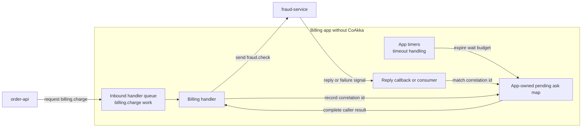

With CoAkka, the connector/runtime owns the ask completion mechanics: pending
ask matching, timeout completion, and deadletter completion. App code still owns
the handler and the business decision after a result arrives.

With `separateDeliveredRequestLane = true`, inbound requests and ask completion
use separate runtime lanes:

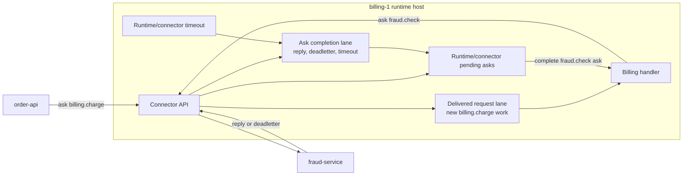

With `separateDeliveredRequestLane = false`, both flows share one runtime lane:

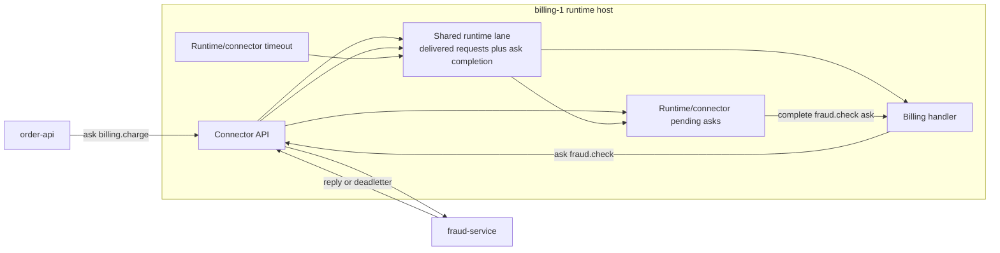

The practical difference is queue interference. With `true`, a burst of inbound
`billing.charge` work is less likely to delay reply/deadletter matching for the
asks `billing-1` already sent. With `false`, the same burst shares the lane with
ask completion. That can be acceptable for a tiny one-way host, but it is not
the recommended default for request/reply services.

## Route Snapshot

A route snapshot is a versioned table. It lets app code ask for a stable target
without hard-coding whether the handler is same-process, same-host, or in a
peer runtime.

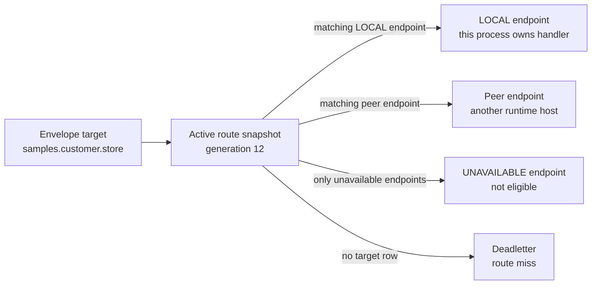

| Route concept | Meaning |
| --- | --- |
| `RuntimeRouteSpec` | One target row in the route table. |
| `RuntimeEndpointSpec` | One eligible or visible endpoint for that target. |
| `RuntimeEndpointFlags.LOCAL` | This process owns the handler and must register it. |
| `RuntimeEndpointFlags.UNAVAILABLE` | Endpoint stays visible but should not receive new work. |
| generation | Monotonic version. Stale generations should not replace newer active routes. |

If `target`, route table, and handler registration do not match, the runtime
does not guess. The caller should see a route-miss deadletter.

## Envelope

In actor systems, "message" often means the domain object sent to an actor or
process. In CoAkka samples, `payload` is that business message. `Envelope` is
the runtime wrapper around it.

| Envelope part | Meaning | Put this here |
| --- | --- | --- |
| `target` | Capability address to route to. | `samples.customer.store` |
| `source` | Sender or responder identity for diagnostics. | `customer-web` |
| payload identity | Message type, schema version, payload format. | `samples.customer.create.request.v1`, version `1`, JSON |
| `payload` | Business body bytes. | `{ "id": "cust-001", "name": "Ada" }` |
| headers / metadata / extra params | Small request context. | tenant, request id, trace id, idempotency key |
| operation | Human-readable operation label. | `create_customer` |
| timeout | Ask wait budget enforced by runtime/connector matching. | `timeoutMs = 5000` |
| correlation id | Matching identity for reply/deadletter diagnostics. | Usually connector/runtime generated or preserved. |

Use this split:

```text
target  = where this work should go
payload = business data
headers = small request context
timeout = how long this caller is willing to wait
```

Do not use headers as a second payload schema. If a value changes the business
meaning of a command or query, put it in the payload and version it through
payload identity. Use headers for context that should travel next to the
envelope: tenant, request id, trace id, idempotency key, or diagnostics tags.

## Ask, Reply, And Event

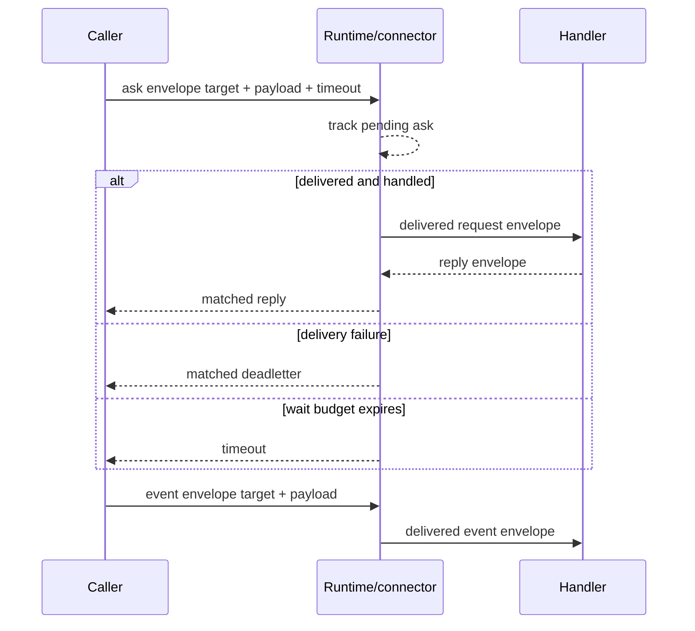

| Shape | Runtime behavior | Caller expectation |
| --- | --- | --- |
| ask | Runtime/connector matches reply, matched deadletter, or timeout back to the pending caller. | Caller waits up to timeout. |
| reply | Handler sends a response envelope with payload identity and payload. | Completes the ask when matched. |
| event | One-way delivery attempt. | No reply wait; failures should still be visible through diagnostics when surfaced. |

Timeout belongs to asks because runtime/connector code is tracking a pending
reply/deadletter match for that caller. One-way events should use explicit
diagnostics and deadletter/stats handling rather than pretending there is a
reply path.

## Deadletter

A deadletter is not a vague timeout. It is runtime evidence that delivery failed
or was rejected.

| Case | Typical evidence | Usual response |
| --- | --- | --- |
| target missing | route-miss deadletter with target and generation | fix target name or route config |
| endpoint unavailable | no eligible endpoint evidence | wait for route update or fail fast |
| queue pressure | queue-rejected deadletter and counters | back off, shed load, or tune capacity after measurement |
| stale route update | stale generation rejected | publish a newer generation |
| invalid route update | invalid snapshot rejected | fix route snapshot |
| handler/application failure | connector/app-specific failure evidence | fix payload, handler validation, or app logic |

Deadletters are terminal for the submitted envelope. A caller may choose to
submit a new envelope later, but that is retry policy, not automatic runtime
behavior.

## Business Timeout And Retry Shape

Timeout and retry are easiest to reason about from the business request, not
from the transport. A user-facing request has a budget: how long the caller is
willing to wait before choosing another outcome. Each runtime ask consumes
part of that budget.

For `Business Logic = One Request`, the shape is direct:

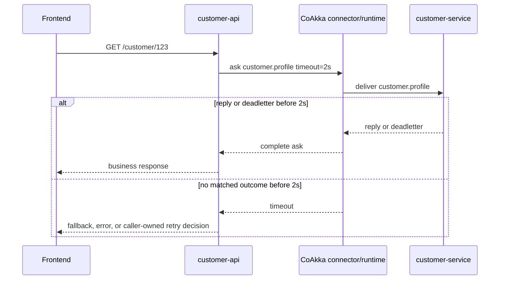

For `Business Logic = Many Requests`, the app may carry a larger business
budget and split it across several asks:

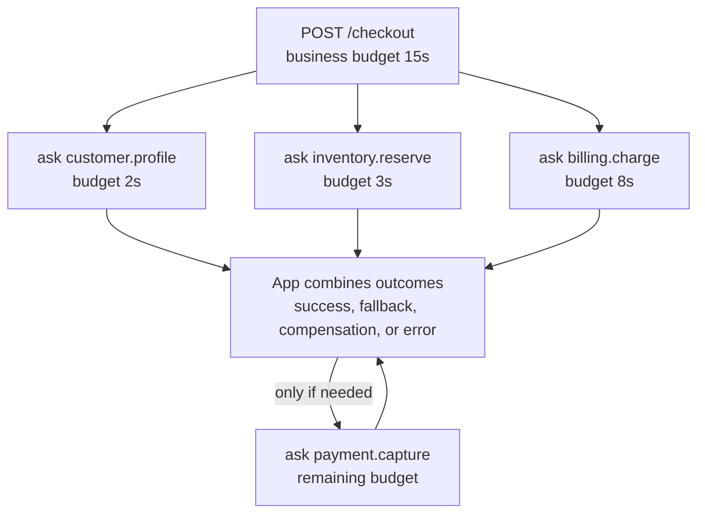

CoAkka standardizes how each ask completes: reply, matched deadletter, or
timeout. It does not decide the business policy after that. A route-miss
deadletter may mean "fix configuration", queue pressure may mean "back off",
and timeout may mean "the caller's wait budget expired before a matched outcome
arrived." These outcomes should not all collapse into a vague failure.

Retry is a business decision because the caller must know whether trying again
is safe. Retrying `customer.profile` is usually safer than retrying
`payment.capture`. Retrying `billing.charge` may be safe only with an
idempotency key and a bounded retry budget. CoAkka can carry that context in
headers and can surface the outcome, but the app owns the choice to retry,
fallback, compensate, or return an error.

## Timeout Is A Wait Budget

| Concept | Runtime/connector responsibility | Not this |
| --- | --- | --- |
| timeout | Track a pending ask and return timeout to the caller when no reply or matched deadletter arrives before the wait budget. | Automatic retry. |
| deadletter | Produce terminal delivery failure evidence and match it to the pending ask when possible. | Generic timeout. |
| retry | Expose the outcome so caller/app policy can decide whether to submit another envelope. | Runtime default behavior. |

The app-host does not implement pending-ask matching itself. Runtime/connector
mechanics track the ask, match a reply or matched deadletter, and surface a
timeout when the wait budget expires. The app-host owns what to do after that
outcome.

A timeout answers one narrow question: "did runtime/connector match a reply or
matched deadletter for this caller before the wait budget expired?"

It does not prove the handler never ran. A request may have reached a handler
and still timed out at the caller because the handler was slow, the reply was
delayed, or the caller's budget was too short. That is why retry-after-timeout
requires idempotency or application-level reconciliation.

Route miss and queue rejection can produce deadletters quickly without waiting
for the full timeout, because the runtime already has terminal failure
evidence.

## Retry Is Caller Policy

CoAkka samples do not make business retry decisions inside the runtime.
Runtime/connector code handles timeout and deadletter mechanics. Retry policy
belongs to the caller or application layer unless a specific sample explicitly
documents a retry behavior.

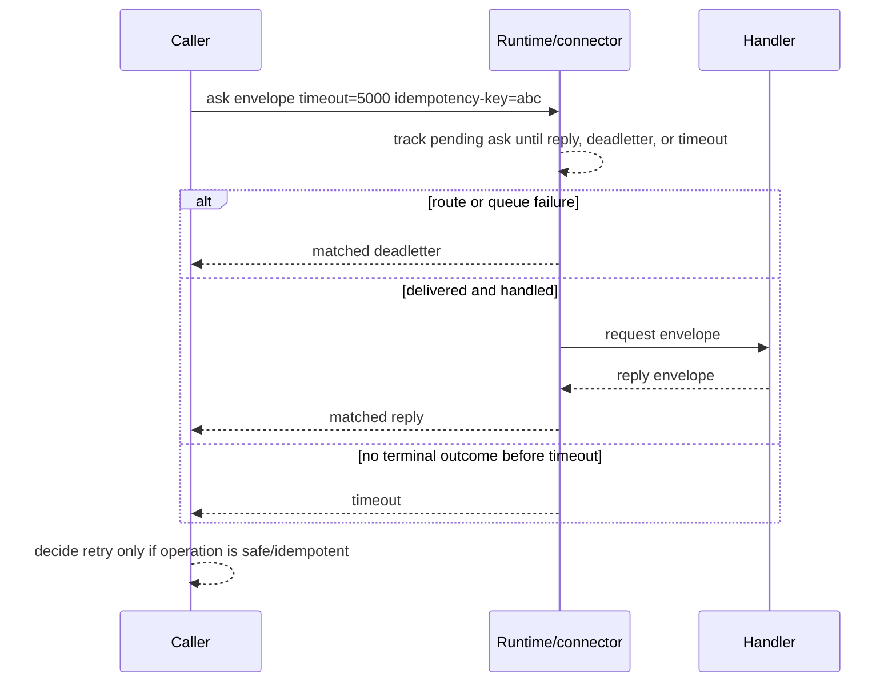

Before retrying, answer:

| Question | Why it matters |
| --- | --- |
| Is the operation idempotent? | Retrying `create` can duplicate work without an idempotency key. |
| Was the result a deadletter or timeout? | Runtime/connector surfaces both, but route miss, queue pressure, and timeout need different responses. |
| Could the first attempt still complete? | Timeout does not prove the handler did nothing. |
| Is there a bounded retry budget? | Unbounded retries can create queue pressure. |
| Does retry preserve context? | Tenant, trace, and idempotency context must survive each attempt. |

Practical default:

| Work type | Retry stance |
| --- | --- |
| read/query | Retry can be reasonable with a short bounded budget. |
| idempotent command | Retry only with an idempotency key or natural business key. |
| non-idempotent command | Do not auto-retry after timeout without reconciliation. |
| route miss | Fix config or target name; blind retry is usually wrong. |
| queue pressure | Back off or shed load before increasing queue size. |

## Cluster Routing

Cluster-style routing keeps the same timeout and retry vocabulary. Runtime may
try another eligible endpoint inside the same request lifecycle only when it
has delivery evidence that the previous endpoint did not accept ownership. A
user retry is different: the app submits a new request after a terminal result.

Read [Runtime Cluster Routing](runtime-cluster-routing.md) for the route
snapshot examples, Mermaid diagrams, failover evidence rules, and transport
compatibility rule.

## Tuning Parameters

Start with visible, conservative behavior. Tune from stats and failure evidence.

| Parameter | Start with | Increase when | Decrease when |
| --- | --- | --- | --- |
| `timeoutMs` / `timeout_ms` | Caller-specific wait budget enforced by runtime/connector pending-ask matching. | Normal handler latency exceeds budget and retry would be worse. | Caller needs fast fallback or overload protection. |
| `queueCapacity` | Bounded and conservative. | Legitimate bursts are rejected and memory budget allows more buffering. | Latency grows, memory is tight, or pressure should surface earlier. |
| `strictNoDrop` | `true` while integrating. | Usually keep true. | Only for a measured fire-and-forget path that can drop safely. |
| `separateDeliveredRequestLane` | `true` for request/reply hosts. | Inbound delivered requests delay reply/deadletter matching for outgoing asks. | Only for tiny one-way-only hosts after measurement. |
| route `generation` | Start at `1`, increment on updates. | Applying a newer route snapshot. | Never reuse old generations for new topology. |
| endpoint flags | `LOCAL` only where this process owns the handler. | This process begins owning a target. | Endpoint is draining or temporarily unavailable. |
| headers / metadata | Minimal request context. | Diagnostics need tenant, request id, trace id, or idempotency key. | Data is actually business payload. |

## Reading A Sample

When a sample feels abstract, find these pieces in order:

1. dependency: which connector package is installed
2. runtime host: where the process starts one runtime participant
3. start spec: `systemName`, `nodeId`, queue policy, route generation
4. route table: which `target` points to which endpoint
5. handler registration: which target this process owns locally
6. ask/event call: target, source, payload identity, payload, timeout, operation
7. failure branch: deadletter/timeout handling and stats output

The surrounding HTTP controller, desktop UI, CLI, or job is just the app-host
deciding when to submit work. The runtime boundary begins when the connector
submits an envelope to a target.
