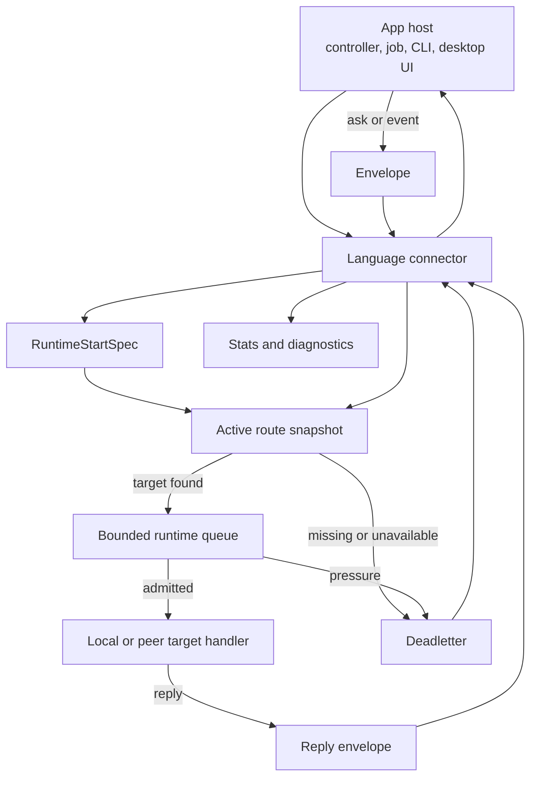
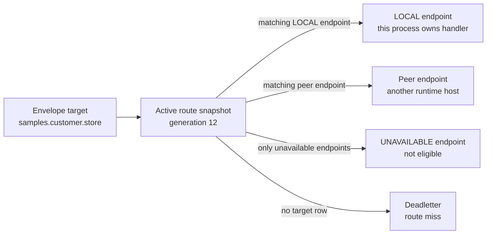
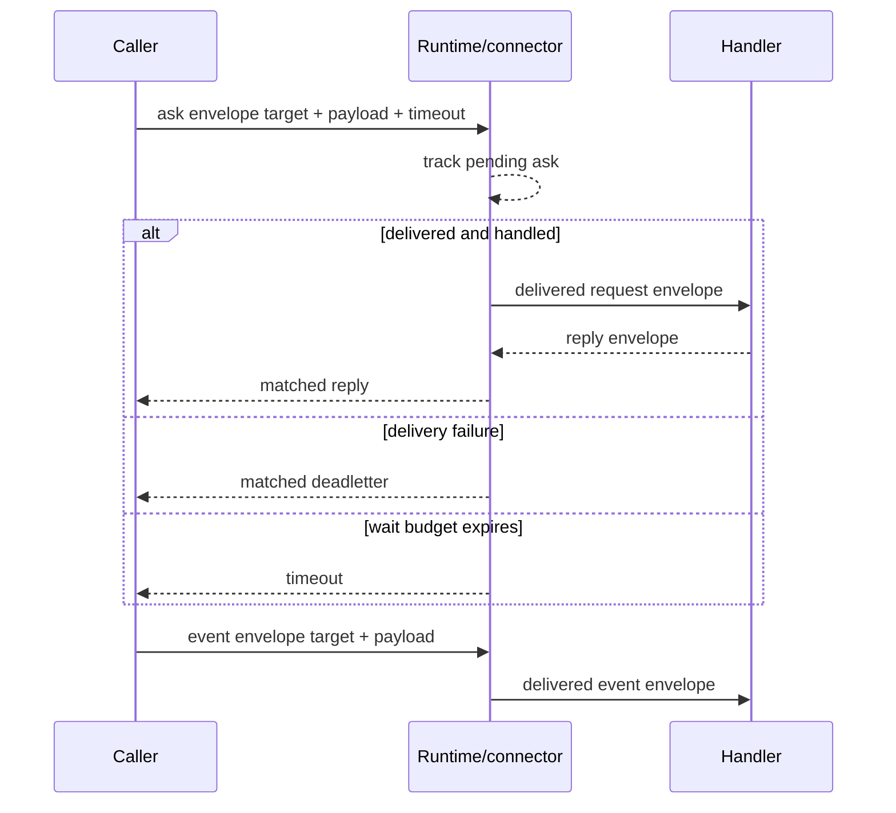
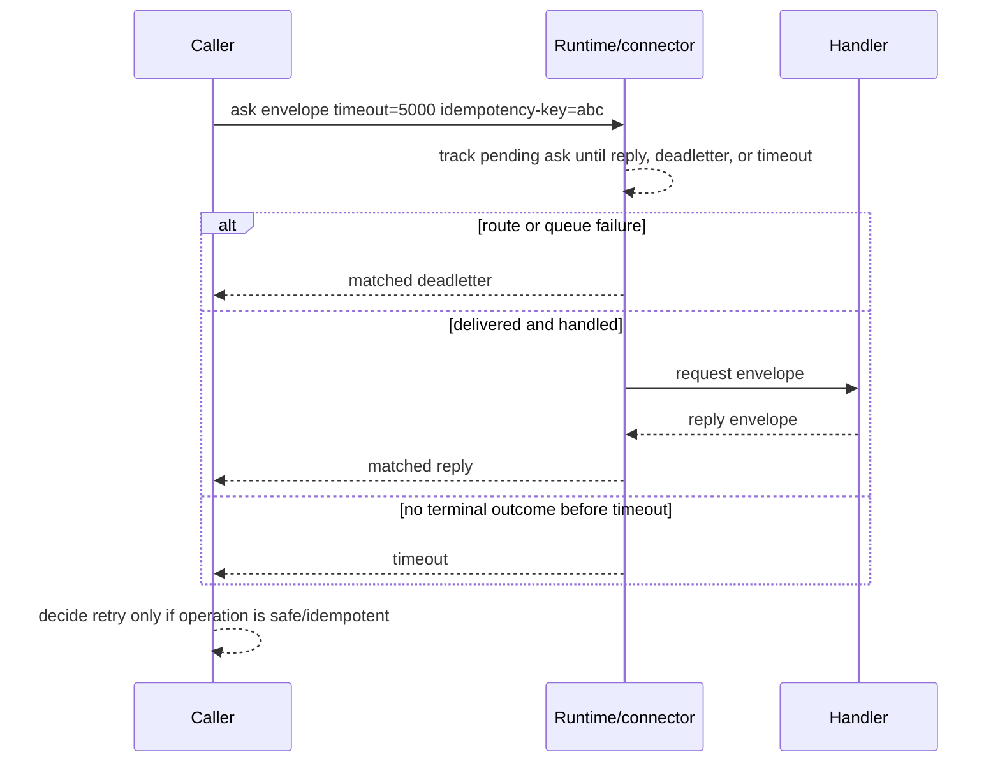

# Runtime Message And Routing Model

This document is the public mental model for CoAkka runtime samples. It explains
what a connector installs, what a runtime start spec declares, how routes are
applied, what an envelope carries, and how deadletters, timeouts, and retries
fit together.

CoAkka does not assume every participant lives inside one actor runtime such as
BEAM or a JVM actor system. The boundary is an app-host plus connector boundary:
JVM, Python, Node.js, Go, C#, Rust, and native hosts submit the same runtime
shape through language-specific connector APIs.

## Table Of Contents

- [Runtime Shape](#runtime-shape)
- [Install Connector vs Start Runtime](#install-connector-vs-start-runtime)
- [Core Vocabulary](#core-vocabulary)
- [RuntimeStartSpec](#runtimestartspec)
- [Route Snapshot](#route-snapshot)
- [Envelope](#envelope)
- [Ask, Reply, And Event](#ask-reply-and-event)
- [Deadletter](#deadletter)
- [Timeout Is A Wait Budget](#timeout-is-a-wait-budget)
- [Retry Is Caller Policy](#retry-is-caller-policy)
- [Tuning Parameters](#tuning-parameters)
- [Reading A Sample](#reading-a-sample)

## Runtime Shape



The connector is the host-language face. The runtime owns the delivery
vocabulary: target resolution, active route generation, queue pressure,
request/reply matching, deadletters, and stats.

## Install Connector vs Start Runtime

Installing a connector and starting a runtime are different steps.

| Step | Plain meaning | Example |
| --- | --- | --- |
| install connector | Add the host-language package that knows how to talk to the native runtime contract. | JVM jar, Python wheel, Node package, Go source package, C# NuGet package. |
| build start spec | Declare this process identity, queue policy, and initial route snapshot. | `RuntimeStartSpec(systemName, nodeId, generation, routes, queueCapacity)`. |
| start runtime host | Create one runtime participant for this process. | `RuntimeHost.start(...)`, `RuntimeHost.Start(...)`, or language equivalent. |
| register handler | Attach code for targets this process owns locally. | `samples.customer.store` handler. |
| send ask/event | Submit an envelope to a target through the connector. | `askJson(...)`, `AskJSON(...)`, `askBlocking(...)`. |

The package install does not decide routing. Routing begins when the process
starts with a `RuntimeStartSpec` and applies a route snapshot.

One practical rule: start one runtime host per process. The app framework still
owns HTTP, UI, jobs, lifecycle hooks, authentication, authorization, and
business validation. CoAkka starts after app code decides there is internal work
to deliver.

## Core Vocabulary

| Term | Short meaning |
| --- | --- |
| connector | Language adapter used by app code to start runtime and send/handle envelopes. |
| runtime host | One process's runtime participant. |
| start spec | Startup declaration for process identity, queue policy, and routes. |
| target | Stable capability address the caller asks for. |
| source | Caller or responder identity used for diagnostics and replies. |
| route snapshot | Versioned target-to-endpoint table. |
| endpoint | One place that can handle a target. |
| `LOCAL` | Endpoint flag saying this process owns the handler. |
| envelope | Runtime wrapper around payload plus routing and matching metadata. |
| payload | Business command, query, reply, or event bytes. |
| payload identity | Message type, schema version, and payload format. |
| deadletter | Structured terminal delivery failure result. |
| timeout | Caller wait budget enforced by runtime/connector ask matching. |
| retry | Caller/application decision to submit again. |

## RuntimeStartSpec

`RuntimeStartSpec` answers: "who is this process, how much work can it buffer,
and what route table should it start with?"

| Field | Question it answers | How to choose it |
| --- | --- | --- |
| `systemName` | Which logical service or app role do I belong to? | Stable service role, such as `customer-store` or `billing-worker`. |
| `nodeId` | Which concrete process/replica am I? | Unique process identity from hostname, pod name, env, or platform metadata. |
| `queueCapacity` | How much runtime work can this process buffer? | Start bounded and conservative; tune from pressure counters. |
| `strictNoDrop` | Should overload become visible? | Prefer `true` while integrating so rejection is observable. |
| `separateDeliveredRequestLane` | Should inbound work be separated from replies/deadletters? | Prefer `true` for request/reply hosts. |
| `generation` | Which route snapshot version is active at startup? | Start at `1`; increment for newer route snapshots. |
| `routes` | Which targets can this process route? | Map target names to local or peer endpoints. |

Example shape:

```text
RuntimeStartSpec
  systemName = customer-store
  nodeId = customer-store-pod-7
  queueCapacity = 128
  strictNoDrop = true
  separateDeliveredRequestLane = true
  generation = 1
  routes:
    target = samples.customer.store
      endpoint host=127.0.0.1 port=19301 flags=LOCAL
```

The sample values are not production sizing. They are visible defaults that make
the boundary easy to read. In a real deployment, `nodeId`, endpoint host, and
route generation should come from deployment config, platform metadata, service
discovery, or a control plane.

## Route Snapshot

A route snapshot is a versioned table. It lets app code ask for a stable target
without hard-coding whether the handler is same-process, same-host, or in a
peer runtime.



| Route concept | Meaning |
| --- | --- |
| `RuntimeRouteSpec` | One target row in the route table. |
| `RuntimeEndpointSpec` | One eligible or visible endpoint for that target. |
| `RuntimeEndpointFlags.LOCAL` | This process owns the handler and must register it. |
| `RuntimeEndpointFlags.UNAVAILABLE` | Endpoint stays visible but should not receive new work. |
| generation | Monotonic version. Stale generations should not replace newer active routes. |

If `target`, route table, and handler registration do not match, the runtime
does not guess. The caller should see a route-miss deadletter.

## Envelope

In actor systems, "message" often means the domain object sent to an actor or
process. In CoAkka samples, `payload` is that business message. `Envelope` is
the runtime wrapper around it.

| Envelope part | Meaning | Put this here |
| --- | --- | --- |
| `target` | Capability address to route to. | `samples.customer.store` |
| `source` | Sender or responder identity for diagnostics. | `customer-web` |
| payload identity | Message type, schema version, payload format. | `samples.customer.create.request.v1`, version `1`, JSON |
| `payload` | Business body bytes. | `{ "id": "cust-001", "name": "Ada" }` |
| headers / metadata / extra params | Small request context. | tenant, request id, trace id, idempotency key |
| operation | Human-readable operation label. | `create_customer` |
| timeout | Ask wait budget enforced by runtime/connector matching. | `timeoutMs = 5000` |
| correlation id | Matching identity for reply/deadletter diagnostics. | Usually connector/runtime generated or preserved. |

Use this split:

```text
target  = where this work should go
payload = business data
headers = small request context
timeout = how long this caller is willing to wait
```

Do not use headers as a second payload schema. If a value changes the business
meaning of a command or query, put it in the payload and version it through
payload identity. Use headers for context that should travel next to the
envelope: tenant, request id, trace id, idempotency key, or diagnostics tags.

## Ask, Reply, And Event



| Shape | Runtime behavior | Caller expectation |
| --- | --- | --- |
| ask | Runtime/connector matches reply, matched deadletter, or timeout back to the pending caller. | Caller waits up to timeout. |
| reply | Handler sends a response envelope with payload identity and payload. | Completes the ask when matched. |
| event | One-way delivery attempt. | No reply wait; failures should still be visible through diagnostics when surfaced. |

Timeout belongs to asks because runtime/connector code is tracking a pending
reply/deadletter match for that caller. One-way events should use explicit
diagnostics and deadletter/stats handling rather than pretending there is a
reply path.

## Deadletter

A deadletter is not a vague timeout. It is runtime evidence that delivery failed
or was rejected.

| Case | Typical evidence | Usual response |
| --- | --- | --- |
| target missing | route-miss deadletter with target and generation | fix target name or route config |
| endpoint unavailable | no eligible endpoint evidence | wait for route update or fail fast |
| queue pressure | queue-rejected deadletter and counters | back off, shed load, or tune capacity after measurement |
| stale route update | stale generation rejected | publish a newer generation |
| invalid route update | invalid snapshot rejected | fix route snapshot |
| handler/application failure | connector/app-specific failure evidence | fix payload, handler validation, or app logic |

Deadletters are terminal for the submitted envelope. A caller may choose to
submit a new envelope later, but that is retry policy, not automatic runtime
behavior.

## Timeout Is A Wait Budget

| Concept | Runtime/connector responsibility | Not this |
| --- | --- | --- |
| timeout | Track a pending ask and return timeout to the caller when no reply or matched deadletter arrives before the wait budget. | Automatic retry. |
| deadletter | Produce terminal delivery failure evidence and match it to the pending ask when possible. | Generic timeout. |
| retry | Expose the outcome so caller/app policy can decide whether to submit another envelope. | Runtime default behavior. |

The app-host does not implement pending-ask matching itself. Runtime/connector
mechanics track the ask, match a reply or matched deadletter, and surface a
timeout when the wait budget expires. The app-host owns what to do after that
outcome.

A timeout answers one narrow question: "did runtime/connector match a reply or
matched deadletter for this caller before the wait budget expired?"

It does not prove the handler never ran. A request may have reached a handler
and still timed out at the caller because the handler was slow, the reply was
delayed, or the caller's budget was too short. That is why retry-after-timeout
requires idempotency or application-level reconciliation.

Route miss and queue rejection can produce deadletters quickly without waiting
for the full timeout, because the runtime already has terminal failure
evidence.

## Retry Is Caller Policy

CoAkka samples do not make business retry decisions inside the runtime.
Runtime/connector code handles timeout and deadletter mechanics. Retry policy
belongs to the caller or application layer unless a specific sample explicitly
documents a retry behavior.



Before retrying, answer:

| Question | Why it matters |
| --- | --- |
| Is the operation idempotent? | Retrying `create` can duplicate work without an idempotency key. |
| Was the result a deadletter or timeout? | Runtime/connector surfaces both, but route miss, queue pressure, and timeout need different responses. |
| Could the first attempt still complete? | Timeout does not prove the handler did nothing. |
| Is there a bounded retry budget? | Unbounded retries can create queue pressure. |
| Does retry preserve context? | Tenant, trace, and idempotency context must survive each attempt. |

Practical default:

| Work type | Retry stance |
| --- | --- |
| read/query | Retry can be reasonable with a short bounded budget. |
| idempotent command | Retry only with an idempotency key or natural business key. |
| non-idempotent command | Do not auto-retry after timeout without reconciliation. |
| route miss | Fix config or target name; blind retry is usually wrong. |
| queue pressure | Back off or shed load before increasing queue size. |

## Tuning Parameters

Start with visible, conservative behavior. Tune from stats and failure evidence.

| Parameter | Start with | Increase when | Decrease when |
| --- | --- | --- | --- |
| `timeoutMs` / `timeout_ms` | Caller-specific wait budget enforced by runtime/connector pending-ask matching. | Normal handler latency exceeds budget and retry would be worse. | Caller needs fast fallback or overload protection. |
| `queueCapacity` | Bounded and conservative. | Legitimate bursts are rejected and memory budget allows more buffering. | Latency grows, memory is tight, or pressure should surface earlier. |
| `strictNoDrop` | `true` while integrating. | Usually keep true. | Only for a measured fire-and-forget path that can drop safely. |
| `separateDeliveredRequestLane` | `true` for request/reply hosts. | Inbound work competes with response/deadletter matching. | Only for tiny one-way-only hosts after measurement. |
| route `generation` | Start at `1`, increment on updates. | Applying a newer route snapshot. | Never reuse old generations for new topology. |
| endpoint flags | `LOCAL` only where this process owns the handler. | This process begins owning a target. | Endpoint is draining or temporarily unavailable. |
| headers / metadata | Minimal request context. | Diagnostics need tenant, request id, trace id, or idempotency key. | Data is actually business payload. |

## Reading A Sample

When a sample feels abstract, find these pieces in order:

1. dependency: which connector package is installed
2. runtime host: where the process starts one runtime participant
3. start spec: `systemName`, `nodeId`, queue policy, route generation
4. route table: which `target` points to which endpoint
5. handler registration: which target this process owns locally
6. ask/event call: target, source, payload identity, payload, timeout, operation
7. failure branch: deadletter/timeout handling and stats output

The surrounding HTTP controller, desktop UI, CLI, or job is just the app-host
deciding when to submit work. The runtime boundary begins when the connector
submits an envelope to a target.
