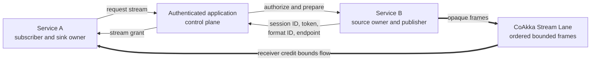
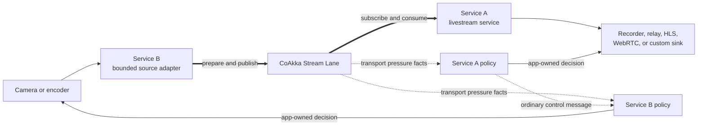
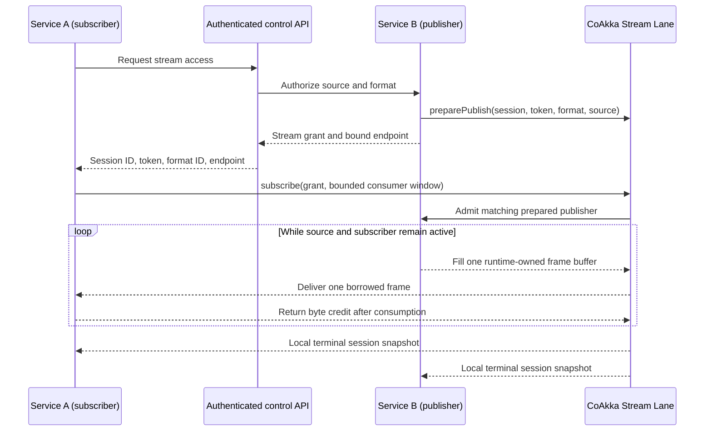
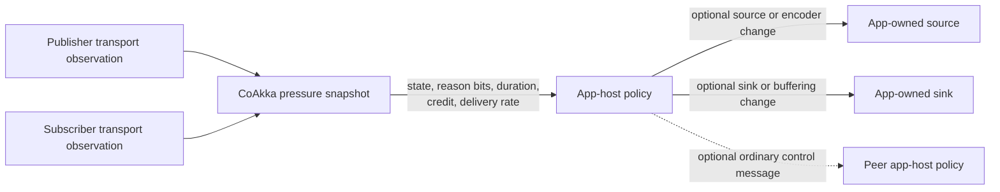

# Runtime Streaming

The CoAkka **stream lane** carries one ordered sequence of bounded binary
frames directly between two application hosts. It is intended for live camera,
microphone, telemetry, and diagnostic sources whose lifetime and size are not
known in advance.

The stream lane is separate from runtime messages and file transfer:



Use normal application messages or an existing authenticated API to authorize
the operation and exchange a stream grant. Keep live frame bytes out of
`Envelope.payload`. Use the file lane instead when the source is immutable,
has a known final size, and needs integrity verification or resumable storage.
For a browser-facing composition, read
[WebSocket Integration With CoAkka](runtime-websocket-integration.md). The
WebSocket endpoint, asynchronous send queue, browser format, and fan-out remain
app-host responsibilities.

## When To Use Stream Lane

Use the stream lane when all or most of these statements are true:

- the source is live, generated incrementally, or has no useful final size;
- the application already has meaningful frame or sample boundaries;
- current data is more valuable than replaying every old item after a slow
  consumer;
- one source service must deliver to one subscriber service without sharing
  direct access to the source device or process;
- memory and in-flight bytes must stay bounded under a slow network or sink;
- the app-host can decide what to do with pressure, drops, format, and quality.

Do not select the stream lane only because a payload is large. An immutable
video, model, dataset, or diagnostic archive is still a file and belongs on
the file lane when the receiver needs exact size, SHA-256 verification,
durable staging, resume, and atomic publication.

| Requirement | Runtime messages | File Lane | Stream Lane |
| --- | --- | --- | --- |
| Small command, event, or reference | Best fit | No | No |
| Immutable object with a known final size | Reference only | Best fit | Usually no |
| Live or incrementally generated source | Control only | No | Best fit |
| Whole-object SHA-256 and resumable staging | No | Yes | No |
| Ordered application-defined frames | Not for bulk bytes | No | Yes |
| Slow-consumer byte bound and pressure signal | Message-lane policy | Transfer progress | Yes |
| Durable replay or multi-subscriber fan-out | Use a durable system | External object distribution | Use a media or event system above the lane |

A recorded video can exercise either lane for different reasons. Copy it as
an intact asset with the file lane. Replay bounded chunks on a monotonic clock
with the stream lane when testing live-source pacing, backpressure, frame
delivery, cancellation, or sink behavior without camera hardware.

## Typical Use Cases

- **Camera isolation:** a Raspberry Pi camera service owns `libcamera`, V4L2,
  and the encoder; a separate livestream service subscribes through CoAkka and
  owns recording, relay, HLS, WebRTC, or another sink.
- **Live audio:** a microphone or audio-capture service publishes bounded
  encoded packets to a speech, monitoring, recording, or relay service.
- **Industrial telemetry:** an edge service emits bounded sensor batches,
  waveforms, or machine-vision results whose stream must remain memory-bounded
  when the analysis service slows down.
- **Live inference pipelines:** a capture or preprocessing service feeds a
  dedicated inference service without granting that service access to the
  camera, device node, or producer process. Model binaries themselves still
  move through the file lane.
- **Remote diagnostics:** an agent streams a bounded trace, packet-capture
  feed, or live diagnostic channel to a collector. A completed diagnostic
  bundle is instead a file-lane transfer.
- **Generated media and data:** an encoder, simulator, or acquisition process
  produces an ordered sequence incrementally and the consumer can handle it
  immediately without waiting for a final object.

The first use case keeps ownership deliberately separate:



CoAkka does not choose a lower resolution, bitrate, FPS, codec, camera mode,
or destination. It reports transport observations promptly. Each app-host
maps those observations to policy for resources it owns.

## Availability

The stream lane is an official native product contract beginning with the
runtime `2.2.0` source line. Builds containing it report
`COAKKA_V2_RUNTIME_FEATURE_STREAM_LANE`; the ABI is declared in
`coakka/v2/stream_lane.h` and its dedicated wire protocol is version 1.

The `2.3.0` source line adds neutral per-session pressure snapshots and
blocking pressure waits. This is an additive host-observation contract; it
does not change stream wire version 1 or move source, codec, relay, and sink
policy into CoAkka.

Exact released generation
`2.5.0+4b65d0b2256037bf7fc180bfa6df8c41efc1dd6a` contains the public Stream
Lane header, pressure snapshots and waits, plus the additive native owner-grant
symbols. It is published through Runtime `2.5.0` on npm, PyPI, and NuGet,
Runtime Go `v1.8.0`, and SwiftPM `v2.5.0`. Maven Central Runtime remains at
`2.4.1`, and the promoted standalone native artifact pointer remains deferred.
Published typed connector APIs remain on the Simple Stream Lane profile.
Dynamic native consumers must feature-detect optional owner-grant symbols.

Direct TCP, TLS, and mutual TLS use the same security profiles as the file
lane. The release gate includes a standalone C11 roundtrip built only against
the installed package, exact native exports, target builds, TLS/mTLS execution,
and sanitizer execution.

## Session Workflow

For a Service A to Service B stream session:



1. Service A requests stream access through the application's authenticated
   control plane.
2. Service B authorizes the caller and creates a unique session ID, a
   cryptographically strong short-lived token, and an application-defined
   `format_id`.
3. Service B calls `coakka_v2_stream_lane_prepare_publish()` with its bounded
   source callback, then returns the endpoint and grant to Service A.
4. Service A calls `coakka_v2_stream_lane_subscribe()` with the same identity,
   token, format, maximum frame size, receiver window, and consumer callback.
5. Service B admits the dedicated connection only when the prepared identity,
   token, and format match.
6. Service B produces frames while Service A has byte credit. Service A
   returns credit only after its consumer callback finishes.
7. Either host may cancel. Each host waits for its local terminal session
   record, records the outcome, and then forgets that record.

When the publisher target has multiple replicas, the prepared source callback
and session state belong to the exact replica that admitted the session. The
Simple API remains supported when one stable publisher owns the endpoint or the
application already pins it. The additive Owner-aware native API in released
generation `2.5.0+4b65d0b2` returns the exact publisher endpoint. Do not
reconnect either profile through a replica-load-balancing Service address.
See [Runtime Lane Owner Grants](runtime-lane-owner-grants.md) for its
availability, Kubernetes addressing, fan-out pressure, and owner-loss contract.

`PUBLISH` is Service B's local direction. `SUBSCRIBE` is Service A's local
direction. Protocol v1 prepares one publisher for one subscriber; it does not
provide fan-out.

## Choose Simple Or Owner-Aware

| Choose | When it is the clearer contract | Runnable C11 profile |
| --- | --- | --- |
| Simple | One publisher instance has a stable endpoint, or application control state already keeps session identity, token, format, frame bound, and endpoint together. | `bash run.sh runtime-test stream-lane-simple` |
| Owner-aware | A prepare command may select one of several replicas, or publisher replacement must invalidate the prior endpoint capability. | `bash run.sh runtime-test stream-lane-owner-aware` |

The Owner-aware profile checks
`COAKKA_V2_RUNTIME_FEATURE_LANE_OWNER_GRANTS`, creates the publisher with
`coakka_v2_stream_lane_create_owned()`, and subscribes using the fixed-size
result from `coakka_v2_stream_lane_prepare_publish_grant()`. Its first valid
`OPEN` consumes the grant; reconnect after admission requires a fresh prepare
and grant. The released native C `2.5.0` generation exposes this profile;
published typed high-level connector APIs remain Simple.

## Service A To Service B Connector Example

The Kotlin names below represent the JVM connector, but every official
connector follows the same ownership model. Service B owns a long-lived
publisher-capable lane and the live source. Service A owns a subscriber-capable
lane and the sink. They exchange only a serializable grant through their
existing authenticated API; they never exchange a `StreamLane` object.

```kotlin
data class StreamGrant(
    val sessionId: String,
    val authorizationToken: String,
    val publisherHost: String,
    val publisherPort: Int,
    val formatId: Long,
    val maxFrameBytes: Int,
    val initialWindowBytes: Int,
)
```

Service B authorizes the request before preparing the publisher. The camera
adapter below exposes
`nextFrame(destination: ByteBuffer): StreamSourceResult`; it writes directly
into the borrowed destination and uses a bounded device wait.

```kotlin
class CameraPublisherService(
    private val advertisedHost: String,
    private val camera: CameraAdapter,
) : AutoCloseable {
    private val lane = StreamLane.open(
        StreamLaneConfig(
            flags = StreamLaneFlags.PUBLISHER,
            bindHost = "0.0.0.0",
        )
    )

    // Called by Service B's authenticated control API.
    fun prepareLiveStream(caller: ServiceIdentity): StreamGrant {
        require(caller.mayViewCamera()) { "stream is not authorized" }

        val sessionId = UUID.randomUUID().toString()
        val token = newUrlSafeToken() // Cryptographically strong and not logged.
        val formatId = CameraFormats.H264_ANNEX_B_720P
        val maxFrameBytes = 256 * 1024
        val initialWindowBytes = 4 * maxFrameBytes

        lane.preparePublish(
            StreamPublishSpec(
                sessionId = sessionId,
                authorizationToken = token,
                formatId = formatId,
                maxFrameBytes = maxFrameBytes,
                source = StreamSource(camera::nextFrame),
            )
        )

        return StreamGrant(
            sessionId,
            token,
            advertisedHost,
            lane.boundPort,
            formatId,
            maxFrameBytes,
            initialWindowBytes,
        )
    }

    override fun close() = lane.close()
}
```

Service A consumes each borrowed frame before returning from the callback. If
the sink needs asynchronous ownership, it must copy into its own bounded
buffer or hand off through a bounded adapter whose lifetime rules are explicit.

```kotlin
class LivestreamSubscriberService(
    private val sink: LivestreamSink,
) : AutoCloseable {
    private val lane = StreamLane.open(
        StreamLaneConfig(flags = StreamLaneFlags.SUBSCRIBER)
    )

    fun subscribe(grant: StreamGrant) {
        lane.subscribe(
            StreamSubscribeSpec(
                sessionId = grant.sessionId,
                authorizationToken = grant.authorizationToken,
                remoteHost = grant.publisherHost,
                remotePort = grant.publisherPort,
                formatId = grant.formatId,
                maxFrameBytes = grant.maxFrameBytes,
                initialWindowBytes = grant.initialWindowBytes,
                consumer = StreamConsumer { bytes, metadata ->
                    sink.consumeBorrowed(bytes, metadata)
                    StreamConsumerDecision.CONTINUE
                },
            )
        )
    }

    override fun close() = lane.close()
}
```

Lifecycle and pressure waits belong on bounded application workers, not UI,
request, renderer, or WebView threads. Passing the last observed sequence
prevents busy-polling:

```kotlin
fun observePublisher(
    lane: StreamLane,
    sessionId: String,
    policy: EncoderPolicy,
) {
    var pressureSequence = 0L
    while (true) {
        val session = lane.session(sessionId, StreamDirection.PUBLISH)
        if (session.terminal) {
            try {
                policy.onTerminal(session)
            } finally {
                lane.forget(sessionId, StreamDirection.PUBLISH)
            }
            return
        }

        val pressure = lane.waitPressure(
            sessionId,
            StreamDirection.PUBLISH,
            afterUpdateSequence = pressureSequence,
            timeoutMs = 1_000,
        )
        policy.observeTransport(pressure)
        pressureSequence = pressure.updateSequence
    }
}
```

`EncoderPolicy` may choose a different app-owned capture profile, but CoAkka
does not call it or define that decision. Production code normally keeps
session waiting and pressure waiting as separate bounded tasks so a quiet
pressure stream cannot delay terminal observation.

## Frame Contract

Every delivered frame contains:

- a runtime-assigned sequence starting at one and increasing by one;
- a monotonic capture timestamp supplied by the source, or runtime monotonic
  time when the source leaves it zero;
- keyframe, discontinuity, or end-of-segment flags;
- the source-reported number of frames or samples dropped before this frame;
- one non-empty opaque payload bounded by the negotiated maximum.

`format_id` is a 64-bit application compatibility identifier. The lane checks
that both sides agreed on it but does not parse a codec, schema, or media
container. Codec negotiation and transcoding remain application or media
adapter responsibilities.

## Backpressure And Memory

The subscriber advertises a bounded byte window. The window must hold at least
one maximum-sized frame. The publisher deducts payload bytes from the window
and the subscriber replenishes them after successful consumption.

Cancellation cannot retract frames already covered by credit. The publisher's
terminal sent count may therefore be greater than the subscriber's consumed
count, but excess data remains bounded by the receiver window.

The runtime retains bounded session descriptors and allocates reusable buffers
per active direction, not per frame. A Raspberry Pi camera adapter should also
use a small bounded capture queue, normally a latest-frame policy, and report
overwritten frames through `dropped_before`. Backpressure must not become an
unbounded queue of stale camera frames.

The public defaults are eight retained session records, one worker per enabled
direction, `256 KiB` maximum frames, a four-frame receiver window, a 30-second
I/O timeout, and progress publication every 30 frames or 250 ms. Hard bounds
are 64 records, four workers per direction, `4 MiB` per frame, and `16 MiB` per
receiver window. Zero-valued optional config fields select the documented
defaults.

## Transport Pressure

CoAkka reports transport observations and never emits media commands. A
publisher can observe receiver-credit waits and prolonged transport writes. A
subscriber can observe a prolonged transport read or consumer callback. Both
directions expose the negotiated window, windowed delivery throughput,
monotonic pressure duration, transition count, and cumulative pressure time.

The states are `INACTIVE`, `FLOWING`, `PRESSURED`, `STALLED`, and
`RECOVERING`. Reason bits identify `CREDIT_WAIT`, `TRANSPORT_WRITE`,
`CONSUMER_BUSY`, or `TRANSPORT_READ`. They do not identify a business or
physical root cause: a credit wait can result from a slow network, peer
scheduling, or a slow sink. A prolonged transport read cannot distinguish
network delay from peer scheduling or an application source that has not
produced another frame.

Use `coakka_v2_stream_lane_get_pressure()` for an immediate retained snapshot
or `coakka_v2_stream_lane_wait_pressure()` with the last pressure
`update_sequence`. The wait reevaluates monotonic thresholds on the calling
host thread; the lane creates no pressure notification thread and invokes no
application callback from its transport hot path. Intermediate observations
may be coalesced, while the latest published state and cumulative counters
remain visible. A generation guard keeps fields within one returned snapshot
coherent across worker updates. Delivery rate accumulates bytes over a
monotonic observation window and flushes a partial window at terminal state,
so acknowledgement bursts do not become instantaneous throughput samples.

Default timing is 100 ms before an in-flight transport read, write, or consumer
operation is pressured, 1000 ms before a pressure condition is stalled, 500 ms
of recovery, and a 100 ms observation/rate interval for waiting hosts. Zero
selects those defaults; each interval has a 60-second hard ceiling.

Service B may map publisher pressure to camera or encoder policy. Service A
may map subscriber pressure to sink policy or send an ordinary application
control message to B. CoAkka does not understand resolution, bitrate, FPS,
codec, camera ownership, or destination type.



## Wire Compatibility

`COAKKA_V2_STREAM_LANE_WIRE_VERSION` is 1. Every connection starts with the
stream magic and wire version; mismatched or malformed peers are rejected
before application frame callbacks run. Frame and control integers use fixed
network byte order. An incompatible framing change requires a new wire version,
not reinterpretation of version 1.

## Callback Rules

The publisher source callback receives runtime-owned writable storage and an
output frame descriptor. It returns:

- `COAKKA_V2_OK` with one non-empty frame;
- `COAKKA_V2_ERR_WOULD_BLOCK` when no frame is currently available;
- `COAKKA_V2_ERR_CLOSED` when the live source ends normally;
- another status when the source fails.

The subscriber consumer callback borrows frame bytes only for the callback
duration. It returns `COAKKA_V2_OK` after consuming or copying a frame, or
`COAKKA_V2_ERR_CLOSED` to cancel cleanly.

Callbacks run on bounded lane workers. Their context storage must remain valid
until the session is terminal and forgotten or the lane is destroyed. They
must not destroy the lane from inside a callback, retain runtime-owned byte
pointers, or block indefinitely. Device reads need a bounded wait so stop and
cancel remain observable.

## Lifecycle And Operations

Session states progress through `PREPARED`, `QUEUED`, `CONNECTING`, `ACTIVE`,
and optionally `STOPPING`, then finish as `ENDED`, `REJECTED`, `FAILED`, or
`CANCELED`. `ENDED + OK` means the source ended normally; it does not imply
file-style durability or replay.

Use `coakka_v2_stream_lane_wait_session()` with the last observed
`update_sequence` instead of polling. Intermediate progress updates may be
coalesced, but terminal state is retained. Use `cancel_session()` for
cooperative cancellation and `forget_session()` after the application records
the terminal outcome. Publisher terminal publication releases the active slot
under the same lane mutex, so a successful terminal wait is sufficient before
`forget_session()`; callers do not need a timing delay or retry loop. After a
successful forget, the same session ID may be prepared again without deferred
cleanup from the prior session affecting it.

Statistics are local direction outcomes. A canceled end-to-end session can
increment the canceled counter once on the publisher host and once on the
subscriber host.

## Security

- `DIRECT` is plaintext and requires an externally authenticated and encrypted
  network boundary.
- `TLS` authenticates the publisher endpoint and encrypts the stream.
- `MUTUAL_TLS` authenticates both transport peers.

TLS identity is not business authorization. Service B must still prepare a
unique session and compare its opaque token before invoking the source
callback. Tokens must not be logged and should expire through application
policy if the prepared session is never used.

## Protocol V1 Non-Goals

Protocol v1 does not implement resume, retransmission, durable checkpoints,
replay, multi-subscriber fan-out, codec negotiation, application adaptation
policy, or cross-session multiplexing. It is not an RTSP, RTP, WebRTC, SRT,
HLS, or player API. Those concerns belong in media adapters and host services.
