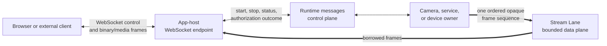
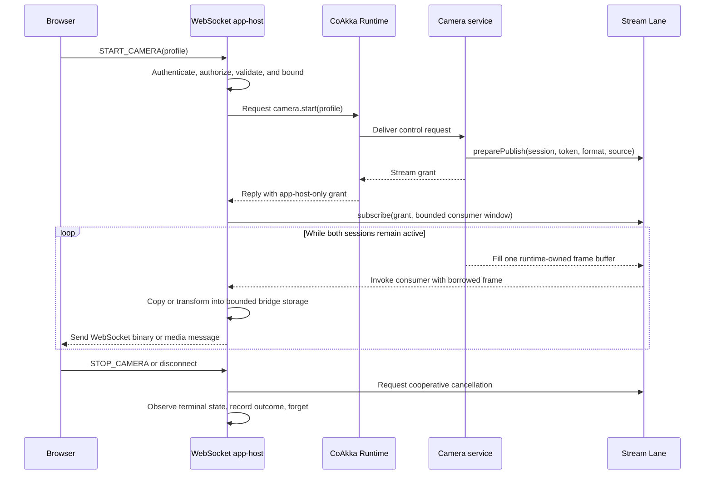

# WebSocket Integration With CoAkka

CoAkka Runtime does not terminate or implement WebSocket. A WebSocket-facing
app-host can compose browser sessions with CoAkka by using:

- ordinary Runtime messages or request/reply for control;
- Stream Lane for one bounded point-to-point sequence of opaque frames; and
- an app-owned WebSocket bridge for browser protocol, buffering, fan-out, and
  session policy.

WebSocket is a full-duplex application protocol commonly opened with an HTTP
handshake. It is not another Runtime transport mode, and Stream Lane does not
need to understand it.



This is protocol composition, not built-in WebSocket support.

## Ownership Boundary

The WebSocket app-host owns:

- the HTTP upgrade, listener, TLS for `wss`, origin checks, authentication,
  authorization, tenant isolation, and rate limits;
- its public command and event schema, WebSocket message types, ping/pong,
  close codes, reconnect behavior, and browser session lifetime;
- mapping Stream Lane `format_id` values to application media or data formats;
- copying borrowed Stream Lane frames into bounded app-owned storage before an
  asynchronous WebSocket send;
- per-client queue limits, slow-client policy, drops, disconnects, and fan-out;
- mapping Runtime and Stream Lane terminal outcomes into its public protocol;
- browser-facing metrics, audit records, and user-visible errors.

CoAkka Runtime owns:

- target routing, bounded admission, request/reply, timeout, deadletter, and
  delivery diagnostics for ordinary Runtime work;
- Stream Lane session admission, token and format matching, ordered bounded
  frames, receiver credit, transport-pressure observations, cancellation, and
  local terminal session records.

CoAkka does not own WebSocket framing, browser playback, codec negotiation,
media transcoding, fan-out, or public session authentication.

## Control Plane And Data Plane

A browser command such as `START_CAMERA` is application control. The app-host
validates and authorizes it, then may submit an ordinary Runtime request to the
service that owns the camera. The service prepares a Stream Lane publisher and
returns a short-lived stream grant through that authenticated control path.

The live bytes then use Stream Lane, not `Envelope.payload`:



The stream token authorizes one Stream Lane session between app-hosts. It is
not a browser identity token and normally should not be sent to JavaScript,
placed in a URL, or written to logs.

## The Borrowed-Frame Rule

The Stream Lane consumer receives `data` and frame metadata borrowed only for
the callback duration. A WebSocket library normally completes sends
asynchronously, so it must not retain those pointers after the callback
returns.

The bridge therefore needs one explicit handoff:

```text
Stream Lane consumer callback
  -> validate frame and size
  -> copy into bounded app-owned storage
  -> enqueue without an unbounded wait
  -> wake the WebSocket event loop
  -> return to Stream Lane

WebSocket event loop
  -> take app-owned frame
  -> encode or wrap according to the public protocol
  -> send
  -> release app-owned frame after send completion
```

The copy is an ownership-boundary copy. It is required whenever the WebSocket
send outlives the Stream Lane callback. Avoiding that copy is valid only when
the WebSocket implementation consumes the bytes synchronously before the
callback returns and the callback still has a bounded wait.

## Backpressure Does Not Cross Automatically

Stream Lane returns receiver credit after the consumer callback successfully
finishes. If the callback copies a frame into an app-host queue and returns,
Stream Lane knows that its own consumer accepted the frame. It cannot know
whether a browser socket later became slow.

The app-host must therefore bound the bridge independently by bytes and/or
frames and select an explicit overflow law:

| Workload | Reasonable bounded policy |
| --- | --- |
| Live display where freshness wins | Keep a latest-frame slot or drop older non-key frames, count drops, and preserve required decoder boundaries. |
| Telemetry where sampling is allowed | Coalesce or sample according to an application contract and expose the reduction. |
| Lossless ordered delivery | Reject or disconnect a slow client, or fail/cancel the Stream Lane session when the bounded queue fills. Do not silently drop. |
| Multi-client live media | Give each client a bounded queue or latest-frame slot so one slow client cannot retain all other clients' data. |

Returning success from the consumer after silently discarding data is correct
only when the application's stream contract explicitly permits that drop and
records it. An unbounded WebSocket queue defeats Stream Lane's memory bound.

Stream Lane pressure snapshots describe Stream Lane transport and consumer
work. App-host queue depth, WebSocket send latency, client drops, and browser
disconnects require separate app-host metrics.

## Fan-Out Belongs Above Stream Lane

Stream Lane wire protocol version 1 prepares one publisher for one subscriber.
It is not a broadcast or multicast protocol.

One gateway may subscribe once and distribute app-owned copies to several
WebSocket clients:

```text
camera service
  -> one Stream Lane session
  -> WebSocket app-host
       -> bounded client A queue
       -> bounded client B queue
       -> recorder or media adapter
```

That is app-host fan-out. The gateway owns membership, per-client bounds,
format compatibility, ordering, drop policy, and removal of slow clients. If
several independent services each require Stream Lane delivery semantics, the
application prepares separate one-to-one sessions or introduces a dedicated
media/event distribution system above the lane.

## Frame And Browser Format

Stream Lane transports opaque application frames. `format_id` proves that the
publisher and subscriber agreed on an application-defined format; it does not
make that format playable by a browser.

Mapping one Stream Lane frame to one WebSocket binary message is valid only
when the app protocol and browser consumer understand the same boundaries.
Depending on the product, the gateway may instead:

- forward JPEG frames to a reviewed browser decoder or expose multipart MJPEG;
- package encoded samples for Media Source Extensions;
- adapt frames for WebCodecs;
- feed an HLS, WebRTC, RTMP, or recording component; or
- decode and transform application data before serializing WebSocket events.

For example, raw H.264 Annex B frames are not automatically a complete
browser playback contract merely because they arrived in binary WebSocket
messages. Codec, container, initialization data, timestamps, and decoder
behavior remain media-adapter responsibilities.

## Failure And Cancellation Mapping

| Event | Required owner and action |
| --- | --- |
| Browser disconnects | App-host stops new sends and requests cooperative cancellation of the related Stream Lane subscriber. |
| WebSocket queue reaches its bound | App-host applies the declared drop, refusal, disconnect, or Stream Lane failure policy and increments evidence. |
| Stream Lane reaches terminal state | App-host records the local terminal snapshot, maps it to its public status or close behavior, then forgets the record. |
| Runtime control request times out or deadletters | App-host reports the reviewed control-plane failure; it must not pretend a stream started. |
| WebSocket send fails | App-host releases queued buffers, closes the public session, and cancels related Stream Lane work when appropriate. |
| App-host shuts down | Stop admission, close public sessions, cancel lane records, wait for terminal state, forget records, stop lanes, then release callback contexts. |

Cancellation is cooperative. A local browser disconnect or timeout does not
prove that remote business work rolled back. The application must not promise
distributed rollback unless a higher-level protocol provides it.

Do not call Stream Lane `stop` or `destroy` from its callback. Callback context
must remain alive until the record is terminal and forgotten, or until the
lane is stopped and destroyed after concurrent work has quiesced.

## Security Checklist

Before exposing a WebSocket gateway beyond loopback or a trusted network:

1. Terminate `wss` with a reviewed certificate and trust policy.
2. Authenticate the external session and authorize every control operation.
3. Validate `Origin` where browser deployment requires it; do not treat it as
   the only authentication mechanism.
4. Bound handshake headers, messages, frames, sessions, rates, and queued
   bytes per client and per tenant.
5. Keep Stream Lane tokens short-lived, unguessable, server-side, and out of
   URLs, browser storage, traces, and logs.
6. Configure Stream Lane TLS or mutual TLS independently when traffic crosses
   an untrusted network. `wss` protects the browser-to-gateway hop only.
7. Make close, cancellation, overflow, drop, and terminal outcomes observable.

## Integration Checklist

Before calling a WebSocket composition production-ready, verify:

- the WebSocket endpoint and Stream Lane are owned by long-lived app-host
  lifecycle objects, not individual request handlers;
- control commands use authenticated application policy and bounded Runtime
  messages or an existing API;
- stream grants never become browser credentials;
- borrowed frame bytes are consumed or copied before callback return;
- every async queue has byte/frame/session bounds and a documented overflow
  outcome;
- fan-out cannot let one slow client stall or retain every other client;
- Stream Lane and WebSocket pressure are measured separately;
- browser disconnect, queue overflow, Stream Lane failure, Runtime timeout,
  and shutdown paths are tested;
- the media/data format is actually consumable by the target browser client;
- matching-host evidence covers the chosen connector, WebSocket library, TLS
  configuration, and target architecture.

## Existing Reference

The public [Raspberry Pi camera sample](https://github.com/phuong-tran/coakka-samples/tree/main/runtime-streaming-demo/rpi-camera)
shows a concrete native app-host that subscribes to bounded MJPEG and PCM
Stream Lane sessions and owns a loopback HTTP/MJPEG/WebSocket gateway.
Its listener is intentionally restricted to `127.0.0.1`; it does not claim
Internet exposure, TLS, or multi-user browser authentication. Its Windows
release evidence also labels WebSocket control as pending. Treat it as an
ownership and lifecycle reference, not proof of a general WebSocket transport
or production Internet gateway.

Read [Runtime Streaming](runtime-streaming.md) for the complete Stream Lane
contract and [Keep HTTP At The Edge](http-edge-runtime-boundary.md) for the
general application-edge boundary.
