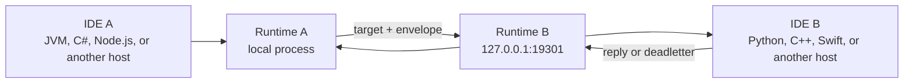

# Build The Product Before The Infrastructure

This guide is for startups and product teams that need to ship, learn, and
change the business quickly. It addresses a common early obstacle: designing a
distributed production topology before the product has proved which boundaries
actually need to be distributed.

CoAkka lets an application begin with the smallest useful runtime shape and
move capabilities later without changing every caller into a new HTTP client.
Start with a monolith when one process and one language are enough. Run several
local processes when the product needs several languages. Add containers,
remote hosts, replicas, and infrastructure policy when deployment evidence
requires them.

The principle is:

```text
stable business target + explicit contract
  first: local handler
  later: peer process or deployed service
```

This is not a claim that infrastructure disappears. It is a way to defer
infrastructure work until the product has a concrete reason for it.

## Start With The Smallest Honest Shape

Choose the simplest shape that supports today's development work.

| Product situation | Starting shape | Runtime network mode |
| --- | --- | --- |
| One language and one application process | Modular monolith with local handlers | `EMBEDDED` |
| Several languages are useful during development | Separate local processes started from their normal IDEs or terminals | `NETWORK_NODE` only for a process that accepts inbound runtime traffic; `OUTBOUND_ONLY` where appropriate |
| A capability needs independent deployment, isolation, or scaling | Separate deployed service or worker | Explicit `NETWORK_NODE` bind and advertise policy |

An embedded runtime does not need a loopback listener. Local routes keep port
`0`, and calls to local targets stay inside the process-owned runtime path.

```text
web or job code
  -> ask "billing.invoice.create"
  -> local billing handler
  -> reply or deadletter
```

This is still a real runtime contract: target ownership, bounded admission,
request/reply matching, timeout, deadletter, lifecycle, and diagnostics remain
visible. The team is not pretending that a local function is already a remote
service.

## A Monolith Can Have Real Boundaries

Monolith does not have to mean one unstructured codebase. Organize the product
around stable business capabilities:

```text
targets
  customer.profile.update
  billing.invoice.create
  inventory.stock.reserve

handlers
  customer module owns customer.profile.update
  billing module owns billing.invoice.create
  inventory module owns inventory.stock.reserve
```

Callers know the target and payload contract. They do not need to know whether
the handler is currently in the same module, process, container, or host.

That boundary gives a startup room to change its deployment without forcing an
early microservice topology. The first version can keep one executable, one
debug session, and one deployment unit while still making capability ownership
explicit.

## Polyglot Development Without A Container Build Loop

A product may need more than one language before it needs production
containers. For example, a team can run a JVM application from IntelliJ and a
Python worker from PyCharm, or a C# service from Rider and a Node.js host from
VS Code.

During local development:

1. Start each application from its own IDE or terminal.
2. Give the inbound participant an explicit loopback bind such as
   `127.0.0.1:19301`.
3. Point the caller's peer route at that local address.
4. Put breakpoints in both applications.
5. Edit, restart, and debug each language with its normal toolchain.



Docker is useful for reproducibility and deployment-like verification, but it
does not have to sit inside every edit-debug cycle. A local multi-process path
can shorten feedback while preserving the same target, envelope, reply, and
deadletter vocabulary used by the deployed path.

## What Stays Stable When A Capability Moves

Suppose `billing.invoice.create` begins inside the main application and later
needs its own process.

Before the split:

```text
route billing.invoice.create -> LOCAL
network mode                 -> EMBEDDED
handler                      -> main application
```

After the split:

```text
caller route                 -> billing peer address
billing network mode         -> NETWORK_NODE
billing route                -> LOCAL
handler                      -> billing process
```

The intended stable surface is:

- target name
- payload identity and schema version
- reply and deadletter expectations
- timeout and cancellation policy
- business ownership of the handler

The parts that intentionally change are:

- route endpoint and generation
- process ownership
- network participation mode
- bind and advertise configuration
- deployment, scaling, and recovery policy

Call sites should not have to acquire a new private controller, URL builder,
status-code convention, retry wrapper, and correlation scheme merely because a
capability moved to another process.

## A Practical Startup Progression

### Stage 1: Product Discovery

Use one process and `EMBEDDED` mode. Keep local routes on port `0`. Define only
the targets and payloads that represent real business capabilities.

Focus on:

- customer workflow
- business rules
- persistence model
- useful product feedback
- explicit failure behavior

Do not design replica counts, service meshes, or cross-region routing for
traffic that does not exist yet.

### Stage 2: Local Polyglot Work

Add a second process when another language or runtime gives the product a
concrete advantage. Run both applications directly from their development
tools. Use loopback networking and explicit local ports for the peer boundary.

At this stage, verify:

- request/reply and deadletter behavior
- payload compatibility between languages
- startup and shutdown ordering
- bounded queue pressure
- breakpoint-driven debugging on both sides

### Stage 3: Deployment-Shaped Verification

Add containers or a compose environment when the team needs reproducible
packaging, dependency isolation, CI verification, or deployment rehearsal.
Keep the same target names and payload contracts used by the local workflow.

Containerization should prove the package and network boundary. It should not
be required to discover whether a line of business logic works.

### Stage 4: Independent Services And Scale

Split a capability when evidence shows a real ownership or operational need:

| Signal | Why a split may help |
| --- | --- |
| Independent release cadence | One capability must ship without redeploying the whole application. |
| Different scaling profile | One workload consumes materially different CPU, memory, I/O, or concurrency. |
| Fault isolation | Failure in one capability must not take down the main process. |
| Security boundary | The capability needs a distinct trust, credential, or data-access boundary. |
| Team ownership | A stable team needs independent operational responsibility. |
| Platform requirement | A language, device, accelerator, or operating system requires another host. |

Do not split only because a future architecture diagram looks cleaner. Every
new service adds packaging, configuration, credentials, rollout, monitoring,
failure, and on-call work.

## CoAkka Can Eliminate The Service Mesh

Separating a CoAkka target into another process does not create a service-mesh
requirement. CoAkka already owns the runtime data-plane concerns that commonly
cause teams to add a mesh around internal HTTP services:

| Concern | CoAkka-owned path |
| --- | --- |
| Peer encryption and identity | Built-in capability-gated [TLS/mTLS](tls-and-mtls.md), including atomic same-mode credential reload |
| Connection lifetime and reuse | Startup-selected [Connection Strategies](connection-strategies.md): per-exchange, bounded pool, persistent single-flight, or multiplexed |
| Endpoint selection and failover | Target-aware [Runtime Cluster Routing](runtime-cluster-routing.md), weighted or rendezvous selection, bounded failover, route generations, replies, and deadletters |
| Delivery diagnostics | [Runtime Logging And Observability](runtime-logging-observability.md): attributable runtime evidence, queue pressure, route generation, endpoint selection, timeout, rejection, and deadletter facts |

These features let a team run CoAkka runtime traffic without sidecars or a
service-mesh data plane. Certificate issuance and secret distribution can stay
with the host or deployment platform. Firewall, CNI, and public ingress policy
can stay at the real network edge. None of those responsibilities requires
putting a proxy beside every application process.

A team may still choose an independent mesh control plane for organization-wide
policy that it deliberately wants outside CoAkka. That is an additional
platform decision, not a CoAkka prerequisite and not the default answer to
internal runtime communication. Require a measured need before accepting the
extra proxies, configuration, resource use, failure modes, and debugging path.

## What CoAkka Does Not Decide For You

Moving a handler does not automatically solve distributed data or operations.
The application still owns:

- database boundaries and transaction semantics
- idempotency and business retries
- payload evolution and compatibility
- authentication, authorization, and secret management
- deployment discovery and network policy
- observability export, SLOs, and incident response
- capacity measurement and cost decisions

CoAkka provides stable target-based delivery, bounded runtime behavior, and an
explicit path from local to remote ownership. The team must still decide when
remote ownership is justified and how the resulting distributed system stays
correct.

## Decision Rule

Use this default:

```text
keep the capability local
until one measured development, ownership, security, isolation, or scaling need
is stronger than the operational cost of another service
```

For the mechanics behind these shapes, continue with:

- [Runtime TLS And mTLS](tls-and-mtls.md)
- [Runtime Connection Strategies](connection-strategies.md)
- [Runtime Logging And Observability](runtime-logging-observability.md)
- [Runtime Cluster Routing](runtime-cluster-routing.md)
- [Runtime Network Modes](runtime-network-modes.md)
- [How It Works](how-it-works.md)
- [Runtime Integration Guide](runtime-integration-guide.md)
- [Containerized Runtime Notes](containerized-runtime.md)
- [Production Readiness](production-readiness.md)
