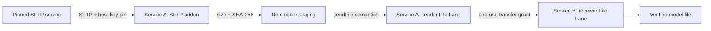

# SFTP Artifact Publisher Sample

This sample models a production-shaped artifact distribution service rather
than a standalone downloader. Service A owns the optional SFTP addon and a
sender File Lane. Service B owns only a receiver File Lane. The addon reports
success only after the pinned SFTP artifact is verified locally and the target
File Lane transfer completes.

## Process Boundaries

| Owner | Responsibilities |
| --- | --- |
| Service A app host | Credentials, pinned host identity, expected artifact metadata, target grants, retry/rollout policy, and lifecycle. |
| SFTP addon | Bounded acquisition, integrity verification, safe staging, File Lane submission, and aggregate terminal projection. |
| CoAkka Runtime | File Lane admission, transport, receiver verification, terminal state, and diagnostics. |
| Service B app host | Destination policy, one-use receive authorization, receiver lifecycle, and post-transfer activation. |

The sample uses two native C11 processes and the public C contracts only:

- [`native/service_a.c`](native/service_a.c) is the publishing service;
- [`native/service_b.c`](native/service_b.c) is the receiving service;
- [`native/run.sh`](native/run.sh) consumes the published archive by default,
  with a separate source-candidate mode for contributors.

This sample is deliberately not wired into the root sample runner. It consumes
the immutable `0.2.1+c5656cc8` five-target addon archive while preserving the
addon's independent package and release boundary.

See the [native walkthrough](native/README.md) for commands and production
hardening notes.
