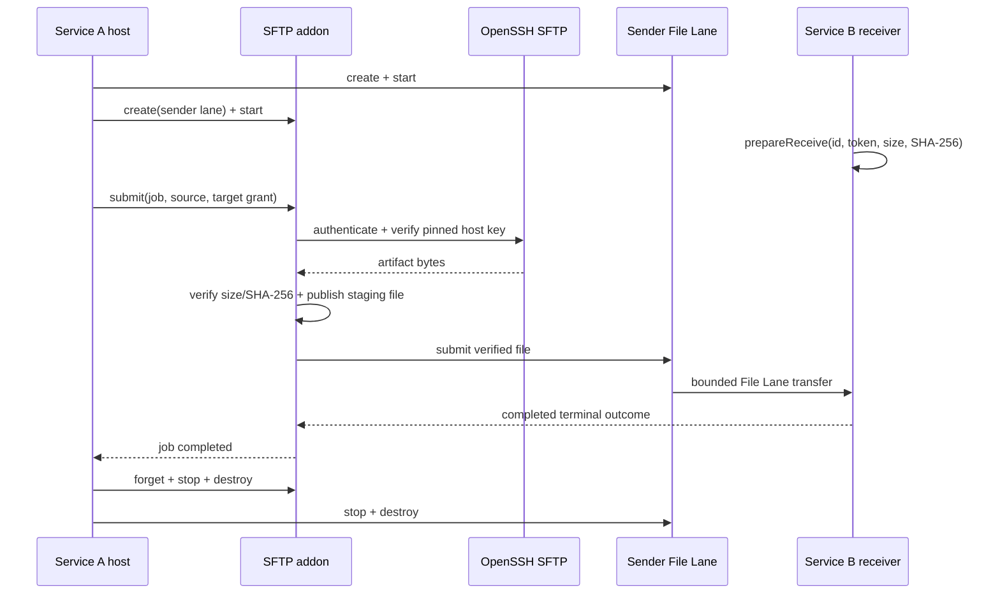

# Native SFTP To File Lane Walkthrough

The native sample proves the complete package and runtime boundary:

1. resolve the exact promoted native Runtime archive;
2. build the SFTP addon from the sibling Core source candidate;
3. stage the addon using its proposed standalone package layout;
4. build Service A and Service B through `find_package` imported targets;
5. acquire a deterministic file from a loopback OpenSSH SFTP server;
6. distribute it through File Lane and compare the receiver bytes.



## Commands

From this directory:

```sh
bash run.sh check
bash run.sh source-candidate
```

`check` performs strict C11 syntax checks and runs ShellCheck when it is
installed. `source-candidate` requires sibling `coakkaCoreNativeDev` and
`coakka-publish` checkouts by default. Override them with `COAKKA_CORE_ROOT`
and `COAKKA_PUBLISH_ROOT` when the workspace differs.

The source build requires CMake 3.20+, C/C++ compilers, pkg-config, OpenSSH,
OpenSSL command-line tools, and a static libssh2 1.11.1+ dependency closure.
Those are contributor requirements for this pre-release command. A promoted
addon archive must absorb libssh2 and its permitted crypto/compression closure;
an addon consumer must not install them separately.

## Consumer Targets

The CMake project keeps the dependency boundary explicit:

```cmake
find_package(CoAkkaRuntimeNativeV2 CONFIG REQUIRED)
find_package(CoAkkaRuntimeAddonArtifactPublisherSftp CONFIG REQUIRED)

target_link_libraries(coakka_sftp_sample_service_a PRIVATE
  CoAkkaRuntimeAddonArtifactPublisherSftp::artifact_publisher_sftp)
target_link_libraries(coakka_sftp_sample_service_b PRIVATE
  CoAkkaRuntimeNativeV2::runtime_v2)
```

Service B does not include the addon header or link its library. The addon is a
Service A deployment choice, not a cluster-wide Runtime dependency.

## Lifecycle And Ownership

Service A starts its sender lane before the addon and stops the addon before
the lane. The publish spec borrows strings, digest arrays, and target entries
only for synchronous admission; the addon copies accepted request data into
bounded owned state. The host retains and then explicitly forgets terminal job
records.

Service B prepares an exact transfer ID, one-use token, size, digest, and
destination before it announces readiness. It verifies the terminal snapshot
and hashes the destination again before forgetting the receive record. Both
processes use bounded capacities and bounded monotonic waits; neither polls with
an unbounded sleep loop.

## Production Changes

The fixture binds both protocols to loopback and uses direct File Lane
transport so it remains self-contained. A real cross-host deployment should:

- select File Lane TLS or mTLS, or place the lane on an equivalently protected
  private network;
- load credentials and transfer grants from the app host's secret and policy
  systems instead of environment variables;
- persist business rollout state outside the addon's bounded terminal cache;
- choose timeouts, queue capacities, staging limits, and fan-out policy from a
  measured resource budget;
- activate a received model only after Service B's own validation and rollout
  policy succeeds.

The sample does not update Go, Swift, npm, NuGet, Python, or other connector
packages. The addon remains an independent native release lane that composes
with the Runtime File Lane contract.
