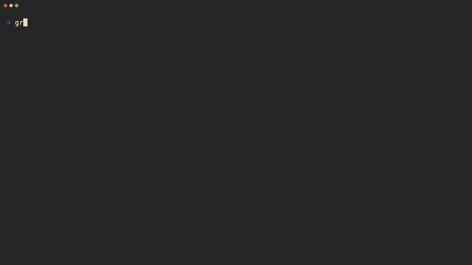

# CoAkka Runtime Client Samples

`coakka-runtime-client` is the CLI runtime client lane for CoAkka Runtime.
The published command and archive names use `coakka-client`.

Run `coakka-client --help` after unpacking a published archive. If
`coakka-runtime-client` is not found, that is expected for this release: it is
the product lane and sample directory name, not the executable name.

Detailed docs live under [docs/](docs/):

- [Introduction](docs/introduction.md)
- [Usage Guide](docs/usage.md)
- [Technical Notes](docs/technical-notes.md)

This lane is for native CLI workflows that show how an operator or developer
can drive a runtime path without building a web UI:

- print version and runtime build diagnostics
- run doctor checks against a packaged client
- submit request/reply calls to runtime targets
- run bounded shell-script verification
- verify Docker bundles without requiring a host toolchain

It is not an inspect dashboard, a topology authority, or a business schema
registry. Topology, route ownership, delivery semantics, and capability truth
stay in CoAkka Runtime. Sample payloads stay owned by the sample workflow.

## CLI Walkthrough



The walkthrough shows the packaged `coakka-client` driving a native runtime
host over the TCP frame profile. It opens with CLI help for discoverability,
then runs `version`, `doctor`, `call`, `ask`, a JSON payload-file request, and
`shell --script`.

Full recording: [coakka-runtime-client.mp4](../docs/assets/coakka-runtime-client.mp4)

## Quick Check

Run the published CLI runtime client smoke:

```sh
bash run.sh runtime-client
bash run.sh runtime-client version
bash run.sh runtime-client doctor
bash run.sh runtime-client docker-walkthrough
bash run.sh runtime-client dockerhub-demo
```

The runner resolves the matching archive from a sibling `coakka-publish`
checkout when present, otherwise it falls back to the public raw artifact URL.
Every artifact is verified against `artifacts/public-artifacts.tsv` before it
is unpacked.

Run the zero-install Linux Docker verification bundle when live Linux bundle
verification is needed:

```sh
bash run.sh runtime-client docker-bundle
```

Abbreviated expected shape; Docker Compose status lines and generated message
IDs may vary:

```text
created:customer#42
created:customer#ask
created:customer#script
created:customer#script-ask
{
  "ok": true,
  "message_kind": "MESSAGE_KIND_RESPONSE",
  "payload_text": "created:{\"customer_id\":\"script\",\"tier\":\"violet\"}"
}
```

That command resolves the published Docker verification bundle for the host
architecture, builds the tiny CLI and customer-service images from the staged
artifacts, then verifies `call`, `ask`, and `shell --script` request/reply
round-trips.

Run the guided Docker CLI walkthrough when the goal is to see the runtime-client
experience rather than just verify the bundle:

```sh
bash run.sh runtime-client docker-walkthrough
```

That path starts two native runtime service containers from the same published
bundle:

```text
service=customer-east port=19091 route=customer.east.create
service=customer-west port=19091 route=customer.west.create
```

Then it runs `coakka-client` from the CLI container against both services and
runs one shell script that switches endpoints inside the same CLI session.

Run the published Docker Hub image when the goal is the lowest-friction Docker
path:

```sh
docker run --rm docker.io/gabrielgun1983/coakka-runtime-client-demo:1.3.2-caff6d6d-remote
```

or:

```sh
bash run.sh runtime-client dockerhub-demo
```

The image starts two native runtime services inside the container, prints their
service names, ports, and routes, then runs the packaged `coakka-client`
against both services. Passing `client` runs the CLI directly:

```sh
docker run --rm docker.io/gabrielgun1983/coakka-runtime-client-demo:1.3.2-caff6d6d-remote client --help
```

## Published Release

The published CLI runtime-client release is platform-specific:

```text
coakka-runtime-client product lane
coakka-client command and archive prefix
2.4.0+c2f53117 release id on all five listed platforms
```

The executable inside each archive is `bin/coakka-client` on macOS/Linux and
`bin/coakka-client.exe` on Windows. The longer `coakka-runtime-client` name is
used for the product lane, docs, and sample directory.

Direct downloads:

| Platform | Archive |
| --- | --- |
| macOS ARM64 | [coakka-client-v2-2.4.0-macos-aarch64.tar.gz](https://raw.githubusercontent.com/phuong-tran/coakka-publish/da4a5e9c3f1f846970fb84c8f18bca893051c487/coakka-tools/coakka-client/releases/2.4.0+c2f53117/coakka-client-v2-2.4.0-macos-aarch64.tar.gz) |
| Linux x86_64 | [coakka-client-v2-2.4.0-linux-x86_64.tar.gz](https://raw.githubusercontent.com/phuong-tran/coakka-publish/da4a5e9c3f1f846970fb84c8f18bca893051c487/coakka-tools/coakka-client/releases/2.4.0+c2f53117/coakka-client-v2-2.4.0-linux-x86_64.tar.gz) |
| Linux ARM64 | [coakka-client-v2-2.4.0-linux-aarch64.tar.gz](https://raw.githubusercontent.com/phuong-tran/coakka-publish/da4a5e9c3f1f846970fb84c8f18bca893051c487/coakka-tools/coakka-client/releases/2.4.0+c2f53117/coakka-client-v2-2.4.0-linux-aarch64.tar.gz) |
| Windows x86_64 | [coakka-client-v2-2.4.0-windows-x86_64.tar.gz](https://raw.githubusercontent.com/phuong-tran/coakka-publish/da4a5e9c3f1f846970fb84c8f18bca893051c487/coakka-tools/coakka-client/releases/2.4.0+c2f53117/coakka-client-v2-2.4.0-windows-x86_64.tar.gz) |
| Windows ARM64 | [coakka-client-v2-2.4.0-windows-aarch64.tar.gz](https://raw.githubusercontent.com/phuong-tran/coakka-publish/da4a5e9c3f1f846970fb84c8f18bca893051c487/coakka-tools/coakka-client/releases/2.4.0+c2f53117/coakka-client-v2-2.4.0-windows-aarch64.tar.gz) |

Artifact catalog and manifest:
[CoAkka Public Artifacts](https://github.com/phuong-tran/coakka-publish/tree/da4a5e9c3f1f846970fb84c8f18bca893051c487),
[public-artifacts.tsv](https://raw.githubusercontent.com/phuong-tran/coakka-publish/da4a5e9c3f1f846970fb84c8f18bca893051c487/artifacts/public-artifacts.tsv)

Per-lane checksums are stored beside each release directory in
`coakka-publish`.

The macOS ARM64 archive completes matching-host command execution. Linux
ARM64/x86-64 complete matching-architecture Docker build and dependency gates.
All five archives pass dependency, architecture, archive, and checksum gates;
matching-host Linux command execution and Windows execution are not recorded
for this generation.

The same published artifacts are resolved from `coakka-publish`:

```text
coakka-tools/coakka-client/releases/2.4.0+c2f53117/
  coakka-client-v2-2.4.0-macos-aarch64.tar.gz
  coakka-client-v2-2.4.0-linux-x86_64.tar.gz
  coakka-client-v2-2.4.0-linux-aarch64.tar.gz
  coakka-client-v2-2.4.0-windows-x86_64.tar.gz
  coakka-client-v2-2.4.0-windows-aarch64.tar.gz
```

The matching Docker verification release is:

```text
coakka-tools/coakka-client/docker-demo/releases/1.3.2+caff6d6d/
```

The `demo/` path segment is part of the already-published artifact layout.
Public docs and commands describe this as the Linux Docker verification bundle.
The runner still accepts `docker-demo` as a compatibility alias.

The sample runner also provides `docker-walkthrough`, which uses that published
bundle to bring up two native runtime services and drive them with the packaged
`coakka-client` inside Docker. That is a sample experience command, not a
separate published artifact.

The Docker Hub demo image is:

```text
docker.io/gabrielgun1983/coakka-runtime-client-demo:1.3.2-caff6d6d-remote
```

It is a prebuilt convenience image for the same runtime-client walkthrough.
The public release archives and checksums remain in `coakka-publish`.

## CLI Runtime Path

The product path is the same on every supported platform: run a native CoAkka
Runtime host, then use the packaged `coakka-client` command to drive the
runtime target and inspect the explicit reply, timeout, or deadletter outcome.

Linux, Windows, macOS, and Docker lanes are verification targets for the same
CLI contract. Platform-specific packaging should prove that the same commands
and runtime outcomes work from the published artifact layout.

Future runnable samples in this directory should prefer this shape:

```text
native runtime host
  <- TCP frame profile
coakka-client call or ask
  -> runtime target
  -> reply, timeout, or deadletter
```

Keep the sample small enough that a user can see the CLI contract directly:
start host, run `version`, run `doctor`, submit one request/reply call, and stop
the host cleanly.
