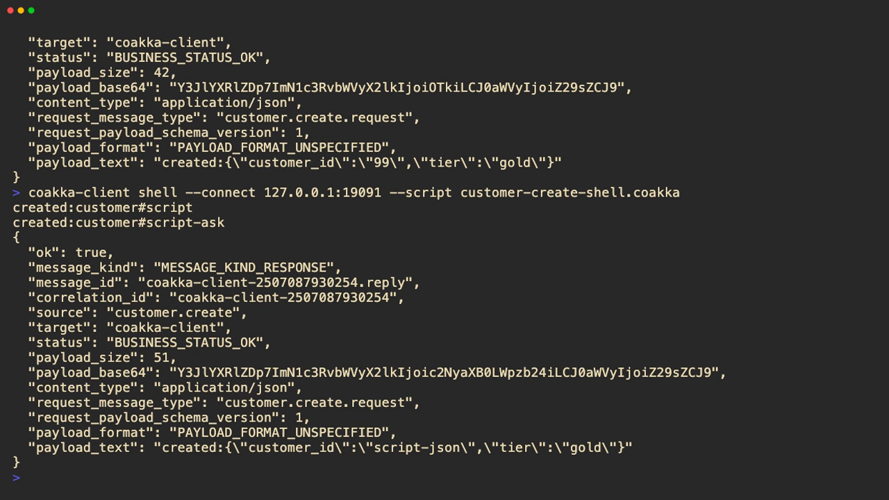

# CoAkka Runtime Client Docs

`coakka-runtime-client` is the CLI runtime client for CoAkka Runtime. The
published command and archive prefix is `coakka-client`.

This docs set is for users who want more than the short sample README:

- [Introduction](introduction.md): what the runtime client is, where it fits,
  and what it is not.
- [Usage Guide](usage.md): command discovery, diagnostics, request/reply,
  JSON payloads, and shell-script mode.
- [Technical Notes](technical-notes.md): artifact layout, runtime boundary,
  transport profile, payload metadata, and verification posture.

Start with the typed automation video when you want a visual walkthrough:

[](../../docs/assets/coakka-runtime-client.mp4)

Then run the local smoke:

```sh
bash run.sh runtime-client
```
