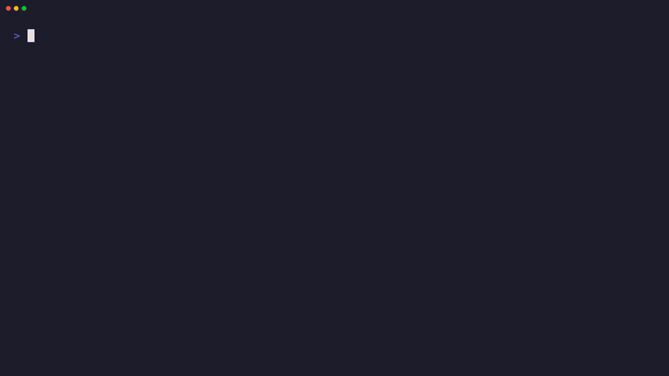
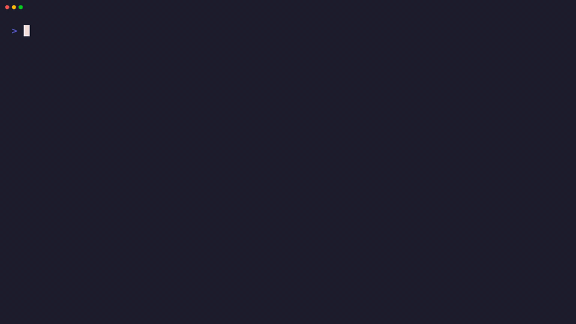

# Runtime Samples

Runtime samples show CoAkka runtime v2 as a shared native runtime
contract consumed through host-language connectors.

For day-to-day development and connector validation, treat macOS and Windows as
valid host environments. For deployment claims, operational drills, and the
usual production rollout path, keep Linux as the primary target.

The public publish surface exposes logger packages, the public native
runtime C ABI package, runtime JVM/language connector packages, and the Spring
Boot and Quarkus adapters. These samples consume those public artifacts.

This `runtime/` directory is the app-host connector sample lane. Most pinned
connector artifacts use the `1.3.1+0da8c2d9-8ff6f32` generation. Bun and Tauri
use the later `1.3.1+0da8c2d9-8ff6f32` generation. Electron uses
`1.3.1+0da8c2d9-8ff6f32`. The separate
`coakka-runtime-client` CLI sample lane lives under
[`../runtime-client`](../runtime-client/README.md) and is published as
`1.3.1+0da8c2d9`.

The runtime lane is not introduced as a generic framework. It starts from
the connector-boundary problem:

- multiple languages
- multiple processes
- gradual migration from working legacy systems
- repeated reinvention of framing, routing, request/reply, lifecycle,
  deadletter handling, and observability

CoAkka runtime v2 is intended to sit at system boundaries without requiring a
large rewrite. A connector can be embedded in an existing service, used by a
desktop application, or placed beside a legacy process as a sidecar. Integration
adapters for systems such as Camel, MQTT, brokers, files, serial devices, or
HTTP services can use the runtime contract as the common routing and diagnostic
surface.

If this is the first runtime sample you read, use this order:

1. Run a basic sample in one language.
2. In the sample code, find the start spec and route table.
3. Find the target handler registered by the owning process.
4. Find the typed ask/event sent by the caller.
5. Find the stats or deadletter output printed after delivery.

That is the smallest CoAkka mental model: an app-host declares who it is, what
targets it knows, which targets it owns locally, then submits typed work through
the runtime boundary.

## Copy-Paste Starter Shapes

These snippets are meant for first integration, not for production packaging
policy. The samples verify public artifacts through the pinned artifact
manifest. Real projects should mirror or pin the same artifacts through their
own package feed, artifact store, or build system.

JVM/Kotlin or Java Gradle:

```kotlin
repositories {
    mavenCentral()
    maven {
        url = uri("https://raw.githubusercontent.com/phuong-tran/coakka-publish/main/maven")
    }
}

dependencies {
    implementation("coakka.v2:coakka-jvm-native-runtime-v2:1.3.1-g0da8c2d9-8ff6f32")
}
```

Spring Boot same-process adapter:

```kotlin
dependencies {
    implementation("coakka.spring:coakka-spring-boot-starter:1.3.1-g0da8c2d9-8ff6f32")
    implementation("org.springframework.boot:spring-boot-starter-web")
}
```

Quarkus same-process adapter:

```kotlin
dependencies {
    implementation("coakka.quarkus:coakka-quarkus-extension:1.3.1-g0da8c2d9-8ff6f32")
    implementation("io.quarkus:quarkus-rest-jackson")
}
```

Python wheel:

```sh
python -m pip install \
  "https://raw.githubusercontent.com/phuong-tran/coakka-publish/main/runtime/python/releases/1.3.1+0da8c2d9-8ff6f32/coakka_v2_connector-1.3.1-py3-none-any.whl"
```

Node.js package:

```sh
npm install coakka-v2-connector-node@1.3.9
```

Bun package:

```sh
bun add coakka-v2-connector-bun@1.3.9
```

Tauri intent bridge:

```sh
bash run.sh runtime tauri intent-command
bash run.sh runtime tauri desktop-intent
```

Electron intent bridge:

```sh
npm install coakka-v2-connector-electron@1.3.9
```

Bun, Tauri, and Electron release gate:

```sh
bash scripts/verify-runtime-release-lanes.sh
```

## Walkthroughs

JVM:



Full recording: [coakka-runtime-jvm.mp4](../docs/assets/coakka-runtime-jvm.mp4)

Python:


Full recording: [coakka-runtime-python.mp4](../docs/assets/coakka-runtime-python.mp4)

Node.js:


Full recording: [coakka-runtime-node.mp4](../docs/assets/coakka-runtime-node.mp4)

Bun:


Full recording: [coakka-runtime-bun.mp4](../docs/assets/coakka-runtime-bun.mp4)

Tauri:


Full recording: [coakka-runtime-tauri.mp4](../docs/assets/coakka-runtime-tauri.mp4)

Electron:



Full recording: [coakka-runtime-electron.mp4](../docs/assets/coakka-runtime-electron.mp4)

Go:


Full recording: [coakka-runtime-go.mp4](../docs/assets/coakka-runtime-go.mp4)

C#:


Full recording: [coakka-runtime-csharp.mp4](../docs/assets/coakka-runtime-csharp.mp4)

Rust:


Full recording: [coakka-runtime-rust.mp4](../docs/assets/coakka-runtime-rust.mp4)

Zig:


Full recording: [coakka-runtime-zig.mp4](../docs/assets/coakka-runtime-zig.mp4)

Mojo:


Full recording: [coakka-runtime-mojo.mp4](../docs/assets/coakka-runtime-mojo.mp4)

Native C/C++:


Full recording: [coakka-runtime-native.mp4](../docs/assets/coakka-runtime-native.mp4)

Go source package:

```sh
mkdir -p third_party/coakka-runtime-go
curl -L \
  "https://raw.githubusercontent.com/phuong-tran/coakka-publish/main/runtime/go/releases/1.3.1+0da8c2d9-8ff6f32/coakka-v2-connector-go-1.3.1.tar.gz" \
  -o /tmp/coakka-v2-connector-go-1.3.1.tar.gz
tar -C third_party/coakka-runtime-go --strip-components 1 \
  -xzf /tmp/coakka-v2-connector-go-1.3.1.tar.gz
```

```go
require github.com/phuong-tran/coakka-runtime-go v0.0.0

replace github.com/phuong-tran/coakka-runtime-go => ./third_party/coakka-runtime-go
```

C# NuGet package from a local feed directory:

```sh
mkdir -p packages
curl -L \
  "https://raw.githubusercontent.com/phuong-tran/coakka-publish/main/runtime/csharp/releases/1.3.1+0da8c2d9-8ff6f32/CoAkka.Runtime.1.3.1.nupkg" \
  -o packages/CoAkka.Runtime.1.3.1.nupkg
dotnet add package CoAkka.Runtime --version 1.3.1 --source ./packages
```

Rust currently ships as a published archive package:

```sh
curl -L \
  "https://raw.githubusercontent.com/phuong-tran/coakka-publish/main/runtime/rust/releases/1.3.1+0da8c2d9-8ff6f32/coakka-runtime-rs-1.3.1-spike.tar.gz" \
  -o /tmp/coakka-runtime-rs-1.3.1-spike.tar.gz
```

After dependency setup, every host follows the same shape:

```text
1. Build a start spec:
   systemName, nodeId, bounded queue policy, generation, routes.

2. Start one runtime host for the process.

3. Register handlers only for targets owned by this process.

4. Send typed asks or events to target names, not URLs or class names.

5. Observe stats and deadletters as delivery outcomes.

6. Shut runtime down through the host framework lifecycle.
```

Name roles in that shape:

| Name | Role |
| --- | --- |
| `systemName` | Logical runtime participant or service name. Example: this process belongs to `customer-store`. |
| `nodeId` | Concrete process/instance identity. Example: this particular replica is `customer-store-node-1`. |
| `target` | Capability address that callers route to. Example: `samples.customer.store` means "send this work to the customer store capability." |

`target` is not `systemName` and not `nodeId`. A process can belong to one
`systemName`, have one concrete `nodeId`, and own one or more targets whose
endpoint is marked `LOCAL` for this process.
The route table maps target names to endpoint candidates.

Target names are application contract names. `samples.customer.store` is only a
sample name. Use a name that matches the capability your system exposes, such
as:

```text
billing.invoice.create
payment.authorize
inventory.stock.reserve
```

If you rename a target, update the same name in three places:

| Place | Example |
| --- | --- |
| route table | `target = "billing.invoice.create"` |
| process-owned handler registration | `registerHandler("billing.invoice.create", ...)` |
| caller ask/event | `target = "billing.invoice.create"` |

If those names do not match, runtime treats the call as a different target and
the caller should see a route-miss deadletter.

The samples often register one handler to keep the code small. A real app-host
can register multiple handlers when the process owns multiple capability
targets:

```text
samples.customer.create
samples.customer.update
samples.customer.delete
samples.customer.list
```

It can also register one broader target and dispatch by message type or
operation inside the handler:

```text
samples.customer.store
```

Use multiple targets when route and diagnostic boundaries should be visible per
operation. Use one broader target when the capability is owned and versioned as
one unit. In both designs, the route table, process-owned handler registration, and
caller target must match.

Concrete copy-paste recipes:

- [JVM runtime recipe](jvm/README.md#integration-recipe)
- [Python runtime recipe](python/README.md#integration-recipe)
- [Node.js runtime recipe](node/README.md#integration-recipe)
- [Bun runtime recipe](bun/README.md#integration-recipe)
- [Tauri intent bridge recipe](tauri/README.md)
- [Go runtime recipe](go/README.md#integration-recipe)
- [Spring Boot starter scenario](scenarios/customer-crud/spring-boot-starter-local)
- [Quarkus same-process scenario](scenarios/customer-crud/quarkus-local)

The runtime samples keep a strict boundary rule: HTTP belongs at a real edge
such as a browser/API, partner API, or legacy HTTP dependency. Application work
does not need an extra REST service just to get a boundary. That backend
HTTP shape spreads an application-owned capability contract across request parsing,
headers, middleware, status mapping, client/server lifecycle, timeout policy,
and test setup before the application has crossed a real product boundary.
CoAkka keeps that path as typed runtime messages with request/reply and
deadletter behavior.

`Local-first` in these samples does not mean the runtime is limited to one
process. It means the first boundary is a runtime boundary instead of
a public HTTP/gRPC service API. The handler may be in the same process, another
process on the same host, or another runtime participant reached through the
transport path. Only `RuntimeEndpointFlags.LOCAL` has the strict process-local
meaning: this process owns that handler and should register it.

For readers coming from REST, the closest address analogy is:

```text
Backend HTTP:
  method + URL path -> controller/handler

CoAkka:
  target + payload identity -> registered handler
```

The analogy is only for orientation. A CoAkka target is runtime routing
vocabulary, not an HTTP URL.

REST path and query parameters do not disappear; they move into the right part
of the runtime envelope. Keep `target` as the stable capability name, put
business arguments in the payload, and use envelope headers or extra params for
small request context:

```text
REST:
  POST /backend/customers/cust-001/hold?tenant=acme

CoAkka:
  target  = customer.hold
  payload = {"customerId":"cust-001","reason":"manual_review"}
  headers = {"tenant":"acme","x-request-id":"req-123"}
```

Headers are not a second payload schema. Use them for context such as tenant,
trace/request id, idempotency key, or diagnostics. Put business data in the
payload and version it through payload identity.

The runtime contract is not tied to web payloads. Each typed message declares a
message type, schema version, and payload format. The samples mostly use JSON
for readability, while the contract also supports payload shapes such as
Protobuf, Thrift, MessagePack, plain text, and binary.

When a sample uses a method such as `askJson(...)` or `AskJSON(...)`, read it
as a convenience helper for the sample payload, not as a runtime limitation.
The runtime routes envelopes by target and carries payload bytes plus
`messageType`, `payloadSchemaVersion`, and `payloadFormat`. JSON is used in
public samples because it is easy to inspect in logs, curl responses, and
browser panels. Format-specific helpers for Protobuf, MessagePack, text, or
binary payloads belong to each host-language connector API; the runtime
contract is the envelope and payload identity.

macOS is a good development path for these samples. Production-like validation
should happen on Linux because native loading, process
supervision, dependency packaging, and memory pressure are part of the runtime
environment.

Current samples:

| Language | Sample | Artifact | Behavior |
| --- | --- | --- | --- |
| JVM | `jvm/basic`, `jvm/deadletter`, `jvm/java-deadletter` | public JVM runtime jar | echo and Kotlin/Java route-miss deadletter observation |
| Python | `python/basic`, `python/deadletter`, `python/hot-reload` | public Python wheel | echo, route-miss deadletter, and route snapshot hot reload |
| Node.js | `node/basic`, `node/deadletter` | public Node package | echo and route-miss deadletter |
| Go | `go/basic`, `go/deadletter` | public Go source package | echo and route-miss deadletter |
| C# | `csharp/basic` | public NuGet package | echo and route-miss deadletter |
| Rust | `rust/basic` | public Rust archive package | echo and route-miss deadletter |
| Zig | `zig/basic` | public source package over native C ABI archive | lifecycle/control, raw request/reply, and route-miss deadletter smoke |
| Mojo | `mojo/basic` | public source package with sample-local shim over native C ABI archive | lifecycle/control, raw request/reply, and route-miss deadletter smoke |
| Native C/C++ | `native/basic`, `native/pressure` | native C ABI archive | route snapshot, route-miss deadletter, and bounded pressure counters |
| Containers | `../containers/node-python` | public Node.js package and Python wheel | Node.js web process to Python store process |

## Runtime Pressure Status

`runtime/native/pressure` is the executable pressure sample for the runtime
intake boundary. It uses the public C ABI directly with `queueCapacity=2` and
`strictNoDrop=true`, submits a burst through the runtime request pipe, and
verifies queue-rejected deadletters plus queue counters.

The higher-level connector samples are listed separately because they exercise a
different boundary. JVM, Python, Node.js, Go, C#, and Rust samples currently
cover request/reply, route-miss deadletters, and route snapshot hot reload where
that connector exposes it. They intentionally do not claim native intake
pressure until the public connector surface exposes a repeatable pressure hook
that can produce the same queue-rejected evidence without bypassing connector
ownership.

Zig and Mojo currently cover lifecycle/control, one raw request/reply, and one
route-miss deadletter through public source connector packages. They prove
native runtime loading, route snapshot application, start, delivered-request
handling, ask-client deadletter matching, stats read, and stop from source.

Scenario track:

| Scenario | Purpose |
| --- | --- |
| `scenarios/customer-crud` | customer add/edit/delete/list flows across Spring Boot, Quarkus, desktop, Node.js, Go, and C# topologies |

The first scenario implementations are:

- `scenarios/customer-crud/spring-boot-single-process`
- `scenarios/customer-crud/spring-boot-starter-local`
- `scenarios/customer-crud/quarkus-local`
- `scenarios/customer-crud/kotlin-desktop-local`
- `scenarios/customer-crud/python-desktop-local`
- `scenarios/customer-crud/spring-boot-spring-boot`
- `scenarios/customer-crud/spring-boot-node`
- `scenarios/customer-crud/spring-boot-go`
- `scenarios/customer-crud/spring-boot-csharp`
- `scenarios/customer-crud/spring-boot-nodes`

They run web, desktop, store, and audit shapes and expose clear runtime
diagnostics. The single-process, starter same-process, Quarkus same-process, and desktop
topologies give successful CRUD paths through process-owned runtime capabilities
without a store HTTP API. The cross-process web-to-store path is runtime-only
and is wired for cross-host delivery through the published public TCP transport
profile. If delivery fails, samples return explicit runtime errors instead of
hiding the failure behind a REST fallback.

For production-facing integration guidance, read:

```text
docs/runtime-integration-guide.md
```

List scenario topologies from the repository root:

```sh
bash run.sh scenarios
```

Run a scenario check without changing directories:

```sh
bash run.sh scenario customer-crud spring-boot-nodes check
```

Run the smallest runtime sample:

```sh
bash run.sh runtime jvm basic
```

Check local toolchains and artifact source:

```sh
bash run.sh doctor
```

Run all runtime lanes:

```sh
bash run.sh runtime
```

This expects local toolchains for every runtime lane, including the Zig and
Mojo source-package basic samples.

From any leaf sample directory, run:

```sh
bash run.sh
```
